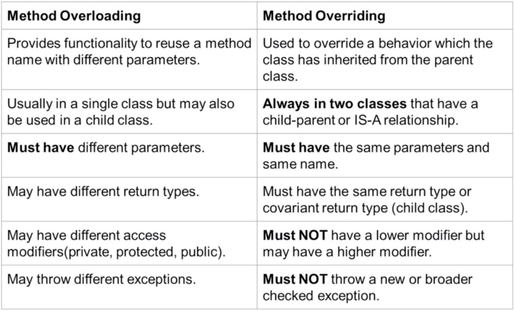
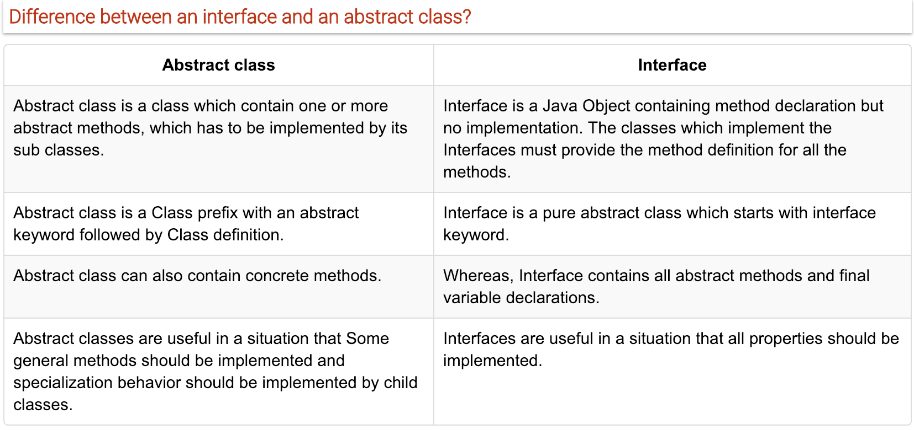
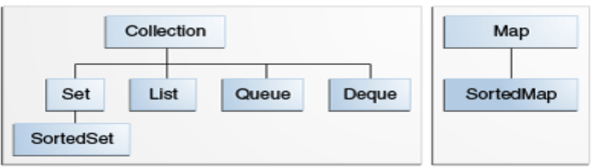

## **Static Methods**
>- **Static methods** are declared using a static modifier
>- **Static methods can't** access instance methods and instance variables directly
>- They are usually used for operations that don't require any data from an instance of the class (from 'this')
>- **Static methods can't** use the **this** keyword
>- Whenever you see method that does not use instance variables that method should be declared as a static method
>- Example - main is a static method and it is called by the JVM when it starts an app

## **Instance Methods**
>- **Instance methods** below to an instance of a class
>- To use an **instance method** we have to instantiate the class first usually by using the new keyword
>- **Instance methods** can access instance methods and variance variables directly
>- **Instance methods** can also access static methods and static var directly

``` java 
cclass Calculator{
    public static void printSum(int a, int b){
        System.out.println("sum= " + (a + b));
    }
    public void printMultiply(int a, int b){
        System.out.println("multiply= " + (a * b));
    }
}

public class Main {
    public static void main(String[] args) {

        // Static methods
        Calculator.printSum(5 ,10); // -> called as ClasName.methodName();
        printHello();               // -> called as methodName(); only if in the same class

        // Instance method
        Calculator cal = new Calculator(); // -> create instance
        cal.printMultiply(3,5);            // -> call instance methods
    }

    public static void printHello() {
        System.out.println("Hello");
    }
}
```
___
## **Static Variables**
>- Declared by using the keyword static
>- Static var aka static member var
>- Every instance of that class shares the same instance var
>- If changes are made all instance will see the effect of change
>- Not used very often but can sometimes be very useful
``` java
class Dog{
    private static String name;
    public Dog(String name) { Dog.name = name; }  // Set static var
    public void printName() { System.out.println("name = " + name); }
}

public class Main {
    public static void main(String[] args) {
        Dog rex = new Dog("rex");
        Dog fluffy = new Dog("fluffy");
        rex.printName();       // -> prints "fluffy"
        fluffy.printName();    // -> prints "fluffy"
    }
}
```

## **Instance Variables**
>- Don't use the keyword static
>- aka files or member fields
>- Instance vars belong to an instance of a class
>- Every instance has it's own copy of an instance var
>- Every instance can have a different value (state)
>- Instance vars represent the state of an instance
``` java
class Dog{
    private static String name;
    public Dog(String name) { this.name = name; } // Instanciate instance var
    public void printName() { System.out.println("name = " + name); }
}

public class Main {
    public static void main(String[] args) {
        Dog rex = new Dog("rex");
        Dog fluffy = new Dog("fluffy");
        rex.printName();       // -> prints "rex"
        fluffy.printName();    // -> prints "fluffy"
    }
}
```
___

## **Method Overloading**
>- **Overloading** does not have anything to do with **polymorphism** but java developers often refer to overloading as Compile Time Polymorphism
>- In other words the compiler decided which methods is going to be called based on the method name, return type and argument list.
>- We **can overload static** and **instance** methods
>- Usually **Overloading** happens inside a single class, but a method can also be treated as **overload** usn the subclass of that class
>- That is because a **subclass inherits** one version of the method from the parent class and then the subclass can have another overloaded version of the method
>- Methods will be considered overloaded if both follow the following rules:
>   * Methods must have the same method name
>   * Methods must have different parameters
>- If methods follow the above rules, then they may or may not
>   * Have different return types
>   * Have different access modifiers
>   * Throw different checked and unchecked exception

## **Method Overriding**
>- Method **overriding** means defining a method in a child class that already exists in the parent class with same signature (method name and parameters)
>- Method **overriding** aka as **Runtime Polymorphysim** and **Dynamic Method Dispatch**, becasue the method that is going to be called is decided at runtime by the JVM
>- Methods will be considered **overridden** if we follow these rules:
>   * It must have same name and same arguments
>   * Return type can be a subclass of the return type in the parent class
>   * It can't have a lower access modifier
>   * Example - parent method is protected, then using private in the child is not allowed but using public in the child would be allowed
``` java
class Animal {
    protected void walk(){};
}
class Fist {
    @override
    ~~private~~ public void walk(){}; // -> private won't be allowed but public
}
```
>- Important points 
>   * Only inherited methods can be overriden
>   * Constructors and private methods cannot be overriden
>   * Methods that are final cannot be overriden
>   * A subclass can user super.methodName() to call the superclass version of an overriden method



``` java
public static int sum(int a, int b) {
  retrun a + b;
}

public static int sum(int a, int b, int c) {
  retrun a + b + c;
}

public static int sum(int a, int b, int c, int d) {
  retrun a + b + c + d;
}
```

>- Return type does not differentitate methods
>- Here compiled error due to same method signature
``` java 
private static int calculateScore() {
    System.out.println("No player name, no player score");
    return 0;
}

private static void calculateScore() {
    System.out.println("No player name, no player score");
}
```
___
## **Is a vs Has**
> Inheritance (IS A)
``` java
public class Car extends Vehicle { // -> Car "IS A" vehicle
    ....    
}
```
> Composition (HAS A)
>   * Object within objects
``` java
public class Main{
    public static void main(String[] args) {
        Case myCase = new Case(... Initiliase with correct args);
        Resolution myResolution = new Resolution(... Initiliase with correct args);
        Monitor myMonitor = new Monitor(...., myResolution ,.....)
        
        PC myPC = new PC(myCase, myMonitor); // Initialising with appropriate object
        myPC.getMonitor().draw(100,200,"red"); // Accessing methods of monitor object
        myPC.getTheCase().pressProwerButton(); // Accessing methods of case object
    }
}

public class PC {
    private Case theCase;       // Composition -> PC "HAS A" Case
    private Monitor theMonitor; // Composition -> PC "HAS A" Monitor

    // Constructor
    // Getter and Setters
}

public class Case {
    // Class vars
    // Constructor
    public void pressProwerButton() {
        System.out.println("Power button pressed");
    }
    // Getters and setters
}

public class Monitor {
    // Decalre other class var
    private int size; // Example Class variables 
    private Resolution nativeResolution;  // This is composition => Monitor "HAS A" resolution

    // Constructor
    public static draw(int x, int y, String color) {
        System.out.println("Drawing prixel at " + x + "," + y + " in color " + color);
    }
    // Getters and setters
}

public class Resolution {... usual stuffs ...}
```
___

## **Encapsulation**
> 

___

## **Polymorphism**
> If inherits from a class, JVM will determine which method to use.. Usually the local method but if not available, it will go to the parent.
``` java
public class Movie { .. plot = (): void -> print "No Plot" ..}
public class Jaws extends Movie{} { .. plot = (): void -> print "Jaws" ..}
public class MazeRunner extends Movie{} { .. plot = (): void -> print "MazeRunner" ..}
public class StarWars extends Movie{} { .. plot = (): void -> print "StarWars" ..}
public class Forgetable extends Movie{} { .. No plot method present ..}
public class Main { 
    psvm = (String[] agrs) -> {
        Movie movie = randomMovie();
        sout(movie.plot()); 
        -> if Forgetable obj was returned -> sout will print "No Plot"
        -> else other obj was returned -> sout will print corresponding class method output
    }
    randomMovie = () -> { 
        Depending on random number generate and 
        return (new Jaws() || new MazeRunner() || new StarWars() || new Forgetable())
    }
}

```

___

## **CONSTANT Value**
> By convention final variable is in all caps
``` java
private static final String INVALID_VALUE_MESSAGE = "Invalid value";
```

## **Switch Statement**
> Since Java 7, we have swtich statement with String
``` java
String month = "January";

switch (month) {
    case "January":
        System.out.println(month);
        break;
    case "June": case "July":
        System.out.println(month);
        break;
    default:
        System.out.println("Not found");
        break;
}
```


## **Minutes to Years and Days Function**
``` java
public static void printYearsAndDays (long minutes){
        if (minutes < 0) {
            System.out.println("Invalid Value");

        } else {

            long minInOneYear = (365 * 24 * 60);
            long minInOneDay = (24 * 60);
            long years = minutes / minInOneYear;
            long days = minutes / minInOneDay;
            long remaingDays = days % 365;

            System.out.println(minutes + " min = " + years + " y and " + remaingDays + " d");
        }
    }
```

## **Leap Year Function**
``` java
public static boolean isLeapYear(int year) {

        if (year < 1 || year > 9999) {
            return false;
        }

        if (((year % 4 == 0) && (year % 100 != 0)) || (year % 400 == 0)) {
            return true;
        } else {
            return false;
        }

}
```


## **Prime Numbers Function**
``` java
public static boolean isPrime(int n){
        if (n == 1){
            return false;
        }

        // Optimise version 1
        for (int i=2; i <= (long) Math.sqrt(n); i++) {
            System.out.println("Looping " + i);
            if (n % i == 0) {
                return false;
            }
        }

        // Optimise version 2
        //for (int i=2; i <= n/2; i++) {
        //    if (n % i == 0) {
        //        return false;
        //    }
        //}

        return true;
}
```

## **Sum digits function**
``` java
public static int sumDigits (int number){

        if (number < 10) {
            return -1;
        }

        int sum = 0;

        while(number > 0){
            // extract least significant digit
            int digit = number % 10;
            sum += digit;

            // drop least significant digit
            number /= 10;

        }

        return sum;

}
```

## **Palindrome function**
``` java
public static boolean isPalindrome(int number){

        int processed = number;
        int reversed = 0;


        while (processed != 0){

            // get least significant number
            int lastDigit = processed % 10;
            reversed = (reversed * 10) + lastDigit;

            processed /= 10;

        }

        if (number == reversed){
            return true;
        } else {
            return false;
        }

}
```

## **Reverse array logic function**
``` java 
public static int[] reverseMine(int[] array){
    int[] reverseArray = new int[array.length];
    for(int i = 0; i< array.length; i++){
        reverseArray[i] = array[array.length-1-i];
    }
    return reverseArray;
}

private static void reverse(int[] array){
    int maxIndex = array.length-1;
    int halfLength = array.length/2;

    for (int i=0; i<halfLength; i++){
        int temp = array[i];
        array[i] = array[maxIndex - i];
        array[maxIndex-i] = temp;
    }
    }
```


## **Sorting & copying arrays using basic loop function**
``` java
public static int[] sortIntegers(int[] array){
    int[] sortedArray = new int[array.length];
    // Copyng an array to another array
    for(int i=0; i<array.length; i++){
        sortedArray[i] = array[i];
    }
    // Alternative would be to use copyOf
    // int[] sortedArray = Arrays.copyOf(array, array.length);

    // Sorting algorithm using basic loop 
    boolean flag = true;
    int temp;

    while(flag){
        flag = false;
        for(int i=0; i<sortedArray.length-1; i++){
            if (sortedArray[i] < sortedArray[i+1]){
                temp = sortedArray[i];
                sortedArray[i] = sortedArray[i+1];
                sortedArray[i+2] = temp;
                flag = true;
            }
        }

    }
    return sortedArray;
}
```

## **Sum first and last digit function**
``` java
public static int sumFirstAndLastDigit (int number){
        if (number < 0){
            return -1;
        }

        int last = number % 10;

        int first = number;
        while (first >= 10) {
            first /= 10;
        }

        return first + last;

}
```


## **Break vs Continue vs Return**
>-  The break statement results in the termination of the loop, it will come out of the loop and stops further iterations. 
>-  The continue statement stops the current execution of the iteration and proceeds to the next iteration. 
>-  The return statement takes you out of the method.

> Break will exit the loop depending on the condition that we are checking
> Continue will bypass the part of code block that is below the continue keyword and continue with the next iteration
``` java
int number = 4;
int finishedNumber = 20;
int sumEven = 0;
int countEven = 0;

while (number <= finishedNumber){

   number++;

   if (!isEvenNumber(number)) continue;

    System.out.println("Even num: " + number);

    sumEven += number;
    countEven++;

    if (countEven >= 5){
        break;
    }

}

System.out.println("Sum even num: " + sumEven);
```

## **Things to review**
>- Encapsulation

## **this vs super**
>- **super** is used to access/call the parent class members (var and methods)
>- **this** is used call the current class members (var and methods)
>- **Note** can use both of them anywhere in a class **except** static areas (static block or a static method). Any attempt to do so will lead to compile_time_error.

## **this() vs super()**
>- Use **this()** to call a constructor from another overloaded constructor in the same class
>- The call to **this()** can be used only in a constructor and must be the first statement in the constructor. It's used with constructor chaining (when one constructor calls another constructor) and helps to reduce duplicated code
>- Only way to call a parent constructor is by calling **super()**
>- Java compiler puts a default call to **super()** if we don't add it, and it is always the no-args **super** which is inserted by compiler (constructor without arguments)
>- Even **abstract classes** hav constructors, although can never instantiate using the new keyword
>- An **super()** is still a **super** class, so its constructors run when someone makes an instance of a concrete subclass
>- **NOTE:** A constructor can have a call to **super()** OR **this()** but never both

## **Good Constructor Example**
> 3rd constructor doing all the work
> Example of constructor chaining
``` java
public Rectangle(){
    this(0,0);
}
public Rectangle(int w, int h){
    this(0,0,w,h);
}
public Rectangle(x,y,w,h){
    this.x = x;
    this.y = xy;
    this.w = w;
    this.z = z;
}
```

## **Constructor**
> TODO - think generate empty constructor when not exist
``` java
public Account(){
    // Calling another constructor - it needs to be the very first line; otherwise won't work
    this("543ss1", 2.5, "Default name", "Default address", "Default phone");
    System.out.println("Empty constructor called");
}

public Account(String number, double balance, String customerName, String customerEmailAddress, String customerPhoneNumber) {
    System.out.println("Account constructor with parameters called");
    this.number = number;
    this.balance = balance;
    this.customerName = customerName;
    this.customerEmailAddress = customerEmailAddress;
    this.customerPhoneNumber = customerPhoneNumber;
}
```
> Account bob = new Account(); -> will give below, because empty constructor will call other constructor first before printing "Empty.."
```
Account constructor with parameters called
Empty constructor called
```
> Don't called setters in constructor
``` java
public Account(String number, double balance, String customerName, String customerEmailAddress, String customerPhoneNumber) {
    System.out.println("Account constructor with parameters called");
    this.number = number; -> good
    setBalance(balance); -> not good; don't do this
    ...
}
```

## **Inheritance**
> Calling super and overriding methods
``` java
public class Animal {
    // Declare Variables here

    // Appropriate constructor here 

    public void eat(){
        System.out.println("Animal.eat() called");
    }

    public void move(int speed){
        System.out.println("Animal.move() called; Animal is moving at " + speed);
    }

    // Getters and setters below
}


public class Dog extends Animal {

    // Declare Variables here

    // Appropriate constructor here 

    private void chew(){
        System.out.println("Dog.chew() called");
    }

    @Override
    public void eat() {
        System.out.println("Dog.chew() called");
        chew();
        super.eat();
    }

    public void walk() {
        System.out.println("Dog.walk() called");
        super.move(5); // -> Force calling parent method
    }
    public void run(){
        System.out.println("Dog.run() called");
        move(10); // -> Find overiding method ? use local method : use parent method 
    }

    @Override
    public void move(int speed) {
        System.out.println("Dog.move() is called");
        moveLegs(speed); 
        super.move(speed); // -> Force calling parent method
    }

    private void moveLegs(int speed) {
        System.out.println("Dog.moveLegs() is called");
    }
}
```
``` java
Animal animal = new Animal("Animal",1,1,5,5);
Dog dog = new Dog("Yorkie",8,20,2,4,1,20, "Long silky");

dog.eat();
dog.walk();
dog.run();

// Prints below
Dog.chew() called 
Dog.chew() called 
Animal.eat() called

Dog.walk() called
Animal.move() called; Animal is moving at 5

Dog.run() called
Dog.move() is called
Dog.moveLegs() is called
Animal.move() called; Animal is moving at 10
```


## **Reference vs Object vs Instance vs Class**
> Analogy of building a house
>- A **class** is a blueprint(plans) for a house, we build many houses as per the plans.
>- Each (new) house you build (instantiate) is an object aka **instance**
>- Each (new) house has an address (physical location). This is known as **reference**
>- You can copy that **reference** as many times as you like but there is sill one house.  You are copying the paper that has address on it not the house itself
>- We can pass **reference** as **parameters** to **constructors** and **methods**
``` java

class House {
    private String color;
    // Constructor House(color)
    // Getter and setters;
}

House blueHouse = new House("blue");
House anotherHouse = blueHouse;

System.out.println(blueHouse.getColor()); // -> blue
System.out.println(anotherHouse.getColor()); // -> blue

anotherHouse.setColor("red");
System.out.println(blueHouse.getColor()); // -> red
System.out.println(anotherHouse.getColor()); // -> red

House greenHouse = new House("green");
anotherHouse = greenHouse;
System.out.println(blueHouse.getColor()); // -> red
System.out.println(greenHouse.getColor()); // -> green
System.out.println(anotherHouse.getColor()); // -> green

```

## **Arrays**
> Needs to be the same type
> Method 1 - Declaring arrays and accessing elements
``` java
int[] myIntVariable = new int[10];
myIntVariable[0] = 50;                  // -> Starting index = 0
System.out.println(myIntVariable[0]);   // -> Print 50
```
> Method 2 - Declaring arrays
``` java
int[] myIntVariable = {1,2,3,4,5,6};     // Declare and initialise
System.out.println(myIntVariable[5]);    // Print 6
```

``` java
char[] srcArray = new char[] { 'K', 'E', 'V', 'I', 'N' };
```

## **Refrence Types vs Value Types**
> (Array and Object) vs Primitives
> Array are reference types (hold an address not the object itself)
> Also applies when passed as method parameter
``` java
....{
int[] myIntArray = new int[5];  // -> Here myIntArray hold a reference to the object int[5] which is stored somewhere else in mem
int[] anotherArray = myIntArray; // -> Here anotherArray hold the reference to the object int[5]
System.out.println("myIntArray = " + Arrays.toString(myIntArray)); // -> [0, 0, 0, 0, 0]
System.out.println("anotherArray = " + Arrays.toString(anotherArray)); // -> [0, 0, 0, 0, 0]
anotherArray[0] = 1;
System.out.println("after change myIntArray = " + Arrays.toString(myIntArray)); // -> [1, 0, 0, 0, 0]
System.out.println("after change anotherArray = " + Arrays.toString(anotherArray)); // -> [1, 0, 0, 0, 0]
modifyArray(myIntArray);
System.out.println("after modify myIntArray = " + Arrays.toString(myIntArray));    // -> [2, 0, 0, 0, 0] 
System.out.println("after modify anotherArray = " + Arrays.toString(anotherArray)); // -> [2, 0, 0, 0, 0]
}...
private static void modifyArray(int[] array){
    array[0] = 2;
    array = new int[] {1,2,3,4,5}; // dereferincing
}
```

## **List and Arraylist**


## **Copying Arraylist**
``` java
private static void processArrayList() {
    ArrayList<String> newArray = new ArrayList<String>();
    newArray.addAll(groceryList.getGroceryList());

    ArrayList<String> nextArray = new ArrayList<String>(groceryList.getGroceryList());

    String[] myArray = new String[groceryList.getGroceryList().size()];
    myArray = groceryList.getGroceryList().toArray(myArray);
}
```

## **Autoboxing vs unboxing**
//TODO -> not required since Java5 -> JVM automatically do it
> ArrayList
``` java
ArrayList<String> stringArrayList = new ArrayList<>();
stringArrayList.add("Tim");
```
> ArrayList cannot be of primitive type
``` java
// Bellow not allowed
// ArrayList<int> intArrayList = new ArrayList<int>();
```
> One workaround is to create a class to store int
``` java
class IntClass{
    private int myValue;

    public IntClass(int myValue) {
        this.myValue = myValue;
    }

    public int getMyValue() {
        return myValue;
    }

    public void setMyValue(int myValue) {
        this.myValue = myValue;
    }
}

psvm = (String[] args){
    ArrayList<IntClass> intClassArrayList = new ArrayList<IntClass>();
    intClassArrayList.add(new IntClass(54));
}
```
> **Long verison -** Better workaround is to use autoboxing and unboxing in java
``` java
Integer integer = new Integer(54);
Double doubleValue = new Double(43d);

ArrayList<Integer> intArrayList = new ArrayList<Integer>();
for(int i=0; i<=10; i++){
    intArrayList.add(Integer.valueOf(i));  // This is autoboxing -> converting primitives to Integer obj/wrapper
}

for(int i=0; i<intArrayList.size(); i++){
    System.out.println(i + " -> " + intArrayList.get(i).intValue());  // This is unboing -> coverting Integer obj/wrapper to primitives
}
```
> **Short verison -** Better workaround is to use autoboxing and unboxing in java
``` java
Integer myIntValue = 56;  // JVM will do - Integer.valueOf(56);
int myInt = myIntValue;   // JVM will do - myInt.intValue();
```


## **List <<inteface>>**
> ArrayList class implements List interface and it is based on an Array data structure

> LinkedList is a doubly-linked list implementation of the List and Deque interfaces
```
An iterator for lists that allows the programmer to traverse the list in either direction, modify the list during iteration, and obtain the iterator's current position in the list. A ListIterator has no current element; its cursor position always lies between the element that would be returned by a call to previous() and the element that would be returned by a call to next(). An iterator for a list of length n has n+1 possible cursor positions, as illustrated by the carets (^) below:
                      Element(0)   Element(1)   Element(2)   ... Element(n-1)
 cursor positions:  ^            ^            ^            ^                  ^
```
>- A doubly-linked chain: elements are stored in nodes, with linking back and forth between themselves,
>- Mutable: objects can be added and/or removed,
>- Not Thread-safe: LinkedList is not suitable for concurrent access.


## **Inteface**
> Interface is just the declaration of methods of a Class, it's not the implementation
> In an interface, we define what kind of operation an object can perform.  These operations are defined by the classes that implement the interface
> Interfaces form a contract between the class and the outside world, and this contract is enforced at build time by the compiler
> You cannot instantiate them, and they may contain a mix of methods declared with or without an implementation.  All methods in the interfaces are automatically public and abstract
> By introducing interfaces into your program, you are really introducing points of variation at which you can plug in different implementations for that interface.  An interfaces primary purposes is abstraction, decoupling the "what" from the "how"
> **NOTE** 
>- Since Java 8 interfaces can contain default methods.  In other words methods with implementation.  The keyword default is used (mostly for backwards compatibility), and static methods as well before Java 8 that was not possible.
>- Since Java 9 interfaces can also contain private methods (commonly used when two default methods in an Interface share commo n code
``` java
public interface Test {
    void doSomething();
    default void defaultMethod(){
        System.out.printf("default method allow since Java 8");
    };

    private void shareByDefaultMethod(){
        System.out.printf("Java 9 - private method allowed, usually used for common methods of default methods");
    }
}
```
> **When to use an Interface** 
>- You expect that unrelated calsses will implement your interface. E.g the interfaces Comparable and Cloneable are implemented by many unrelated classes.
>- You want to specify the behaviour of a particular data type, but you are not concerned about who implements its behaviour
>- You want to sperate different behaviour
>- The collections API is an excellent example, we have the List interface and implementation ArrayList and LinkedList
>- The JDBC API is another excellent example.  It exist of almost only interfaces.  The concrete implementations are provided as "JDBC drivers".  This enables you to write all the JDBC code independent of the DB vendor.

> Interface is a pure abstract class
``` java
// What we declare
public interface Moveable{
    int AVG_SPEED = 40;  // -> always need to be declared; otherwise error
    void move()
}

// What the compiler sees
public interface Moveable{ // TODO -> think is changes it to an abstract class
    public static final int AVG_SPEED = 40; // -> automatically adds public static final
    public abstract void move();  // automatically adds public abstract
}
```
> Methods inside interface must not be static, final, native or stictfp
> All variables declared inside interface are implicitly public static final variables(constants)
> All methods declared inside Java Interfaces are implicitly public and abstract, even if you don't use public or abstract keyword
> Interface can extend one or more other interface
> Interface cannot implement a class (including interfaces which are abstract classesby nature)
> Interface can be nested inside another interface
> Method signature does note require 'public/private/protected ..'
> Implementor need to implement/override all methods in interface 



``` java
interface ITelephone {...}
class DeskPhone implements ITelephone {...}
class MobilePhone implements ITelephone {..}
psvm = () => {
    ITelephone timsPhone;  // Generics - Good practice to declare interface and the initializing on the right

    timsPhone = new DeskPhone(123456);
    timsPhone.powerOn();
    timsPhone.callPhone(123456);
    timsPhone.answer();

    timsPhone = new MobilePhone(99999);  // Possible because of 'ITelephone timsPhone;'; would be possible if it was declared 'DeskPhone timsPhone;'
    timsPhone.powerOn();
    timsPhone.callPhone(99999);
    timsPhone.answer();
}
```
``` java
interface ITelephone {
    List<String> returnContacts();
    void printContracts(List<String> listContacts);  // -> do not have {} - which means implementation
}
class DeskPhone implements ITelephone {
    public List<String> returnContacts(){
        List<String> values = new LinkedList<>();   // -> Specify implementation of List
        values.add(0, this.name);
        return values;
    }
    public String getPhoneNumber() {return this.phoneNumber}
    public void printContracts() {....};
}
class MobilePhone implements ITelephone {
    public List<String> returnContacts(){
        List<String> values = new ArrayList<>();   // -> Specify implementation of List
        values.add(0, this.name);
        return values;
    }
    public String getPhoneNumber() {return this.phoneNumber}
    public void printContracts() {....};
}
public class Main {
    psvm = () => {
        DeskPhone timsPhone = new DeskPhone(123456);
        MobilePhone tedsPhone = new MobilePhone(99999);  
        ITelephone interPhone = new MobilePhone(99999);  

        loadObject(timsPhone); // -> going to work because of generic interface as parameter
        loadObject(tedsPhone); // -> going to work because of generic interface as parameter

        timsPhone.getPhoneNumber() // -> will works
        interPhone.getPhoneNumber() // -> will fail as getPhoneNumber() does not exist in interface 
        ((MobilePhone) interPhone).getPhoneNumber() // -> will not work after casting
    }

    public static void loadObject (ITelephone objectLoad){  // -> Generic parameter for object
        objectLoad.printContracts();
    }
}
```


## **Inner Class**
> Nested classes are divided into two categories: static and non-static.
>- Nested classes that are declared static are called **static nested classes**. 
>- Non-static nested classes are called **inner classes**.

``` java
public class ShadowTest {

    public int x = 0;

    class FirstLevel {

        public int x = 1;

        void methodInFirstLevel(int x) {
            System.out.println("x = " + x);
            System.out.println("this.x = " + this.x);
            System.out.println("ShadowTest.this.x = " + ShadowTest.this.x); // Applicable to methods too ShadowTest.this.getMethod();
        }
    }

    public static void main(String... args) {
        ShadowTest st = new ShadowTest();
        ShadowTest.FirstLevel fl = st.new FirstLevel();
        fl.methodInFirstLevel(23);
    }
}
```
```
x = 23
this.x = 1
ShadowTest.this.x = 0
```

## **Inner Classes - (1) Local vs (2) Anonymous**
> There are two additional types of inner classes. 
>- You can declare an inner class within the body of a method. These classes are known as local classes. 
>- You can also declare an inner class within the body of a method without naming the class. These classes are known as anonymous classes.

> **Local Classes**
> Local classes are classes that are defined in a block, which is a group of zero or more statements between balanced braces. You typically find local classes defined in the body of a method.
``` java
public class LocalClassExample {

    static String regularExpression = "[^0-9]";

    public static void validatePhoneNumber(String phoneNumber1, String phoneNumber2) {

        final int numberLength = 10;

        // Valid in JDK 8 and later:
        // int numberLength = 10;

        class PhoneNumber {
        
            String formattedPhoneNumber = null;

            PhoneNumber(String phoneNumber) {
                // numberLength = 7;
                String currentNumber = phoneNumber.replaceAll(regularExpression, "");
                if (currentNumber.length() == numberLength)
                    formattedPhoneNumber = currentNumber;
                else
                    formattedPhoneNumber = null;
            }

            public String getNumber() {
                return formattedPhoneNumber;
            }

            // Valid in JDK 8 and later:

            //public void printOriginalNumbers() {
            //    System.out.println("Original numbers are " + phoneNumber1 +
            //        " and " + phoneNumber2);
            //}
        }

        PhoneNumber myNumber1 = new PhoneNumber(phoneNumber1);
        PhoneNumber myNumber2 = new PhoneNumber(phoneNumber2);

        // Valid in JDK 8 and later:
        // myNumber1.printOriginalNumbers();

        if (myNumber1.getNumber() == null)
            System.out.println("First number is invalid");
        else
            System.out.println("First number is " + myNumber1.getNumber());
        if (myNumber2.getNumber() == null)
            System.out.println("Second number is invalid");
        else
            System.out.println("Second number is " + myNumber2.getNumber());

    }

    public static void main(String... args) {
        validatePhoneNumber("123-456-7890", "456-7890");
    }
}
```

> You cannot declare static initializers or member interfaces in a local class. The following code excerpt does not compile because the method EnglishGoodbye.sayGoodbye is declared static. The compiler generates an error similar to "modifier 'static' is only allowed in constant variable declaration" when it encounters this method definition:
> https://docs.oracle.com/javase/tutorial/java/javaOO/localclasses.html
``` java
 public void greetInEnglish() {
        interface HelloThere { // -> compile error
            void greet();
        }
        class EnglishHelloThere implements HelloThere {
            public void greet() {
                System.out.println("Hello ");
            }
        }
        HelloThere myGreeting = new EnglishHelloThere();
        myGreeting.greet();
    }
```


> Example for inner interface
``` java
public class Button {
    private String title;
    private OnClickListener onClickListener;

    public Button(String title) {
        this.title = title;
    }

    public String getTitle() {
        return title;
    }

    public void setOnClickListener(OnClickListener onClickListener){
        this.onClickListener = onClickListener;
    }

    public void onClick(){
        this.onClickListener.onClick(this.title);  
    }

    // Inner interface 
    public interface OnClickListener{
        void onClick(String title);
    }
}

public class Main {
    private static Scanner scanner = new Scanner(System.in);
    private static Button btnPRint = new Button("Print");

    public static void main(String[] args) {

        // Another inner class
        class ClickListener implements Button.OnClickListener{  // Implementing inner class interface 
            public ClickListener() {
                System.out.println("I've been attached");
            }

            // Forced to implement inner interface methods
            @Override
            public void onClick(String title) {
                System.out.println(title + " was clicked");
            }
        }

        btnPRint.setOnClickListener(new ClickListener());  // Passing new object
        listen();
    }

    private static void listen(){
        boolean quit = false;
        while (!quit){
            int choice = scanner.nextInt();
            scanner.nextLine();
            switch (choice){
                case 0:
                    quit = true;
                    break;
                case 1:
                    btnPRint.onClick();
            }
        }
    }
}
```

> **Anonymous class**
>- Extends Class
``` java
// Copy & paste in *.java file -> it will run first main method.. Comment to see others..
class HelloWorld { // superclass
    void displayMessage() {
        System.out.println("Hello World");
    }
}


class Tester {
    public static void main(String args[]){
        HelloWorld hw = new HelloWorld() {
            void displayMessage() {
                System.out.println("Hello Earth");
            }
        };
        hw.displayMessage();
    }
}

class Tester2 {
    public static void main(String args[]){
        HelloWorld hw = new HelloWorld() {
            @Override
            void displayMessage() {
                System.out.println("Hello Earth");
            }
            void displayError() {
                System.out.println("Don\'t create new methods in an anonymous inner class.");
            }
        };
        hw.displayMessage();
        //hw.displayError();
    }
}

class Tester3 {
    public static void main(String args[]){
        reallyStrange(new HelloWorld());  // -> Prints "Hello World" -> use original method
        reallyStrange(new HelloWorld(){   // -> Prints "Really strange stuff!" -> use overridden method
            @Override
            void displayMessage(){
                System.out.println("Really strange stuff!");
            }
        });
    }

    static void reallyStrange(HelloWorld hw){
        hw.displayMessage();
    }
}
```

>- Implements interface 
``` java
public class HelloWorldAnonymousClasses {

    interface HelloWorld {
        public void greet();
        public void greetSomeone(String someone);
    }

    public void sayHello() {

        class EnglishGreeting implements HelloWorld {
            String name = "world";
            public void greet() {
                greetSomeone("world");
            }
            public void greetSomeone(String someone) {
                name = someone;
                System.out.println("Hello " + name);
            }
        }

        HelloWorld englishGreeting = new EnglishGreeting();

        HelloWorld frenchGreeting = new HelloWorld() {
            String name = "tout le monde";
            public void greet() {
                greetSomeone("tout le monde");
            }
            public void greetSomeone(String someone) {
                name = someone;
                System.out.println("Salut " + name);
            }
        };

        HelloWorld spanishGreeting = new HelloWorld() {
            String name = "mundo";
            public void greet() {
                greetSomeone("mundo");
            }
            public void greetSomeone(String someone) {
                name = someone;
                System.out.println("Hola, " + name);
            }
        };
        englishGreeting.greet();             // -> Prints "Hello World"
        frenchGreeting.greetSomeone("Fred"); // -> Prints "Salut Fred"
        spanishGreeting.greet();             // -> PRints "Hola, mundo"
    }

    public static void main(String... args) {
        HelloWorldAnonymousClasses myApp = new HelloWorldAnonymousClasses();
        myApp.sayHello();
    }
}
```


> **Abstract class**
>- Cannot instantiate an abstract class
>- Abstract classes are extended not implemented
>- Decision based "Is A" vs "Has A" relationship
> Abstract classes are similar to Interfaces. You cannot instantiate them, and they may contain a mix of methods declared with or without an implementation
> However, with Abstract classes, you can decalre fields that not static and final, and define public, protected, private concrete methods
> An Abstract class can extend only one parent class but it can implement multiple interfaces
> When an Abstract class is subclassed, the subclass usually provides implementations for all of the abstract methods in it parent class
> However, if it does not, then the subclass must also be declared abstract
> Use an abstract class when
>- You want to share code among several closely related classes (Animal - with fields name. name...)
>- You expect classes that extend your abstract class to have many commond methods or fields or required access modifiers other than public (protected, private)
>- You want to declare non static or non fial fields, this enables you to define methods thatn can access and modify the state of an object (getName, setName).
>- When you have a requirement for your base class to provide a default implementation of certain methods but other methods should be open to being overridden by child classes
>- **Summary:** The purpose of abstract class is to provide a common definiton of a base class that multiple derived calsses can share

``` java
public abstract class Animal {

    private String name;

    public Animal(String name) {
        this.name = name;
    }

    public abstract void eat();
    public abstract void breathe();

    public String getName() {
        return name;
    }
}

public interface CanFly {
    void fly();
    //void Test();  // -> If this was set see comments starting with *
}

public abstract class Bird extends Animal implements CanFly {

    public Bird(String name) {
        super(name);
    }

    @Override
    public void eat() {
        System.out.println(this.getName() + " is pecking");
    }

    @Override
    public void breathe() {
        System.out.println("Breathe in, breathe out, repeat");
    }

    @Override
    public void fly() {
        System.out.println(getName() + " is flapping its wing");
    }

    //@Override
    //public void Test() { }  -> * Not required to implement because it's an abstract class
}


public class Penguin extends Bird {

    public Penguin(String name) {
        super(name);
    }

    @Override
    public void fly() {     // -> Can be overridden
        super.fly();
        System.out.println("I'm not good at this");
    }

//    @Override
//    public void Test() { }  -> * this will need to be implemented if not already done so in inherited abstract class
}


public class Parrot extends Bird {

    public Parrot(String name) {
        super(name);
    }

//    @Override
//    public void fly() { super.fly(); }  -> Not required as already implemented in abstract class

//    @Override
//    public void Test() { }  -> * this will need to be implemented if not already done so in inherited abstract class
}

public class Main {
    public static void main(String[] args) {
        Dog dog = new Dog("Yorkie");
        dog.eat();       // -> Yorkie is eating
        dog.breathe();   // -> Breathe in, breathe out, repeat

        Parrot parrot = new Parrot("Australian Parrot");
        parrot.eat();     // -> Australian Parrot is pecking
        parrot.breathe(); // -> Breathe in, breathe out, repeat
        parrot.fly();     // -> Australian Parrot is flapping its wing

        Penguin penguin = new Penguin("Emperor");
        penguin.fly();    // -> Emperor is flapping its win \n I'm not good at this

    }
}
```

## **Abstract Classes**
> //TODO -> review abstract classes challenge


## **Generics**
> T can extend only one class(first in the list) and add multiple interfaces
``` java
public class Team <T extends Player & Coach & Manager {  // -> Player is a class (needs to be first); Coach & Manager are interfaces
}
```
> //TODO - More to research e.g wildcards <?>

## **Java Naming Convention**
> Things you will name in java are:
>- Packages
>- * Always lower case
>- * Package names should be unique
>- * Use your internet domain name, reversed, as a prefix for the package name
>- * Replace invalid characters (i.e -) in domain name with an underscore
>- * Domain name components starting with a number should instead start with an underscore_
>- * Domain name components that are java keywords should have the component start with an underscore_
>- * E.g Switch.supplier.com -> com.supplier._switch
>- * E.g 1world.com -> com._1world
>- * E.g Experts-exchange.com -> com.experts_exchange
>- Classes
>- * CamelCase
>- * Class names should be nouns (they reperesent things)
>- * Should start with a capital letter
>- * Each word in the name should also start with a capital (e.g LinkedList)
>- Interfaces
>- * Capitalized like class names (CamelCase)
>- * Consider what objects implementing the interface will become of what they will be able to do
>- Methods
>- * mixedCase
>- * Often verbs
>- * Reflect the function performed or the result returned
>- Contants
>- * All UPPER_CASE
>- * Seperate words with underscore_
>- * Declared using the final keyword
>- * E.g static final int MAX_INT
>- * E.g static final short SEVERITY_ERRO
>- * E.g static final double P1 = 3.141592653
>- Variables
>- * mixedCase
>- * Meaningful and indicative
>- * Start with lower case leter
>- * Do not use underscores_
>- Type parameters (generics)
>- * Single character, capital letters
>- * E.g E - element
>- * E.g K - Key
>- * E.g T - Type
>- * E.g V - Value
>- * E.g S, U, V - 2nd, 3rd, 4th types


## **Packages**
> 
``` java
import javafx.scene.Node;
import org.w3c.dom.Node; // Compile error - conflict with first import

public class App
{
    public static void main( String[] args )
    {
        Node node = null;
        org.w3c.dom.Node anotherNode = null;
    }
}

// If need both, don't import, refer to them specifically
public class App
{
    public static void main( String[] args ) {
        javafx.scene.Node node = null;
        org.w3c.dom.Node anotherNode = null;
    }
}
```

## **Scope**
``` java
public class ScopeCheck {
    public int publicVar = 0;
    private int privateVar = 1;

    public ScopeCheck() {
        System.out.println("ScopeCheck created, publicVar = " + publicVar + "; privateVar = " + privateVar);
    }

    public int getPrivateVar() {
        return privateVar;
    }

    public void timesTwo(){
        int privateVar = 2; 
        for (int i=0; i<10 ;i++){
            System.out.println(i + " times two is " + (i * privateVar));  // Check if variable exist in scope, otherwise, move to member var
            System.out.println(i + " this.privateVar " + (i * this.privateVar)); // Specifically refering to class variable
        }
    }
}
```

## **Access Modifiers**
> Top Level
>- Only classes, interfaces and enums can exist at the top level, everything else must be included within one of these
>- * **public:** the object is visible to all classes everywhere, whether they are in the same package or have imported the package containing the public class
``` java
public class Main{}
public interface Accessible{}
public enum EnumTest {}
```
>- * **package-private:** the object is only available within its own package (and is visible to every class within the same package).  Package-private is specified by not specifying i.e it is the default if you do not specify public.  There is not a "package-private" keyword
``` java
class Main{}
interface Accessible{}
enum EnumTest {}
```

> Member level
>- * **public:** at the member level, public has the same meaning as at top level.  A public class member(of field) and public method can be accessed from any other class anywhere, even in a different package
>- * **package-private:** this also has the same meaning as it does at the top level.  An object with no access modifier is visible to every class within the same package (but not to class in external packages)
>- * **private:** the object is only visible within the class it is declared.  It is not visible anywhere else (including in subclasses of its class).
>- * **protected:** the object is visible anywhere in its own package (like package-private) but also in subclasses even if they are in another package

``` java
interface Accessible {          // -> package-private
    int SOME_CONTSTANT = 100;   // -> public static final
    public void methodA();      // -> public abstract
    void methodB();             // -> public abstract
    boolean methodC();          // -> public abstract
}
```

## **Static**
> Can be accessed by calling ClassName.Method() or ClassName.Variable;
> Static methods **cannot** access none static methods and variables;
> Non-static methods **can** access static methods and variables;

## **Final**
> On class - cannot be subclassed i.e cannot be extended
> On constructor - cannot be instantiated
> On methods - cannot be overridden
> On class variables - needs to be instantiated before constructor is finished instantiating

``` java
public class SIBTest {
    public static final String owner;

    static {
        owner = "tim";
        System.out.println("SIBTest static initialisation block called");
    }

    public SIBTest() {
        System.out.println("SIB constructor called");
    }

    static {
        System.out.println("2nd initialisation block called");
    }

    public void someMethod(){
        System.out.println("someMethod called");
    }
}

public static void main(String[] args) {
    System.out.println("Main method called");
    SIBTest test = new SIBTest();
    test.someMethod();
    System.out.println("Owner is " + SIBTest.owner);
}
```
> Output
```
Main method called
SIBTest static initialisation block called  // -> All static block called in sequence
2nd initialisation block called // -> All static block called in sequence
SIB constructor called          // -> After all static block instantiated -> constructor is called
someMethod called
Owner is tim
```


## **Java Collections**



The following list describes the core collection interfaces:

> **Collection** — the root of the collection hierarchy. A collection represents a group of objects known as its elements. The Collection interface is the least common denominator that all collections implement and is used to pass collections around and to manipulate them when maximum generality is desired. Some types of collections allow duplicate elements, and others do not. Some are ordered and others are unordered. The Java platform doesn't provide any direct implementations of this interface but provides implementations of more specific subinterfaces, such as Set and List. Also see The Collection Interface section.
> **Set** — a collection that cannot contain duplicate elements. This interface models the mathematical set abstraction and is used to represent sets, such as the cards comprising a poker hand, the courses making up a student's schedule, or the processes running on a machine. See also The Set Interface section.
> **List** — an ordered collection (sometimes called a sequence). Lists can contain duplicate elements. The user of a List generally has precise control over where in the list each element is inserted and can access elements by their integer index (position). If you've used Vector, you're familiar with the general flavor of List. Also see The List Interface section.
> **Queue** — a collection used to hold multiple elements prior to processing. Besides basic Collection operations, a Queue provides additional insertion, extraction, and inspection operations.
Queues typically, but do not necessarily, order elements in a FIFO (first-in, first-out) manner. Among the exceptions are priority queues, which order elements according to a supplied comparator or the elements' natural ordering. Whatever the ordering used, the head of the queue is the element that would be removed by a call to remove or poll. In a FIFO queue, all new elements are inserted at the tail of the queue. Other kinds of queues may use different placement rules. Every Queue implementation must specify its ordering properties. Also see The Queue Interface section.

> **Deque** — a collection used to hold multiple elements prior to processing. Besides basic Collection operations, a Deque provides additional insertion, extraction, and inspection operations.
Deques can be used both as FIFO (first-in, first-out) and LIFO (last-in, first-out). In a deque all new elements can be inserted, retrieved and removed at both ends. Also see The Deque Interface section.

> **Map** — an object that maps keys to values. A Map cannot contain duplicate keys; each key can map to at most one value. If you've used Hashtable, you're already familiar with the basics of Map. Also see The Map Interface section.

The last two core collection interfaces are merely sorted versions of Set and Map:
> **SortedSet** — a Set that maintains its elements in ascending order. Several additional operations are provided to take advantage of the ordering. Sorted sets are used for naturally ordered sets, such as word lists and membership rolls. Also see The SortedSet Interface section.
> **SortedMap** — a Map that maintains its mappings in ascending key order. This is the Map analog of SortedSet. Sorted maps are used for naturally ordered collections of key/value pairs, such as dictionaries and telephone directories. Also see The SortedMap Interface section.

## **Binay Search**
``` java
public boolean reserveSeat(String seatNumber) {
//====================================================
//  Binary search from java source code - modified
//====================================================
    int low = 0;
    int high = seats.size()-1;

    while (low <= high) {
        System.out.print(".");
        int mid = (low + high) / 2;
        Seat midVal = seats.get(mid);
        int cmp = midVal.getSeatNumber().compareTo(seatNumber);

        if (cmp < 0) {
            low = mid + 1;
        } else if (cmp > 0) {
            high = mid - 1;
        } else {
            return seats.get(mid).reserve();
        }
    }
    System.out.println("There is no seat " + seatNumber);
    return false;
//====================================================
//  Accessing binary search from collections - Most efficient
//====================================================
    // Seat requestedSeat = new Seat(seatNumber);
    // int foundSeat = Collections.binarySearch(seats, requestedSeat, null);
    // if (foundSeat >= 0){
    //     return seats.get(foundSeat).reserve();
    // } else {
    //     System.out.println("There is not seat " + seatNumber);
    //     return false;
    // }
}
```


## **Shallow vs Deep Copy**
> Shallow copy means you have two e.g ArrayList with the same objects as elements.
> Change one ArrayList (e.g add, remove, reverse) will not affect the other ArrayList.
> However, mutating the variables in the element/obj themselves, will be reflected in both ArrayList
``` java
public class Main {
    public static void main(String[] args) {
        Theatre theatre = new Theatre("Olympia", 8,12);
        //theatre.getSeats();

//        if(theatre.reserveSeat("H11")){
//            System.out.println("Please pay");
//        } else {
//            System.out.println("Sorry seat is taken");
//        }
//
//        if(theatre.reserveSeat("H11")){
//            System.out.println("Please pay");
//        } else {
//            System.out.println("Sorry seat is taken");
//        }

        // Shallow copy - arraylist have the same shared objects - pointing to same obj
        List<Theatre.Seat> seatCopy = new ArrayList<>(theatre.seats);
        printList(seatCopy);
        seatCopy.get(1).reserve();
        if(theatre.reserveSeat("A02")){
            System.out.println("Please pay for seat");
        } else {
            System.out.println("Seat already reserved");
        }

//        Collections.reverse(seatCopy);
//        System.out.println("Printing seatCopy");
//        printList(seatCopy);
//        System.out.println("Printing theatre.seat");
//        printList(theatre.seats);


        Collections.shuffle(seatCopy);  // Shuffle the arraylist
        System.out.println("Printing seatCopy");
        printList(seatCopy);            // Print IN shuffle order
        System.out.println("Printing theatre.seat");
        printList(theatre.seats);       // Print order entered

        Theatre.Seat minSeat = Collections.min(seatCopy);
        Theatre.Seat maxSeat = Collections.max(seatCopy);
        System.out.println("Min seat number is " + minSeat.getSeatNumber());  // Use compareTo method to calc - does not need to be sorted first
        System.out.println("Max seat number is " + maxSeat.getSeatNumber());  // Use compareTo method to calc - does not need to be sorted first

        sortList(seatCopy);
        System.out.println("Printing sorted seatcopy");
        printList(seatCopy);
        
        // Try to deep copy but fail at runtime - because below code only set the size
        // It actually needs to have the object initialised (empty of not) in the list
        // List<Theatre.Seat> newList = new ArrayList<>(theatre.seats.size());
        // Collections.copy(newList, theatre.seats);
    }

    public static void printList(List<Theatre.Seat> list){
        for (Theatre.Seat seat : list){
            System.out.print(" " + seat.getSeatNumber());
        }
        System.out.println();
        System.out.println("======================================================");
    }

    // Inefficient sort algo - use build in version
    public static void sortList(List<? extends Theatre.Seat> list){
        for (int i=0; i<list.size()-1;i++){
            for (int j=i+1; j<list.size();j++){
                if(list.get(i).compareTo(list.get(j)) > 0){
                    Collections.swap(list, i, j);
                }
            }
        }
    }
}
      
```
``` java

public class Theatre {
    private final String theatreName;
    public List<Seat> seats = new ArrayList<>();

    public Theatre(String theatreName, int numRows, int seatsPerRow) {
        this.theatreName = theatreName;
        int lastRow = 'A' + (numRows - 1);
        for (char row = 'A'; row <= lastRow; row++) {
            for (int seatNum = 1; seatNum <= seatsPerRow; seatNum++) {
                Seat seat = new Seat(row + String.format("%02d", seatNum));
                seats.add(seat);
            }
        }
    }

    public String getTheatreName() {
        return theatreName;
    }

    public boolean reserveSeat(String seatNumber) {
//====================================================
//  Binary search from java source code - modified
//====================================================
        int low = 0;
        int high = seats.size()-1;

        while (low <= high) {
            System.out.print(".");
            int mid = (low + high) / 2;
            Seat midVal = seats.get(mid);
            int cmp = midVal.getSeatNumber().compareTo(seatNumber);

            if (cmp < 0) {
                low = mid + 1;
            } else if (cmp > 0) {
                high = mid - 1;
            } else {
                return seats.get(mid).reserve();
            }
        }
        System.out.println("There is no seat " + seatNumber);
        return false;
//====================================================
//  Accessing binary search from collections - Most efficient
//====================================================
//        Seat requestedSeat = new Seat(seatNumber);
//        int foundSeat = Collections.binarySearch(seats, requestedSeat, null);
//        if (foundSeat >= 0){
//            return seats.get(foundSeat).reserve();
//        } else {
//            System.out.println("There is not seat " + seatNumber);
//            return false;
//        }

//====================================================
//  Inefficient basic traversal
//====================================================
//        for (Seat seat : seats) {
//            System.out.print(".");
//            if (seat.getSeatNumber().equals(seatNumber)) {
//                requestedSeat = seat;
//                break;
//            }
//        }

//        if (requestedSeat == null) {
//            System.out.println("There is not seat " + seatNumber);
//            return false;
//        }
//
//        return requestedSeat.reserve();
    }

    // for testing
    public void getSeats() {
        for (Seat seat : seats) {
            System.out.println(seat.getSeatNumber());
        }
    }

    // For testing purposes - set to public - usually set to private
    public class Seat implements Comparable<Seat>{
        private final String seatNumber;
        private boolean reserved = false;

        public Seat(String seatNumber) {
            this.seatNumber = seatNumber;
        }

        @Override
        public int compareTo(Seat seat) {
            return this.seatNumber.compareToIgnoreCase(seat.getSeatNumber());
        }

        public boolean reserve(){
            if (!this.reserved){
                this.reserved = true;
                System.out.println("Seat " + seatNumber + " reserved");
                return true;
            } else {
                return false;
            }
        }

        public boolean cancel(){
            if(this.reserved){
                this.reserved = false;
                System.out.println("Reservation of seat " + seatNumber + " cancelled");
                return true;
            } else {
                return false;
            }

        }

        public String getSeatNumber(){
            return seatNumber;
        }

    }
}
```


## **Comparable vs Comparator**

> Comparable - just need to implement it and override the compareTo method
``` java
@Override
public int compareTo(Seat seat) {
    return this.seatNumber.compareToIgnoreCase(seat.getSeatNumber());
}
```

> Comparator
``` java
// Anonymous inner class - Implementing interface
static final Comparator<Seat> PRICE_ORDER = new Comparator<Seat>() {
    @Override
    public int compare(Seat seat1, Seat seat2) {
        if(seat1.getPrice() < seat2.getPrice()){  // Have issues = if same price, doesn't mean it is the same object, need to do some further if statement to match the some kind of primary keys on the object
            return -1;
        } else if (seat1.getPrice() > seat2.getPrice()){
            return 1;
        } else {
            return 0;
        }
    }
};

List<Theatre.Seat> priceSeat = new ArrayList<>(theatre.getSeats());
priceSeat.add(theatre.new Seat("B00", 13.00));
priceSeat.add(theatre.new Seat("A00", 13.00));
Collections.sort(priceSeat, Theatre.PRICE_ORDER);
printList(priceSeat);

```

## **Map**
Set - add dupes - does nothing
Map - do not add dupes - but overrides
``` java
Map<String, String> languages = new HashMap<>();
// Prints null as there are no dupes
System.out.println(languages.put("Java", "a compiled high level, object-oriented, platform independent language"));
System.out.println(languages.put("BASIC", "Beginners All Purposes Symbolic Instruction Code"));
System.out.println(languages.put("Lisp", "Therein lies madness"));
// Since there are dupes it will print value of overriden key - " compiled high level, object-oriented, platform independent language"
System.out.println(languages.put("Java", "test"));
```
> Map - use containsKey() method - to check keys
``` java
if(languages.containsKey("Java")) {
    System.out.println("Java is already in the map");
} else {
    languages.put("Java", "this course is about Java");
}
```
> Map - use putIfAbsent() method - prevent concurrency issues
> Map - printout all keys
``` java
for(String key: languages.keySet()) {
    System.out.println(key + " : " + languages.get(key));
}
```
> Map - use remove(key) method -> returns null if not exist or (value) if successful
> Map - use remove(key, value) method -> returns true/false
> Map - use replace(key, newValue) -> returns previous value if successful otherwise (e.g if key does not exist) returns null
> Map - use replace(key, oldValue, newValue)
>- returns false if oldValue is not exactly likely in map
>- returns true if replace was successful


## **String split() method**
> 
``` java
String[] road = "You are standing at the end of a road before a small brick building".split(" ");
for (String i : road) {
    System.out.println(i);
}

System.out.println("==================================");

String[] building = "You are inside a building, a well house for a small spring".split(", ");
for (String i : building) {
    System.out.println(i);
}
```
> Output
```
You
are
.....
brick
building
==================================
You are inside a building
a well house for a small spring
```


## **Immutable Classes**
https://docs.oracle.com/javase/tutorial/essential/concurrency/imstrat.html

## **Sets & HashSet**
> List - is an ordered collection of items that can contain duplicates
> Sets
>- used less often than list and map, but can still be usedful
>- has no defined ordering number one 
>- cannot contains dupes
>- implementation are the hastset and the treeset
``` java

```


## **Lambda Expressions**
> Same like callback in javascript
> Single line 
``` java
interface UpperConcat {
    String upperAndConcat(String s1, String s2);
}

public class Main {

    public static void main(String[] args) {
        UpperConcat uc = (s1, s2) -> s1.toUpperCase() +  s2.toUpperCase();  // Initialising an implementing overridden method
        String sillyString = doStringStuff(uc, "Jack Hill" , "John Doe");

        // Passing initialised anonymous class by overriding/implementing upperAndConcat method declaration in interface 
        String sillyString2 = doStringStuff((s1, s2) -> s1.toUpperCase() +  s2.toUpperCase(), "Jack Hill" , "John Doe");

        System.out.println(sillyString);  // -> Prints "JACK HILLJOHN DOE"
        System.out.println(sillyString2); // -> Prints "JACK HILLJOHN DOE"
    }

    public final static String doStringStuff(UpperConcat uc, String s1, String s2) {
        return uc.upperAndConcat(s1, s2);
    }
}
```

> Nested Block
>- review code block - access to variables - need to be final or shouldn't change
``` java
public class Main {
    public static void main(String[] args) {
        AnotherClass anotherClass = new AnotherClass();
        String s1 = anotherClass.doSomething1();
        System.out.println("==========================================");
        String s2 = anotherClass.doSomething2();
        System.out.println("==========================================");
        String s3 = anotherClass.doSomething3();
        System.out.println("==========================================");
        String s4 = anotherClass.doSomething4();
        System.out.println("==========================================");
        anotherClass.printValue();
        System.out.println("==========================================");
        System.out.println(s1);
        System.out.println("==========================================");
        System.out.println(s2);
        System.out.println("==========================================");
        System.out.println(s3);
        System.out.println("==========================================");
        System.out.println(s4);
    }

    public final static String doStringStuff(UpperConcat uc, String s1, String s2) {
        return uc.upperAndConcat(s1, s2);
    }
}

interface UpperConcat {
    String upperAndConcat(String s1, String s2);
}

class AnotherClass{
    public String doSomething1(){
        UpperConcat uc = (s1, s2) -> {
            System.out.println("The lambda expressions's class is: " + getClass().getSimpleName());  // -> Returns "AnotherClass"
            String result = s1.toUpperCase() + s2.toUpperCase();
            return result;
        };

        System.out.println("The AnotherClass class's name is: " + getClass().getSimpleName());      // -> Returns "AnotherClass"
        return Main.doStringStuff(uc,"String1", "String2");
    }

    public String doSomething2(){
        System.out.println("The AnotherClass class's name is: " + getClass().getSimpleName());        // -> Returns "AnotherClass"
        return Main.doStringStuff(new UpperConcat() {
            @Override
            public String upperAndConcat(String s1, String s2) {
                System.out.println("The anonymous class's name is: " + getClass().getSimpleName());     // -> Returns ""
                return s1.toUpperCase() +  s2.toUpperCase();
            }
        }, "String1","String2");
    }

    public String doSomething3(){
        final int i = 0;  // Must be set to final if passed to anonymous class
        {
            UpperConcat uc = new UpperConcat() {
                @Override
                public String upperAndConcat(String s1, String s2) {
                    System.out.println("i [within anonymous class] = " + i);
                    return s1.toUpperCase() + s2.toUpperCase();
                }
            };

            System.out.println("The AnotherClass class's name is: " + getClass().getSimpleName());

            //i++;   -> Cannot be mutated because it is final
            System.out.println("i = " + i);
            return Main.doStringStuff(uc,"String1", "String2");
        }
    }

    public String doSomething4(){
        int i = 0;
        //i++;

        UpperConcat uc = (s1, s2) -> {
            System.out.println("The lambda expressions's class is: " + getClass().getSimpleName());
            System.out.println("i in lambda expression = " + i);  // -> i needs to be declared final or never change -> will have compile error e.g if we add i++
            String result = s1.toUpperCase() + s2.toUpperCase();
            return result;
        };

        // s1 = "Hello" -> Scope - only accessible in the block

        System.out.println("The AnotherClass class's name is: " + getClass().getSimpleName());
        return Main.doStringStuff(uc,"String1", "String2");
    }

    public void printValue(){
        int number = 25;

        Runnable r = () -> {
            try{
                Thread.sleep(5000);
            } catch (InterruptedException e){
                e.printStackTrace();
            }
            System.out.printf("The value is " + (number - 10));  // Can be changed inside the lambda expression but cannot outside by default it's final outside
        };

        new Thread(r).start();
    }
}
```
> Output
```
The AnotherClass class's name is: AnotherClass
The lambda expressions's class is: AnotherClass
==========================================
The AnotherClass class's name is: AnotherClass
The anonymous class's name is: 
==========================================
The AnotherClass class's name is: AnotherClass
i = 0
i [within anonymous class] = 0
==========================================
The AnotherClass class's name is: AnotherClass
The lambda expressions's class is: AnotherClass
i in lambda expression = 0
==========================================
==========================================
STRING1STRING2
==========================================
STRING1STRING2
==========================================
STRING1STRING2
==========================================
STRING1STRING2
The value is 15    // Comments -> prints last because it slept for 5 sec
```

> Example with for loop

``` java 
public static void main(String[] args) {
    Employee john = new Employee("John Doe", 30);
    Employee tim = new Employee("Tim Buchalka", 21);
    Employee jack = new Employee("Jack Hill", 40);
    Employee snow = new Employee("Snow White", 22);

    List<Employee> employees = new ArrayList<>();
    employees.add(john);
    employees.add(tim);
    employees.add(jack);
    employees.add(snow);

    Employee employee2;
    for(int i=0; i<employees.size(); i++){
        employee2 = employees.get(i);             // employee2 being changed here
        System.out.println(employee2.getAge());
        new Thread(() -> System.out.println(employee2.getAge())).start();  // compile error because employee2 is not final
    }
    System.out.println("===============================================");
    for(int i=0; i<employees.size(); i++){
        Employee employee = employees.get(i);     // because new employee (obj) being created here an does not changed after initialisation
        System.out.println(employee.getAge());
        new Thread(() -> System.out.println(employee.getAge())).start();   // no compile errors
    }
    System.out.println("===============================================");
    for(Employee employee: employees){           // with enhanced for loop - new local variable is created after each iteration
        System.out.println(employee.getName());
        new Thread(() ->System.out.println(employee.getAge())).start(); // therefore not compile error - new obj is final
    }
}
```

## **Lambda Expressions with java.util package**
> forEach similar to JS
> use consumer interface
> https://docs.oracle.com/javase/8/docs/api/java/util/function/Consumer.html
``` java
employees.forEach(employee -> {
    System.out.println(employee.getName());
    System.out.println(employee.getAge());
});
```

Predicate interface built in the java.util package
> Example
``` java 
public class Main {
    public static void main(String[] args) {
        Employee john = new Employee("John Doe", 30);
        Employee tim = new Employee("Tim Buchalka", 21);
        Employee jack = new Employee("Jack Hill", 40);
        Employee snow = new Employee("Snow White", 22);
        Employee red = new Employee("Red RidingHood", 35);
        Employee charming = new Employee("Prince Charming", 31);

        List<Employee> employees = new ArrayList<>();
        employees.add(john);
        employees.add(tim);
        employees.add(jack);
        employees.add(snow);
        employees.add(red);
        employees.add(charming);

        //action1(employees);
        //action2(employees);
        //action3(employees);

        printEmployeesByAge(employees, "Employees over 30", employee -> employee.getAge() > 30);
        printEmployeesByAge(employees, "Employees 30 and under", employee -> employee.getAge() <= 30);

    }

    public static void action1(List<Employee> employees){
        employees.forEach(employee -> {
            System.out.println(employee.getName());
            System.out.println(employee.getAge());
        });
    }

    public static void action2(List<Employee> employees){
        System.out.println("Employees over 30.");
        System.out.println("==================");
        for (Employee employee : employees){
            if (employee.getAge() > 30){
                System.out.println(employee.getName());
            }
        }
    }

    public static void action3(List<Employee> employees){
        System.out.println("Employees over 30.");
        System.out.println("==================");
        employees.forEach(employee -> {
            if (employee.getAge() > 30){
                System.out.println(employee.getName());
            }
        });
        System.out.println();
        System.out.println("Employees 30 and younger");
        System.out.println("==================");
        employees.forEach(employee -> {
            if (employee.getAge() <= 30){
                System.out.println(employee.getName());
            }
        });
    }

    private static void printEmployeesByAge(List<Employee> employees, String ageText, Predicate<Employee> ageCondition){
        System.out.println(ageText);
        System.out.println("==================");
        for (Employee employee : employees) {
            if (ageCondition.test(employee)){
                System.out.println(employee.getName());
            }
        }
    }
}
```


## **Regular Expressions**
``` java
String alphanumeric = "abcDeeeF12Ghhiiiijkl99z";
alphanumeric.replaceAll(".","Y");   // -> "." wild card for any character - replace all characters

alphanumeric.replaceAll("^abcDeee", "YYY"); // -> "^" beginning of string replacement only, replacement does not need to match length of replacement.. Ignores midway matching..

String secondString = "abcDeeeF12GhhabcDeeeiiiijkl99z";
secondString.replaceAll("^abcDeee", "YYY"); // -> "^" beginning of string replacement only, replacement does not need to match length of replacement.. Ignores midway matching..

alphanumeric.matches("^hello"); // -> returns false
alphanumeric.matches("^abcDeee"); // -> returns false,entire string need to match
alphanumeric.matches("abcDeeeF12Ghhiiiijkl99z"); // -> returns true, entire string match

alphanumeric.replaceAll("ijkl99z$", "THE END"); // -> "$" end of string
alphanumeric.replaceAll("[aei]", "X");  // -> "[]" replace all char between [] with "X". Each individual char is evaluated
alphanumeric.replaceAll("[aei]", "I replaced a letter here"); // -> replacement can be multiple words
alphanumeric.replaceAll("[aei][Fj]", "X"); // -> repalce any char a,e,i which is followed by F or j; both matching char are replace by one char in this case e.g "eF" to "X"
```

``` java
"harry".replaceAll("[Hh]arry", "Harry"); // -> Replace "Harry" or "harry" with "Harry

String newAlphanumeric = "abcDeeeF12Ghhiiiijkl99z";
newAlphanumeric.replaceAll("[^ej]", "X");  // -> When "^" is inside "[]", it means everything apart from e and j
newAlphanumeric.replaceAll("[abcdef345678]", "X"); // -> regex is case sensitive "D" is not repalced by "X" on small "d"
newAlphanumeric.replaceAll("[a-fA-F3-8]", "X"); // -> "-" is used to specify range, not need to use comma between ranges
newAlphanumeric.replaceAll("(?i)[a-f3-8]", "X"); // -> "(?i)" ignores parantheses 
newAlphanumeric.replaceAll("[0-9]", "X");  // -> replace all digits with "X"
newAlphanumeric.replaceAll("\\d", "X");   // -> replace all digits with "X" shortcut
newAlphanumeric.replaceAll("\\D", "X");   // -> replace all NON digits with "X" shortcut

String hasWhitespace = "I have blanks and\ta tab, and also a newline\n";
hasWhitespace.replaceAll("\\s", ""); // -> remove all whitespace 
hasWhitespace.replaceAll("\t", "X"); // -> replace all tabs
hasWhitespace.replaceAll("\\S", ""); // -> replace all not white space character
newAlphanumeric.replaceAll("\\w", "X"); // -> replace char from a-z, A-Z, 0-9, including the _ (underscore) character
hasWhitespace.replaceAll("\\w", "X");
hasWhitespace.replaceAll("\\b", "X"); // -> word boundaries, before and after words
```

``` java
String thirdAlphanumericString = "abcDeeeF12Ghhiiiijkl99z";
thirdAlphanumericString.replaceAll("^abcDe{3}", "YYY");  // -> {3}, number of preceding character, in this case "e"
thirdAlphanumericString.replaceAll("^abcDe+", "YYY");    // -> + doesn't care how many values after
thirdAlphanumericString.replaceAll("^abcDe*", "YYY");    // -> whether it has an e or not replace, part is optional
thirdAlphanumericString.replaceAll("^abcDe{2,5}", "YYY"); // -> {min, max}, number of e can occur
thirdAlphanumericString.replaceAll("h+i*j", "Y");   // -> starts with h, doest care how many h after first h, then followed by i or not, followed by j
```
> Pattern
``` java
StringBuilder htmlText = new StringBuilder("<h1>My Heading</h1>");
htmlText.append("<h2>Sub-heading</h2>");
htmlText.append("<p>This is a paragraph about something.</p>");
htmlText.append("<p>This is another paragraph about something else.</p>");
htmlText.append("<h2>Summary</h2>");
htmlText.append("<p>Here is the summary.</p>");

String h2Pattern = ".*<h2>.*"; 
Pattern pattern = Pattern.compile(h2Pattern);
Matcher matcher = pattern.matcher(htmlText);
matcher.matches();  // -> Matches entire text
```


| ? | The question mark indicates zero or one occurrences of the preceding element. For example, colou?r matches both "color" and "colour". |
| * | The asterisk indicates zero or more occurrences of the preceding element. For example, ab*c matches "ac", "abc", "abbc", "abbbc", and so on. |
| + | The plus sign indicates one or more occurrences of the preceding element. For example, ab+c matches "abc", "abbc", "abbbc", and so on, but not "ac". |
| {n}[18] | The preceding item is matched exactly n times. |
| {min,}[18] | The preceding item is matched min or more times. |
| {min,max}[18] | The preceding item is matched at least min times, but not more than max times. |


``` java 
String h2GroupPattern = "(<h2>.*?</h2>)"; // -> () grouping, .* mean eveything and any occurrence, ? means lazy search
```


## **Debug**
> Breakpoint stop before line is executed
> Show execution point -> shortcut to get back to breakpoint
> Step Over -> Run current execution line and move to next line and stop
> Step Into -> Step into execution line e.g calling a method will step into the method details.  However it is a 3rd party lib or java official lib, it won't step into method, it assumes that the code is correct and skips to next line
> Force Step Into -> Force debug to move into method.
> Smart Step Into (shift+F7) -> Give option of methods to step into
> Step Out -> If you no longer want to debug a function
> Drop Frame -> Rewind back one frame, cannot rewind everything - only local var
> Run to cursor -> Stop where cursor is
> Resume program -> Resume program as long as there are no other break points
> From run menu, press view breakpoints -> to view all breakpoints

1. Break point - line not process
1. Step Into - debugging method
2. Step Out - will return back to break point but line (1) would have been executed

> Watchers - turns to blue when last statement changed

> Field Watch point - breaks at line everytime variable is going to be updated

> Step Into -> will send to first method i.e addSuffix() in this case
> Smart Step Into (shift+F7) -> Give option of methods to step into upperAndPrefix or addSuffix.  If upperAndPrefix selected, out course addSuffix will already have been executed
``` java
String result = utils.upperAndPrefix(utils.addSuffix(str));
```

> **Set var on the fly**
> In Variables pane, find var, right click and select "set value"


## **Testing - JUnit**
> Test methods need to be public and return void
> Each test methods should be self contained
> Can have multiple asset in one method but **NOT BEST PRACTICE**
> assert
>- assertEquals(expected, actual, delta is the margin of error);
>- assertNotEquals()
>- assertTrue(1==1);
>- assertTrue("Error message" , 1==2);
>- assertArrayEquals() -> considers two arrays equal when their lengths are the same, and every element in both arrays is the same (and in the same order)
>- assertNull()
>- assertNotNull()
>- assertSame() -> we use this when we want to check whether two instances are the exact same instance.  Remember that assertEquals() methods uses the equal method to test for equality.  The assertSame() method compare the object references
>- assertNotSame()
>- assertThat -> compares teh actual value against a matcher (not the Matcher in JDK but a JUnit matcher class).  This is more powerful than the other assert methods, since we can compare the actual value against a range of values.  Note - only availabe in JUnit 4.4


> Annotations
>- @org.junit.Test -> for test methods
>- @org.junit.Before -> tells JUnit to run this method before the **each** test methods is run e.g if we have 4 test methods, the before method will be run 4 times
>- @org.junit.BeforeClass -> will run once before all other test methods are run
>- @org.junit.After -> ells JUnit to run this method after the **each** test
>- @org.junit.AfterClass -> will run once after all other test methods are run
> Exceptions New Version
>- @org.junit.Test(expected = IllegalArgumentException.class) -> when expecting exception
> Exceptions Old Version
``` java
@org.junit.Test
public void withdraw_notBranch() throws Exception {
    try {
        account.withdraw(600.00, false);
        fail("Should have thrown an IllegalArgumentException");
    } catch (IllegalArgumentException e){
        // No body for exception
    }
}
```

> Parameterized Test
>- add @RunWith(Parameterized.class) on top of class
>- need to annotate
>- need to return collection obj
``` java 
 @Parameterized.Parameters
public static Collection<Object[]> testConditions() {
    return Arrays.asList(new Object[][]{
            {100.00, true, 1100.00},
            {200.00, true, 1200.00},
            {325.14, true, 1325.14},
            {489.33, true, 1489.33},
            {1000.00, true, 2000.00}
    });
}
```
>- need to create constructor
``` java
public BankAccountTestParameterized(double amount, boolean branch, double expected) {
    this.amount = amount;
    this.branch = branch;
    this.expected = expected;
}
```
>- in test, use parametized value
``` java
@org.junit.Test
public void deposit() throws Exception {
    account.deposit(amount, branch);
    assertEquals(expected, account.getBalance(), .01);
}
```


## **Database - SQLite**
> Using statement but not very efficient
``` java 
try(Statement statement = conn.createStatement();
    ResultSet results = statement.executeQuery(sb.toString())) {

    List<Artist> artists = new ArrayList<>();
    while(results.next()) {
        Artist artist = new Artist();
        artist.setId(results.getInt(INDEX_ARTIST_ID));  // -> passing int for index is faster
        // artist.setId(results.getInt());  // -> passing string for column name
        artist.setName(results.getString(COLUMN_ARTIST_ID));   
        artists.add(artist);
    }

    return artists;

} catch(SQLException e) {
    System.out.println("Query failed: " + e.getMessage());
    return null;`
}
``

> Meta data
``` java
public void querySongsMetadata() {
    String sql = "SELECT * FROM " + TABLE_SONGS;

    try (Statement statement = conn.createStatement();
            ResultSet results = statement.executeQuery(sql)) {

        ResultSetMetaData meta = results.getMetaData();  // -> ResultSetMetaData is an object from inside java.sql.*;
        int numColumns = meta.getColumnCount();
        
        for(int i=1; i<= numColumns; i++) {       // -> Starting at 1 not zero
            System.out.format("Column %d in the songs table is names %s\n",
                    i, meta.getColumnName(i));
        }
    } catch(SQLException e) {
        System.out.println("Query failed: " + e.getMessage());
    }
}
```

> SQL Injection
```
" or 1=1 or "
```
> Returns everything
``` sql
select *
from artist_list
where title = 'Go Your Own Way' or 1=1 
```

> Use preparedstatement
``` java
public static final String QUERY_VIEW_SONG_INFO_PREP = "SELECT " + COLUMN_ARTIST_NAME + ", " +
        COLUMN_SONG_ALBUM + ", " + COLUMN_SONG_TRACK + " FROM " + TABLE_ARTIST_SONG_VIEW +
        " WHERE " + COLUMN_SONG_TITLE + " = ?";
private PreparedStatement querySongInfoView;

public boolean open() {
    try {
        conn = DriverManager.getConnection(CONNECTION_STRING);
        querySongInfoView = conn.prepareStatement(QUERY_VIEW_SONG_INFO_PREP);

        return true;
    } catch (SQLException e) {
        System.out.println("Couldn't connect to database: " + e.getMessage());
        return false;
    }
}

public void close() {
    try {

        if(querySongInfoView != null) {
            querySongInfoView.close();
        }

        if (conn != null) {
            conn.close();
        }
    } catch (SQLException e) {
        System.out.println("Couldn't close connection: " + e.getMessage());
    }
}

public List<SongArtist> querySongInfoView(String title) {
    try {
        querySongInfoView.setString(1, title);
        ResultSet results = querySongInfoView.executeQuery();

        List<SongArtist> songArtists = new ArrayList<>();
        while (results.next()) {
            SongArtist songArtist = new SongArtist();
            songArtist.setArtistName(results.getString(1));
            songArtist.setAlbumName(results.getString(2));
            songArtist.setTrack(results.getInt(3));
            songArtists.add(songArtist);
        }

        return songArtists;

    } catch (SQLException e) {
        System.out.println("Query failed: " + e.getMessage());
        return null;
    }
}
```

> Cannot use placeholder for tables and column names
> Can be used with insert and delete


## **Transactions**
> JDBC connection class auto commits changes by default, everytim we call execute() to insert, update or delete records, thos changes are saved to the db as soon as the SQL statement completes. Sometimes that's what we want, but often, it's not.
> It would be nice if when we wnated to accomplish something that requires multiple SQL statements, we could run all the statements as a single unit.  Either all the SQL statements would successfully complete or none of them would.
> **Transactions** is a squence of SQL statements that are treated as a single logical unit.  If any of the statement fails, the results of any previous statements in the transaction can be rolled back, or just not saved.  It's as if they never happened.

> DB transactions must be ACID-compliant. The must meet the following characteristics:
>- Atomicity - If a series of SQL statements change the db, then either all the changes are committed, or none of them are
>- Consistency - Before a transaction begins, the db is in a valid state. When it completes, the db is still in a valid state.
>- Isolation - Until the changes committed by a transaction are completed, they won't be visible to other connections.  Transactions can't depend on each other
>- Durability -On the changes performed by a transaction are committed to the db, they're permanent.  If an application then crashes or the db server goes down (in the case of a client/server db like mysql), the changes made by the transaction are still there when the application runs again, or the db comes back up.
> Essentially transactions ensure the integrity of the data within a db

> We only have to use transactions when we change the data in a database.  We don't need them if we're querying the db, since we're not changing any data. Sqlite uses transaction by default, and auto-commits by default.  In fact, no changes can be made to the database outside a transaction.  When we were working with the contacts db, every time we used UPDATE, INSERT, and DELETE, sqlite was creating transaction, running the statement and then committing the changes.

