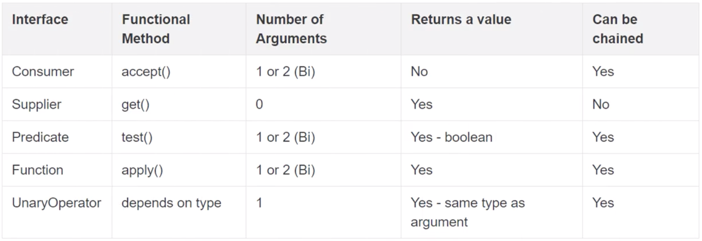
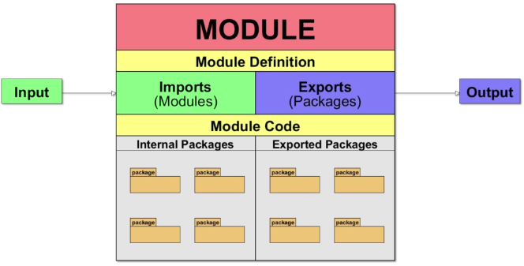
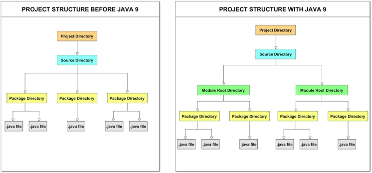
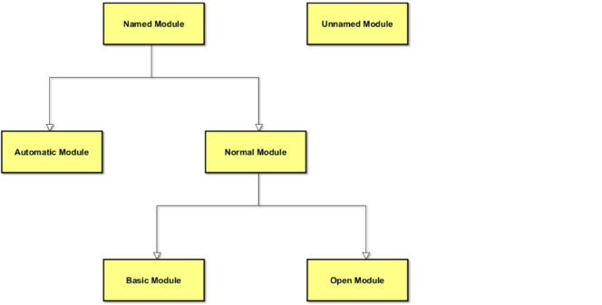
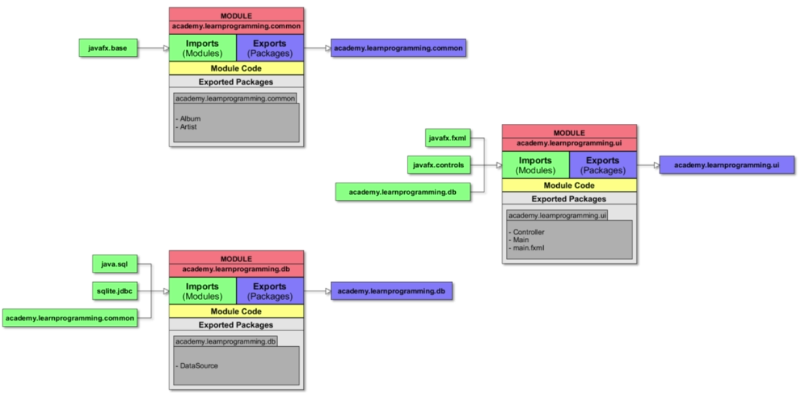
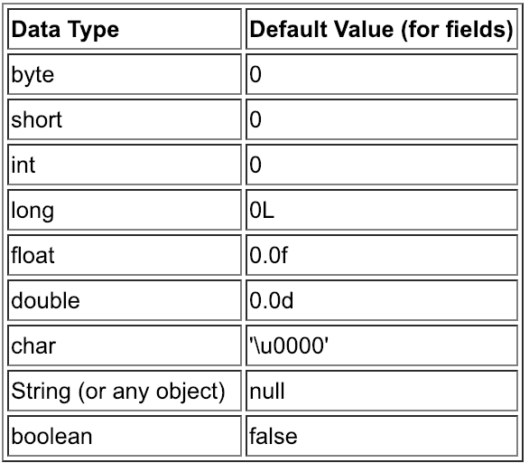

## **Static Methods**
>- **Static methods** are declared using a static modifier
>- **Static methods can't** access instance methods and instance variables directly
>- They are usually used for operations that don't require any data from an instance of the class (from 'this')
>- **Static methods can't** use the **this** keyword
>- Whenever you see method that does not use instance variables that method should be declared as a static method
>- Example - main is a static method and it is called by the JVM when it starts an app

## **Instance Methods**
>- **Instance methods** below to an instance of a class
>- To use an **instance method** we have to instantiate the class first usually by using the new keyword
>- **Instance methods** can access instance methods and variance variables directly
>- **Instance methods** can also access static methods and static var directly

``` java 
cclass Calculator{
    public static void printSum(int a, int b){
        System.out.println("sum= " + (a + b));
    }
    public void printMultiply(int a, int b){
        System.out.println("multiply= " + (a * b));
    }
}

public class Main {
    public static void main(String[] args) {

        // Static methods
        Calculator.printSum(5 ,10); // -> called as ClasName.methodName();
        printHello();               // -> called as methodName(); only if in the same class

        // Instance method
        Calculator cal = new Calculator(); // -> create instance
        cal.printMultiply(3,5);            // -> call instance methods
    }

    public static void printHello() {
        System.out.println("Hello");
    }
}
```
___
## **Static Variables**
>- Declared by using the keyword static
>- Static var aka static member var
>- Every instance of that class shares the same instance var
>- If changes are made all instance will see the effect of change
>- Not used very often but can sometimes be very useful
``` java
class Dog{
    private static String name;
    public Dog(String name) { Dog.name = name; }  // Set static var
    public void printName() { System.out.println("name = " + name); }
}

public class Main {
    public static void main(String[] args) {
        Dog rex = new Dog("rex");
        Dog fluffy = new Dog("fluffy");
        rex.printName();       // -> prints "fluffy"
        fluffy.printName();    // -> prints "fluffy"
    }
}
```

## **Instance Variables**
>- Don't use the keyword static
>- aka files or member fields
>- Instance vars belong to an instance of a class
>- Every instance has it's own copy of an instance var
>- Every instance can have a different value (state)
>- Instance vars represent the state of an instance
``` java
class Dog{
    private String name;
    public Dog(String name) { this.name = name; } // Instanciate instance var
    public void printName() { System.out.println("name = " + name); }
}

public class Main {
    public static void main(String[] args) {
        Dog rex = new Dog("rex");
        Dog fluffy = new Dog("fluffy");
        rex.printName();       // -> prints "rex"
        fluffy.printName();    // -> prints "fluffy"
    }
}
```
___

## **Method Overloading**
>- **Overloading** does not have anything to do with **polymorphism** but java developers often refer to overloading as Compile Time Polymorphism
>- In other words the compiler decided which methods is going to be called based on the method name, return type and argument list.
>- We **can overload static** and **instance** methods
>- Usually **Overloading** happens inside a single class, but a method can also be treated as **overload** usn the subclass of that class
>- That is because a **subclass inherits** one version of the method from the parent class and then the subclass can have another overloaded version of the method
>- Methods will be considered overloaded if both follow the following rules:
>   * Methods must have the same method name
>   * Methods must have different parameters
>- If methods follow the above rules, then they may or may not
>   * Have different return types
>   * Have different access modifiers
>   * Throw different checked and unchecked exception

## **Method Overriding**
>- Method **overriding** means defining a method in a child class that already exists in the parent class with same signature (method name and parameters)
>- Method **overriding** aka as **Runtime Polymorphysim** and **Dynamic Method Dispatch**, becasue the method that is going to be called is decided at runtime by the JVM
>- Methods will be considered **overridden** if we follow these rules:
>   * It must have same name and same arguments
>   * Return type can be a subclass of the return type in the parent class
>   * It can't have a lower access modifier
>   * Example - parent method is protected, then using private in the child is not allowed but using public in the child would be allowed
``` java
class Animal {
    protected void walk(){};
}
class Fist {
    @override
    ~~private~~ public void walk(){}; // -> private won't be allowed but public
}
```
>- Important points 
>   * Only inherited methods can be overriden
>   * Constructors and private methods cannot be overriden
>   * Methods that are final cannot be overriden
>   * A subclass can user super.methodName() to call the superclass version of an overriden method


``` java
public static int sum(int a, int b) {
  retrun a + b;
}

public static int sum(int a, int b, int c) {
  retrun a + b + c;
}

public static int sum(int a, int b, int c, int d) {
  retrun a + b + c + d;
}
```

>- Return type does not differentitate methods
>- Here compiled error due to same method signature
``` java 
private static int calculateScore() {
    System.out.println("No player name, no player score");
    return 0;
}

private static void calculateScore() {
    System.out.println("No player name, no player score");
}
```
___
## **Is a vs Has**
> Inheritance (IS A)
``` java
public class Car extends Vehicle { // -> Car "IS A" vehicle
    ....    
}
```
> Composition (HAS A)
>   * Object within objects
``` java
public class Main{
    public static void main(String[] args) {
        Case myCase = new Case(... Initiliase with correct args);
        Resolution myResolution = new Resolution(... Initiliase with correct args);
        Monitor myMonitor = new Monitor(...., myResolution ,.....)
        
        PC myPC = new PC(myCase, myMonitor); // Initialising with appropriate object
        myPC.getMonitor().draw(100,200,"red"); // Accessing methods of monitor object
        myPC.getTheCase().pressProwerButton(); // Accessing methods of case object
    }
}

public class PC {
    private Case theCase;       // Composition -> PC "HAS A" Case
    private Monitor theMonitor; // Composition -> PC "HAS A" Monitor

    // Constructor
    // Getter and Setters
}

public class Case {
    // Class vars
    // Constructor
    public void pressProwerButton() {
        System.out.println("Power button pressed");
    }
    // Getters and setters
}

public class Monitor {
    // Decalre other class var
    private int size; // Example Class variables 
    private Resolution nativeResolution;  // This is composition => Monitor "HAS A" resolution

    // Constructor
    public static draw(int x, int y, String color) {
        System.out.println("Drawing prixel at " + x + "," + y + " in color " + color);
    }
    // Getters and setters
}

public class Resolution {... usual stuffs ...}
```
___

## **Encapsulation**
> 

___

## **Polymorphism**
> If inherits from a class, JVM will determine which method to use.. Usually the local method but if not available, it will go to the parent.
``` java
public class Movie { .. plot = (): void -> print "No Plot" ..}
public class Jaws extends Movie { .. plot = (): void -> print "Jaws" ..}
public class MazeRunner extends Movie { .. plot = (): void -> print "MazeRunner" ..}
public class StarWars extends Movie { .. plot = (): void -> print "StarWars" ..}
public class Forgetable extends Movie { .. No plot method present ..}
public class Main { 
    psvm = (String[] agrs) -> {
        Movie movie = randomMovie();
        sout(movie.plot()); 
        -> if Forgetable obj was returned -> sout will print "No Plot"
        -> else other obj was returned -> sout will print corresponding class method output
    }
    randomMovie = () -> { 
        Depending on random number generate and 
        return (new Jaws() || new MazeRunner() || new StarWars() || new Forgetable())
    }
}

```

___

## **CONSTANT Value**
> By convention final variable is in all caps
``` java
private static final String INVALID_VALUE_MESSAGE = "Invalid value";
```

## **Switch Statement**
> Since Java 7, we have swtich statement with String
``` java
String month = "January";

switch (month) {
    case "January":
        System.out.println(month);
        break;
    case "June": case "July":
        System.out.println(month);
        break;
    default:
        System.out.println("Not found");
        break;
}
```


## **Minutes to Years and Days Function**
``` java
public static void printYearsAndDays (long minutes){
        if (minutes < 0) {
            System.out.println("Invalid Value");

        } else {

            long minInOneYear = (365 * 24 * 60);
            long minInOneDay = (24 * 60);
            long years = minutes / minInOneYear;
            long days = minutes / minInOneDay;
            long remaingDays = days % 365;

            System.out.println(minutes + " min = " + years + " y and " + remaingDays + " d");
        }
    }
```

## **Leap Year Function**
``` java
public static boolean isLeapYear(int year) {

        if (year < 1 || year > 9999) {
            return false;
        }

        if (((year % 4 == 0) && (year % 100 != 0)) || (year % 400 == 0)) {
            return true;
        } else {
            return false;
        }

}
```


## **Prime Numbers Function**
``` java
public static boolean isPrime(int n){
        if (n == 1){
            return false;
        }

        // Optimise version 1
        for (int i=2; i <= (long) Math.sqrt(n); i++) {
            System.out.println("Looping " + i);
            if (n % i == 0) {
                return false;
            }
        }

        // Optimise version 2
        //for (int i=2; i <= n/2; i++) {
        //    if (n % i == 0) {
        //        return false;
        //    }
        //}

        return true;
}
```

## **Sum digits function**
``` java
public static int sumDigits (int number){

        if (number < 10) {
            return -1;
        }

        int sum = 0;

        while(number > 0){
            // extract least significant digit
            int digit = number % 10;
            sum += digit;

            // drop least significant digit
            number /= 10;

        }

        return sum;

}
```

## **Palindrome function**
``` java
public static boolean isPalindrome(int number){

        int processed = number;
        int reversed = 0;


        while (processed != 0){

            // get least significant number
            int lastDigit = processed % 10;
            reversed = (reversed * 10) + lastDigit;

            processed /= 10;

        }

        if (number == reversed){
            return true;
        } else {
            return false;
        }

}
```

## **Reverse array logic function**
``` java 
public static int[] reverseMine(int[] array){
    int[] reverseArray = new int[array.length];
    for(int i = 0; i< array.length; i++){
        reverseArray[i] = array[array.length-1-i];
    }
    return reverseArray;
}

private static void reverse(int[] array){
    int maxIndex = array.length-1;
    int halfLength = array.length/2;

    for (int i=0; i<halfLength; i++){
        int temp = array[i];
        array[i] = array[maxIndex - i];
        array[maxIndex-i] = temp;
    }
    }
```


## **Sorting & copying arrays using basic loop function**
``` java
public static int[] sortIntegers(int[] array){
    int[] sortedArray = new int[array.length];
    // Copyng an array to another array
    for(int i=0; i<array.length; i++){
        sortedArray[i] = array[i];
    }
    // Alternative would be to use copyOf
    // int[] sortedArray = Arrays.copyOf(array, array.length);

    // Sorting algorithm using basic loop 
    boolean flag = true;
    int temp;

    while(flag){
        flag = false;
        for(int i=0; i<sortedArray.length-1; i++){
            if (sortedArray[i] < sortedArray[i+1]){
                temp = sortedArray[i];
                sortedArray[i] = sortedArray[i+1];
                sortedArray[i+2] = temp;
                flag = true;
            }
        }

    }
    return sortedArray;
}
```

## **Sum first and last digit function**
``` java
public static int sumFirstAndLastDigit (int number){
        if (number < 0){
            return -1;
        }

        int last = number % 10;

        int first = number;
        while (first >= 10) {
            first /= 10;
        }

        return first + last;

}
```


## **Break vs Continue vs Return**
>-  The break statement results in the termination of the loop, it will come out of the loop and stops further iterations. 
>-  The continue statement stops the current execution of the iteration and proceeds to the next iteration. 
>-  The return statement takes you out of the method.

> Break will exit the loop depending on the condition that we are checking
> Continue will bypass the part of code block that is below the continue keyword and continue with the next iteration
``` java
int number = 4;
int finishedNumber = 20;
int sumEven = 0;
int countEven = 0;

while (number <= finishedNumber){

   number++;

   if (!isEvenNumber(number)) continue;

    System.out.println("Even num: " + number);

    sumEven += number;
    countEven++;

    if (countEven >= 5){
        break;
    }

}

System.out.println("Sum even num: " + sumEven);
```

## **Things to review**
>- Encapsulation

## **this vs super**
>- **super** is used to access/call the parent class members (var and methods)
>- **this** is used call the current class members (var and methods)
>- **Note** can use both of them anywhere in a class **except** static areas (static block or a static method). Any attempt to do so will lead to compile_time_error.

## **this() vs super()**
>- Use **this()** to call a constructor from another overloaded constructor in the same class
>- The call to **this()** can be used only in a constructor and must be the first statement in the constructor. It's used with constructor chaining (when one constructor calls another constructor) and helps to reduce duplicated code
>- Only way to call a parent constructor is by calling **super()**
>- Java compiler puts a default call to **super()** if we don't add it, and it is always the no-args **super** which is inserted by compiler (constructor without arguments)
>- Even **abstract classes** hav constructors, although can never instantiate using the new keyword
>- An **super()** is still a **super** class, so its constructors run when someone makes an instance of a concrete subclass
>- **NOTE:** A constructor can have a call to **super()** OR **this()** but never both

## **Good Constructor Example**
> 3rd constructor doing all the work
> Example of constructor chaining
``` java
public Rectangle(){
    this(0,0);
}
public Rectangle(int w, int h){
    this(0,0,w,h);
}
public Rectangle(x,y,w,h){
    this.x = x;
    this.y = xy;
    this.w = w;
    this.z = z;
}
```

## **Constructor**
> TODO - think generate empty constructor when not exist
``` java
public Account(){
    // Calling another constructor - it needs to be the very first line; otherwise won't work
    this("543ss1", 2.5, "Default name", "Default address", "Default phone");
    System.out.println("Empty constructor called");
}

public Account(String number, double balance, String customerName, String customerEmailAddress, String customerPhoneNumber) {
    System.out.println("Account constructor with parameters called");
    this.number = number;
    this.balance = balance;
    this.customerName = customerName;
    this.customerEmailAddress = customerEmailAddress;
    this.customerPhoneNumber = customerPhoneNumber;
}
```
> Account bob = new Account(); -> will give below, because empty constructor will call other constructor first before printing "Empty.."
```
Account constructor with parameters called
Empty constructor called
```
> Don't called setters in constructor
``` java
public Account(String number, double balance, String customerName, String customerEmailAddress, String customerPhoneNumber) {
    System.out.println("Account constructor with parameters called");
    this.number = number; -> good
    setBalance(balance); -> not good; don't do this
    ...
}
```

## **Inheritance**
> Calling super and overriding methods
``` java
public class Animal {
    // Declare Variables here

    // Appropriate constructor here 

    public void eat(){
        System.out.println("Animal.eat() called");
    }

    public void move(int speed){
        System.out.println("Animal.move() called; Animal is moving at " + speed);
    }

    // Getters and setters below
}


public class Dog extends Animal {

    // Declare Variables here

    // Appropriate constructor here 

    private void chew(){
        System.out.println("Dog.chew() called");
    }

    @Override
    public void eat() {
        System.out.println("Dog.chew() called");
        chew();
        super.eat();
    }

    public void walk() {
        System.out.println("Dog.walk() called");
        super.move(5); // -> Force calling parent method
    }
    public void run(){
        System.out.println("Dog.run() called");
        move(10); // -> Find overiding method ? use local method : use parent method 
    }

    @Override
    public void move(int speed) {
        System.out.println("Dog.move() is called");
        moveLegs(speed); 
        super.move(speed); // -> Force calling parent method
    }

    private void moveLegs(int speed) {
        System.out.println("Dog.moveLegs() is called");
    }
}
```
``` java
Animal animal = new Animal("Animal",1,1,5,5);
Dog dog = new Dog("Yorkie",8,20,2,4,1,20, "Long silky");

dog.eat();
dog.walk();
dog.run();

// Prints below
Dog.chew() called 
Dog.chew() called 
Animal.eat() called

Dog.walk() called
Animal.move() called; Animal is moving at 5

Dog.run() called
Dog.move() is called
Dog.moveLegs() is called
Animal.move() called; Animal is moving at 10
```


## **Reference vs Object vs Instance vs Class**
> Analogy of building a house
>- A **class** is a blueprint(plans) for a house, we build many houses as per the plans.
>- Each (new) house you build (instantiate) is an object aka **instance**
>- Each (new) house has an address (physical location). This is known as **reference**
>- You can copy that **reference** as many times as you like but there is sill one house.  You are copying the paper that has address on it not the house itself
>- We can pass **reference** as **parameters** to **constructors** and **methods**
``` java

class House {
    private String color;
    // Constructor House(color)
    // Getter and setters;
}

House blueHouse = new House("blue");
House anotherHouse = blueHouse;

System.out.println(blueHouse.getColor()); // -> blue
System.out.println(anotherHouse.getColor()); // -> blue

anotherHouse.setColor("red");
System.out.println(blueHouse.getColor()); // -> red
System.out.println(anotherHouse.getColor()); // -> red

House greenHouse = new House("green");
anotherHouse = greenHouse;
System.out.println(blueHouse.getColor()); // -> red
System.out.println(greenHouse.getColor()); // -> green
System.out.println(anotherHouse.getColor()); // -> green

```

## **Arrays**
> Needs to be the same type
> Method 1 - Declaring arrays and accessing elements
``` java
int[] myIntVariable = new int[10];
myIntVariable[0] = 50;                  // -> Starting index = 0
System.out.println(myIntVariable[0]);   // -> Print 50
```
> Method 2 - Declaring arrays
``` java
int[] myIntVariable = {1,2,3,4,5,6};     // Declare and initialise
System.out.println(myIntVariable[5]);    // Print 6
```

``` java
char[] srcArray = new char[] { 'K', 'E', 'V', 'I', 'N' };
```

## **Refrence Types vs Value Types**
> (Array and Object) vs Primitives
> Array are reference types (hold an address not the object itself)
> Also applies when passed as method parameter
``` java
....{
int[] myIntArray = new int[5];  // -> Here myIntArray hold a reference to the object int[5] which is stored somewhere else in mem
int[] anotherArray = myIntArray; // -> Here anotherArray hold the reference to the object int[5]
System.out.println("myIntArray = " + Arrays.toString(myIntArray)); // -> [0, 0, 0, 0, 0]
System.out.println("anotherArray = " + Arrays.toString(anotherArray)); // -> [0, 0, 0, 0, 0]
anotherArray[0] = 1;
System.out.println("after change myIntArray = " + Arrays.toString(myIntArray)); // -> [1, 0, 0, 0, 0]
System.out.println("after change anotherArray = " + Arrays.toString(anotherArray)); // -> [1, 0, 0, 0, 0]
modifyArray(myIntArray);
System.out.println("after modify myIntArray = " + Arrays.toString(myIntArray));    // -> [2, 0, 0, 0, 0] 
System.out.println("after modify anotherArray = " + Arrays.toString(anotherArray)); // -> [2, 0, 0, 0, 0]
}...
private static void modifyArray(int[] array){
    array[0] = 2;
    array = new int[] {1,2,3,4,5}; // dereferincing
}
```

## **List and Arraylist**


## **Copying Arraylist**
``` java
private static void processArrayList() {
    ArrayList<String> newArray = new ArrayList<String>();
    newArray.addAll(groceryList.getGroceryList());

    ArrayList<String> nextArray = new ArrayList<String>(groceryList.getGroceryList());

    String[] myArray = new String[groceryList.getGroceryList().size()];
    myArray = groceryList.getGroceryList().toArray(myArray);
}
```

## **Autoboxing vs unboxing**
//TODO -> not required since Java5 -> JVM automatically do it
> ArrayList
``` java
ArrayList<String> stringArrayList = new ArrayList<>();
stringArrayList.add("Tim");
```
> ArrayList cannot be of primitive type
``` java
// Bellow not allowed
// ArrayList<int> intArrayList = new ArrayList<int>();
```
> One workaround is to create a class to store int
``` java
class IntClass{
    private int myValue;

    public IntClass(int myValue) {
        this.myValue = myValue;
    }

    public int getMyValue() {
        return myValue;
    }

    public void setMyValue(int myValue) {
        this.myValue = myValue;
    }
}

psvm = (String[] args){
    ArrayList<IntClass> intClassArrayList = new ArrayList<IntClass>();
    intClassArrayList.add(new IntClass(54));
}
```
> **Long verison -** Better workaround is to use autoboxing and unboxing in java
``` java
Integer integer = new Integer(54);
Double doubleValue = new Double(43d);

ArrayList<Integer> intArrayList = new ArrayList<Integer>();
for(int i=0; i<=10; i++){
    intArrayList.add(Integer.valueOf(i));  // This is autoboxing -> converting primitives to Integer obj/wrapper
}

for(int i=0; i<intArrayList.size(); i++){
    System.out.println(i + " -> " + intArrayList.get(i).intValue());  // This is unboing -> coverting Integer obj/wrapper to primitives
}
```
> **Short verison -** Better workaround is to use autoboxing and unboxing in java
``` java
Integer myIntValue = 56;  // JVM will do - Integer.valueOf(56);
int myInt = myIntValue;   // JVM will do - myInt.intValue();
```


## **List <<inteface>>**
> ArrayList class implements List interface and it is based on an Array data structure

> LinkedList is a doubly-linked list implementation of the List and Deque interfaces
```
An iterator for lists that allows the programmer to traverse the list in either direction, modify the list during iteration, and obtain the iterator's current position in the list. A ListIterator has no current element; its cursor position always lies between the element that would be returned by a call to previous() and the element that would be returned by a call to next(). An iterator for a list of length n has n+1 possible cursor positions, as illustrated by the carets (^) below:
                      Element(0)   Element(1)   Element(2)   ... Element(n-1)
 cursor positions:  ^            ^            ^            ^                  ^
```
>- A doubly-linked chain: elements are stored in nodes, with linking back and forth between themselves,
>- Mutable: objects can be added and/or removed,
>- Not Thread-safe: LinkedList is not suitable for concurrent access.


## **Inteface**
> Interface is just the declaration of methods of a Class, it's not the implementation
> In an interface, we define what kind of operation an object can perform.  These operations are defined by the classes that implement the interface
> Interfaces form a contract between the class and the outside world, and this contract is enforced at build time by the compiler
> You cannot instantiate them, and they may contain a mix of methods declared with or without an implementation.  All methods in the interfaces are automatically public and abstract
> By introducing interfaces into your program, you are really introducing points of variation at which you can plug in different implementations for that interface.  An interfaces primary purposes is abstraction, decoupling the "what" from the "how"
> **NOTE** 
>- Since Java 8 interfaces can contain default methods.  In other words methods with implementation.  The keyword default is used (mostly for backwards compatibility), and static methods as well before Java 8 that was not possible.
>- Since Java 9 interfaces can also contain private methods (commonly used when two default methods in an Interface share commo n code
``` java
public interface Test {
    void doSomething();
    default void defaultMethod(){
        System.out.printf("default method allow since Java 8");
    };

    private void shareByDefaultMethod(){
        System.out.printf("Java 9 - private method allowed, usually used for common methods of default methods");
    }
}
```
> **When to use an Interface** 
>- You expect that unrelated calsses will implement your interface. E.g the interfaces Comparable and Cloneable are implemented by many unrelated classes.
>- You want to specify the behaviour of a particular data type, but you are not concerned about who implements its behaviour
>- You want to sperate different behaviour
>- The collections API is an excellent example, we have the List interface and implementation ArrayList and LinkedList
>- The JDBC API is another excellent example.  It exist of almost only interfaces.  The concrete implementations are provided as "JDBC drivers".  This enables you to write all the JDBC code independent of the DB vendor.

> Interface is a pure abstract class
``` java
// What we declare
public interface Moveable{
    int AVG_SPEED = 40;  // -> always need to be declared; otherwise error
    void move()
}

// What the compiler sees
public interface Moveable{ // TODO -> think is changes it to an abstract class
    public static final int AVG_SPEED = 40; // -> automatically adds public static final
    public abstract void move();  // automatically adds public abstract
}
```
>- Methods inside interface must not be static, final, native or stictfp
>- All variables declared inside interface are implicitly public static final variables(constants)
>- All methods declared inside Java Interfaces are implicitly public and abstract, even if you don't use public or abstract keyword
>- Interface can extend one or more other interface
>- Interface cannot implement a class (including interfaces which are abstract classesby nature)
>- Interface can be nested inside another interface
>- Method signature does note require 'public/private/protected ..'
>- Implementor need to implement/override all methods in interface 


``` java
interface ITelephone {...}
class DeskPhone implements ITelephone {...}
class MobilePhone implements ITelephone {..}
psvm = () => {
    ITelephone timsPhone;  // Generics - Good practice to declare interface and the initializing on the right

    timsPhone = new DeskPhone(123456);
    timsPhone.powerOn();
    timsPhone.callPhone(123456);
    timsPhone.answer();

    timsPhone = new MobilePhone(99999);  // Possible because of 'ITelephone timsPhone;'; would be possible if it was declared 'DeskPhone timsPhone;'
    timsPhone.powerOn();
    timsPhone.callPhone(99999);
    timsPhone.answer();
}
```
``` java
interface ITelephone {
    List<String> returnContacts();
    void printContracts();  // -> do not have {} - which means implementation
}
class DeskPhone implements ITelephone {
    public List<String> returnContacts(){
        List<String> values = new LinkedList<>();   // -> Specify implementation of List
        values.add(0, this.name);
        return values;
    }
    public String getPhoneNumber() {return this.phoneNumber}
    public void printContracts() {....};
}
class MobilePhone implements ITelephone {
    public List<String> returnContacts(){
        List<String> values = new ArrayList<>();   // -> Specify implementation of List
        values.add(0, this.name);
        return values;
    }
    public String getPhoneNumber() {return this.phoneNumber}
    public void printContracts() {....};
}
public class Main {
    psvm = () => {
        DeskPhone timsPhone = new DeskPhone("123456");
        MobilePhone tedsPhone = new MobilePhone("99999");  
        ITelephone interPhone = new MobilePhone("99999");  

        loadObject(timsPhone); // -> going to work because of generic interface as parameter
        loadObject(tedsPhone); // -> going to work because of generic interface as parameter

        timsPhone.getPhoneNumber() // -> will works
        interPhone.getPhoneNumber() // -> will fail as getPhoneNumber() does not exist in interface 
        ((MobilePhone) interPhone).getPhoneNumber() // -> will not work after casting
    }

    public static void loadObject (ITelephone objectLoad){  // -> Generic parameter for object
        objectLoad.printContracts();
    }
}
```


## **Inner Class**
> Nested classes are divided into two categories: static and non-static.
>- Nested classes that are declared static are called **static nested classes**. 
>- Non-static nested classes are called **inner classes**.

``` java
public class ShadowTest {

    public int x = 0;

    class FirstLevel {

        public int x = 1;

        void methodInFirstLevel(int x) {
            System.out.println("x = " + x);
            System.out.println("this.x = " + this.x);
            System.out.println("ShadowTest.this.x = " + ShadowTest.this.x); // Applicable to methods too ShadowTest.this.getMethod();
        }
    }

    public static void main(String... args) {
        ShadowTest st = new ShadowTest();
        ShadowTest.FirstLevel fl = st.new FirstLevel();
        fl.methodInFirstLevel(23);
    }
}
```
```
x = 23
this.x = 1
ShadowTest.this.x = 0
```

## **Inner Classes - (1) Local vs (2) Anonymous**
> There are two additional types of inner classes. 
>- You can declare an inner class within the body of a method. These classes are known as local classes. 
>- You can also declare an inner class within the body of a method without naming the class. These classes are known as anonymous classes.

> **Local Classes**
> Local classes are classes that are defined in a block, which is a group of zero or more statements between balanced braces. You typically find local classes defined in the body of a method.
``` java
public class LocalClassExample {

    static String regularExpression = "[^0-9]";

    public static void validatePhoneNumber(String phoneNumber1, String phoneNumber2) {

        final int numberLength = 10;

        // Valid in JDK 8 and later:
        // int numberLength = 10;

        class PhoneNumber {
        
            String formattedPhoneNumber = null;

            PhoneNumber(String phoneNumber) {
                // numberLength = 7;
                String currentNumber = phoneNumber.replaceAll(regularExpression, "");
                if (currentNumber.length() == numberLength)
                    formattedPhoneNumber = currentNumber;
                else
                    formattedPhoneNumber = null;
            }

            public String getNumber() {
                return formattedPhoneNumber;
            }

            // Valid in JDK 8 and later:

            //public void printOriginalNumbers() {
            //    System.out.println("Original numbers are " + phoneNumber1 +
            //        " and " + phoneNumber2);
            //}
        }

        PhoneNumber myNumber1 = new PhoneNumber(phoneNumber1);
        PhoneNumber myNumber2 = new PhoneNumber(phoneNumber2);

        // Valid in JDK 8 and later:
        // myNumber1.printOriginalNumbers();

        if (myNumber1.getNumber() == null)
            System.out.println("First number is invalid");
        else
            System.out.println("First number is " + myNumber1.getNumber());
        if (myNumber2.getNumber() == null)
            System.out.println("Second number is invalid");
        else
            System.out.println("Second number is " + myNumber2.getNumber());

    }

    public static void main(String... args) {
        validatePhoneNumber("123-456-7890", "456-7890");
    }
}
```

> You cannot declare static initializers or member interfaces in a local class. The following code excerpt does not compile because the method EnglishGoodbye.sayGoodbye is declared static. The compiler generates an error similar to "modifier 'static' is only allowed in constant variable declaration" when it encounters this method definition:
> https://docs.oracle.com/javase/tutorial/java/javaOO/localclasses.html
``` java
 public void greetInEnglish() {
        interface HelloThere { // -> compile error
            void greet();
        }
        class EnglishHelloThere implements HelloThere {
            public void greet() {
                System.out.println("Hello ");
            }
        }
        HelloThere myGreeting = new EnglishHelloThere();
        myGreeting.greet();
    }
```


> Example for inner interface
``` java
public class Button {
    private String title;
    private OnClickListener onClickListener;

    public Button(String title) {
        this.title = title;
    }

    public String getTitle() {
        return title;
    }

    public void setOnClickListener(OnClickListener onClickListener){
        this.onClickListener = onClickListener;
    }

    public void onClick(){
        this.onClickListener.onClick(this.title);  
    }

    // Inner interface 
    public interface OnClickListener{
        void onClick(String title);
    }
}

public class Main {
    private static Scanner scanner = new Scanner(System.in);
    private static Button btnPRint = new Button("Print");

    public static void main(String[] args) {

        // Another inner class
        class ClickListener implements Button.OnClickListener{  // Implementing inner class interface 
            public ClickListener() {
                System.out.println("I've been attached");
            }

            // Forced to implement inner interface methods
            @Override
            public void onClick(String title) {
                System.out.println(title + " was clicked");
            }
        }

        btnPRint.setOnClickListener(new ClickListener());  // Passing new object
        listen();
    }

    private static void listen(){
        boolean quit = false;
        while (!quit){
            int choice = scanner.nextInt();
            scanner.nextLine();
            switch (choice){
                case 0:
                    quit = true;
                    break;
                case 1:
                    btnPRint.onClick();
            }
        }
    }
}
```

> **Anonymous class**
>- Extends Class
``` java
// Copy & paste in *.java file -> it will run first main method.. Comment to see others..
class HelloWorld { // superclass
    void displayMessage() {
        System.out.println("Hello World");
    }
}


class Tester {
    public static void main(String args[]){
        HelloWorld hw = new HelloWorld() {
            void displayMessage() {
                System.out.println("Hello Earth");
            }
        };
        hw.displayMessage();
    }
}

class Tester2 {
    public static void main(String args[]){
        HelloWorld hw = new HelloWorld() {
            @Override
            void displayMessage() {
                System.out.println("Hello Earth");
            }
            void displayError() {
                System.out.println("Don\'t create new methods in an anonymous inner class.");
            }
        };
        hw.displayMessage();
        //hw.displayError();
    }
}

class Tester3 {
    public static void main(String args[]){
        reallyStrange(new HelloWorld());  // -> Prints "Hello World" -> use original method
        reallyStrange(new HelloWorld(){   // -> Prints "Really strange stuff!" -> use overridden method
            @Override
            void displayMessage(){
                System.out.println("Really strange stuff!");
            }
        });
    }

    static void reallyStrange(HelloWorld hw){
        hw.displayMessage();
    }
}
```

>- Implements interface 
``` java
public class HelloWorldAnonymousClasses {

    interface HelloWorld {
        public void greet();
        public void greetSomeone(String someone);
    }

    public void sayHello() {

        class EnglishGreeting implements HelloWorld {
            String name = "world";
            public void greet() {
                greetSomeone("world");
            }
            public void greetSomeone(String someone) {
                name = someone;
                System.out.println("Hello " + name);
            }
        }

        HelloWorld englishGreeting = new EnglishGreeting();

        HelloWorld frenchGreeting = new HelloWorld() {
            String name = "tout le monde";
            public void greet() {
                greetSomeone("tout le monde");
            }
            public void greetSomeone(String someone) {
                name = someone;
                System.out.println("Salut " + name);
            }
        };

        HelloWorld spanishGreeting = new HelloWorld() {
            String name = "mundo";
            public void greet() {
                greetSomeone("mundo");
            }
            public void greetSomeone(String someone) {
                name = someone;
                System.out.println("Hola, " + name);
            }
        };
        englishGreeting.greet();             // -> Prints "Hello World"
        frenchGreeting.greetSomeone("Fred"); // -> Prints "Salut Fred"
        spanishGreeting.greet();             // -> PRints "Hola, mundo"
    }

    public static void main(String... args) {
        HelloWorldAnonymousClasses myApp = new HelloWorldAnonymousClasses();
        myApp.sayHello();
    }
}
```


> **Abstract class**
>- Cannot instantiate an abstract class
>- Abstract classes are extended not implemented
>- Decision based "Is A" vs "Has A" relationship
> Abstract classes are similar to Interfaces. You cannot instantiate them, and they may contain a mix of methods declared with or without an implementation
> However, with Abstract classes, you can decalre fields that not static and final, and define public, protected, private concrete methods
> An Abstract class can extend only one parent class but it can implement multiple interfaces
> When an Abstract class is subclassed, the subclass usually provides implementations for all of the abstract methods in it parent class
> However, if it does not, then the subclass must also be declared abstract
> Use an abstract class when
>- You want to share code among several closely related classes (Animal - with fields name. name...)
>- You expect classes that extend your abstract class to have many commond methods or fields or required access modifiers other than public (protected, private)
>- You want to declare non static or non fial fields, this enables you to define methods thatn can access and modify the state of an object (getName, setName).
>- When you have a requirement for your base class to provide a default implementation of certain methods but other methods should be open to being overridden by child classes
>- **Summary:** The purpose of abstract class is to provide a common definiton of a base class that multiple derived calsses can share

``` java
public abstract class Animal {

    private String name;

    public Animal(String name) {
        this.name = name;
    }

    public abstract void eat();
    public abstract void breathe();

    public String getName() {
        return name;
    }
}

public interface CanFly {
    void fly();
    //void Test();  // -> If this was set see comments starting with *
}

public abstract class Bird extends Animal implements CanFly {

    public Bird(String name) {
        super(name);
    }

    @Override
    public void eat() {
        System.out.println(this.getName() + " is pecking");
    }

    @Override
    public void breathe() {
        System.out.println("Breathe in, breathe out, repeat");
    }

    @Override
    public void fly() {
        System.out.println(getName() + " is flapping its wing");
    }

    //@Override
    //public void Test() { }  -> * Not required to implement because it's an abstract class
}


public class Penguin extends Bird {

    public Penguin(String name) {
        super(name);
    }

    @Override
    public void fly() {     // -> Can be overridden
        super.fly();
        System.out.println("I'm not good at this");
    }

//    @Override
//    public void Test() { }  -> * this will need to be implemented if not already done so in inherited abstract class
}


public class Parrot extends Bird {

    public Parrot(String name) {
        super(name);
    }

//    @Override
//    public void fly() { super.fly(); }  -> Not required as already implemented in abstract class

//    @Override
//    public void Test() { }  -> * this will need to be implemented if not already done so in inherited abstract class
}

public class Main {
    public static void main(String[] args) {
        Dog dog = new Dog("Yorkie");
        dog.eat();       // -> Yorkie is eating
        dog.breathe();   // -> Breathe in, breathe out, repeat

        Parrot parrot = new Parrot("Australian Parrot");
        parrot.eat();     // -> Australian Parrot is pecking
        parrot.breathe(); // -> Breathe in, breathe out, repeat
        parrot.fly();     // -> Australian Parrot is flapping its wing

        Penguin penguin = new Penguin("Emperor");
        penguin.fly();    // -> Emperor is flapping its win \n I'm not good at this

    }
}
```

## **Abstract Classes**
> //TODO -> review abstract classes challenge


## **Generics**
> T can extend only one class(first in the list) and add multiple interfaces
``` java
public class Team <T extends Player & Coach & Manager {  // -> Player is a class (needs to be first); Coach & Manager are interfaces
}
```
> //TODO - More to research e.g wildcards <?>

## **Java Naming Convention**
> Things you will name in java are:
>- Packages
>- * Always lower case
>- * Package names should be unique
>- * Use your internet domain name, reversed, as a prefix for the package name
>- * Replace invalid characters (i.e -) in domain name with an underscore
>- * Domain name components starting with a number should instead start with an underscore_
>- * Domain name components that are java keywords should have the component start with an underscore_
>- * E.g Switch.supplier.com -> com.supplier._switch
>- * E.g 1world.com -> com._1world
>- * E.g Experts-exchange.com -> com.experts_exchange
>- Classes
>- * CamelCase
>- * Class names should be nouns (they reperesent things)
>- * Should start with a capital letter
>- * Each word in the name should also start with a capital (e.g LinkedList)
>- Interfaces
>- * Capitalized like class names (CamelCase)
>- * Consider what objects implementing the interface will become of what they will be able to do
>- Methods
>- * mixedCase
>- * Often verbs
>- * Reflect the function performed or the result returned
>- Contants
>- * All UPPER_CASE
>- * Seperate words with underscore_
>- * Declared using the final keyword
>- * E.g static final int MAX_INT
>- * E.g static final short SEVERITY_ERRO
>- * E.g static final double P1 = 3.141592653
>- Variables
>- * mixedCase
>- * Meaningful and indicative
>- * Start with lower case leter
>- * Do not use underscores_
>- Type parameters (generics)
>- * Single character, capital letters
>- * E.g E - element
>- * E.g K - Key
>- * E.g T - Type
>- * E.g V - Value
>- * E.g S, U, V - 2nd, 3rd, 4th types


## **Packages**
> 
``` java
import javafx.scene.Node;
import org.w3c.dom.Node; // Compile error - conflict with first import

public class App
{
    public static void main( String[] args )
    {
        Node node = null;
        org.w3c.dom.Node anotherNode = null;
    }
}

// If need both, don't import, refer to them specifically
public class App
{
    public static void main( String[] args ) {
        javafx.scene.Node node = null;
        org.w3c.dom.Node anotherNode = null;
    }
}
```

## **Scope**
``` java
public class ScopeCheck {
    public int publicVar = 0;
    private int privateVar = 1;

    public ScopeCheck() {
        System.out.println("ScopeCheck created, publicVar = " + publicVar + "; privateVar = " + privateVar);
    }

    public int getPrivateVar() {
        return privateVar;
    }

    public void timesTwo(){
        int privateVar = 2; 
        for (int i=0; i<10 ;i++){
            System.out.println(i + " times two is " + (i * privateVar));  // Check if variable exist in scope, otherwise, move to member var
            System.out.println(i + " this.privateVar " + (i * this.privateVar)); // Specifically refering to class variable
        }
    }
}
```

## **Access Modifiers**
> Top Level
>- Only classes, interfaces and enums can exist at the top level, everything else must be included within one of these
>- * **public:** the object is visible to all classes everywhere, whether they are in the same package or have imported the package containing the public class
``` java
public class Main{}
public interface Accessible{}
public enum EnumTest {}
```
>- * **package-private:** the object is only available within its own package (and is visible to every class within the same package).  Package-private is specified by not specifying i.e it is the default if you do not specify public.  There is not a "package-private" keyword
``` java
class Main{}
interface Accessible{}
enum EnumTest {}
```

> Member level
>- * **public:** at the member level, public has the same meaning as at top level.  A public class member(of field) and public method can be accessed from any other class anywhere, even in a different package
>- * **package-private:** this also has the same meaning as it does at the top level.  An object with no access modifier is visible to every class within the same package (but not to class in external packages)
>- * **private:** the object is only visible within the class it is declared.  It is not visible anywhere else (including in subclasses of its class).
>- * **protected:** the object is visible anywhere in its own package (like package-private) but also in subclasses even if they are in another package

``` java
interface Accessible {          // -> package-private
    int SOME_CONTSTANT = 100;   // -> public static final
    public void methodA();      // -> public abstract
    void methodB();             // -> public abstract
    boolean methodC();          // -> public abstract
}
```

## **Static**
> Can be accessed by calling ClassName.Method() or ClassName.Variable;
> Static methods **cannot** access none static methods and variables;
> Non-static methods **can** access static methods and variables;

## **Final**
> On class - cannot be subclassed i.e cannot be extended
> On constructor - cannot be instantiated
> On methods - cannot be overridden
> On class variables - needs to be instantiated before constructor is finished instantiating

``` java
public class SIBTest {
    public static final String owner;

    static {
        owner = "tim";
        System.out.println("SIBTest static initialisation block called");
    }

    public SIBTest() {
        System.out.println("SIB constructor called");
    }

    static {
        System.out.println("2nd initialisation block called");
    }

    public void someMethod(){
        System.out.println("someMethod called");
    }
}

public static void main(String[] args) {
    System.out.println("Main method called");
    SIBTest test = new SIBTest();
    test.someMethod();
    System.out.println("Owner is " + SIBTest.owner);
}
```
> Output
```
Main method called
SIBTest static initialisation block called  // -> All static block called in sequence
2nd initialisation block called // -> All static block called in sequence
SIB constructor called          // -> After all static block instantiated -> constructor is called
someMethod called
Owner is tim
```


## **Java Collections**


The following list describes the core collection interfaces:

> **Collection** — the root of the collection hierarchy. A collection represents a group of objects known as its elements. The Collection interface is the least common denominator that all collections implement and is used to pass collections around and to manipulate them when maximum generality is desired. Some types of collections allow duplicate elements, and others do not. Some are ordered and others are unordered. The Java platform doesn't provide any direct implementations of this interface but provides implementations of more specific subinterfaces, such as Set and List. Also see The Collection Interface section.
> **Set** — a collection that cannot contain duplicate elements. This interface models the mathematical set abstraction and is used to represent sets, such as the cards comprising a poker hand, the courses making up a student's schedule, or the processes running on a machine. See also The Set Interface section.
> **List** — an ordered collection (sometimes called a sequence). Lists can contain duplicate elements. The user of a List generally has precise control over where in the list each element is inserted and can access elements by their integer index (position). If you've used Vector, you're familiar with the general flavor of List. Also see The List Interface section.
> **Queue** — a collection used to hold multiple elements prior to processing. Besides basic Collection operations, a Queue provides additional insertion, extraction, and inspection operations.
Queues typically, but do not necessarily, order elements in a FIFO (first-in, first-out) manner. Among the exceptions are priority queues, which order elements according to a supplied comparator or the elements' natural ordering. Whatever the ordering used, the head of the queue is the element that would be removed by a call to remove or poll. In a FIFO queue, all new elements are inserted at the tail of the queue. Other kinds of queues may use different placement rules. Every Queue implementation must specify its ordering properties. Also see The Queue Interface section.

> **Deque** — a collection used to hold multiple elements prior to processing. Besides basic Collection operations, a Deque provides additional insertion, extraction, and inspection operations.
Deques can be used both as FIFO (first-in, first-out) and LIFO (last-in, first-out). In a deque all new elements can be inserted, retrieved and removed at both ends. Also see The Deque Interface section.

> **Map** — an object that maps keys to values. A Map cannot contain duplicate keys; each key can map to at most one value. If you've used Hashtable, you're already familiar with the basics of Map. Also see The Map Interface section.

The last two core collection interfaces are merely sorted versions of Set and Map:
> **SortedSet** — a Set that maintains its elements in ascending order. Several additional operations are provided to take advantage of the ordering. Sorted sets are used for naturally ordered sets, such as word lists and membership rolls. Also see The SortedSet Interface section.
> **SortedMap** — a Map that maintains its mappings in ascending key order. This is the Map analog of SortedSet. Sorted maps are used for naturally ordered collections of key/value pairs, such as dictionaries and telephone directories. Also see The SortedMap Interface section.

## **Binay Search**
``` java
public boolean reserveSeat(String seatNumber) {
//====================================================
//  Binary search from java source code - modified
//====================================================
    int low = 0;
    int high = seats.size()-1;

    while (low <= high) {
        System.out.print(".");
        int mid = (low + high) / 2;
        Seat midVal = seats.get(mid);
        int cmp = midVal.getSeatNumber().compareTo(seatNumber);

        if (cmp < 0) {
            low = mid + 1;
        } else if (cmp > 0) {
            high = mid - 1;
        } else {
            return seats.get(mid).reserve();
        }
    }
    System.out.println("There is no seat " + seatNumber);
    return false;
//====================================================
//  Accessing binary search from collections - Most efficient
//====================================================
    // Seat requestedSeat = new Seat(seatNumber);
    // int foundSeat = Collections.binarySearch(seats, requestedSeat, null);
    // if (foundSeat >= 0){
    //     return seats.get(foundSeat).reserve();
    // } else {
    //     System.out.println("There is not seat " + seatNumber);
    //     return false;
    // }
}
```


## **Shallow vs Deep Copy**
> Shallow copy means you have two e.g ArrayList with the same objects as elements.
> Change one ArrayList (e.g add, remove, reverse) will not affect the other ArrayList.
> However, mutating the variables in the element/obj themselves, will be reflected in both ArrayList
``` java
public class Main {
    public static void main(String[] args) {
        Theatre theatre = new Theatre("Olympia", 8,12);
        //theatre.getSeats();

//        if(theatre.reserveSeat("H11")){
//            System.out.println("Please pay");
//        } else {
//            System.out.println("Sorry seat is taken");
//        }
//
//        if(theatre.reserveSeat("H11")){
//            System.out.println("Please pay");
//        } else {
//            System.out.println("Sorry seat is taken");
//        }

        // Shallow copy - arraylist have the same shared objects - pointing to same obj
        List<Theatre.Seat> seatCopy = new ArrayList<>(theatre.seats);
        printList(seatCopy);
        seatCopy.get(1).reserve();
        if(theatre.reserveSeat("A02")){
            System.out.println("Please pay for seat");
        } else {
            System.out.println("Seat already reserved");
        }

//        Collections.reverse(seatCopy);
//        System.out.println("Printing seatCopy");
//        printList(seatCopy);
//        System.out.println("Printing theatre.seat");
//        printList(theatre.seats);


        Collections.shuffle(seatCopy);  // Shuffle the arraylist
        System.out.println("Printing seatCopy");
        printList(seatCopy);            // Print IN shuffle order
        System.out.println("Printing theatre.seat");
        printList(theatre.seats);       // Print order entered

        Theatre.Seat minSeat = Collections.min(seatCopy);
        Theatre.Seat maxSeat = Collections.max(seatCopy);
        System.out.println("Min seat number is " + minSeat.getSeatNumber());  // Use compareTo method to calc - does not need to be sorted first
        System.out.println("Max seat number is " + maxSeat.getSeatNumber());  // Use compareTo method to calc - does not need to be sorted first

        sortList(seatCopy);
        System.out.println("Printing sorted seatcopy");
        printList(seatCopy);
        
        // Try to deep copy but fail at runtime - because below code only set the size
        // It actually needs to have the object initialised (empty of not) in the list
        // List<Theatre.Seat> newList = new ArrayList<>(theatre.seats.size());
        // Collections.copy(newList, theatre.seats);
    }

    public static void printList(List<Theatre.Seat> list){
        for (Theatre.Seat seat : list){
            System.out.print(" " + seat.getSeatNumber());
        }
        System.out.println();
        System.out.println("======================================================");
    }

    // Inefficient sort algo - use build in version
    public static void sortList(List<? extends Theatre.Seat> list){
        for (int i=0; i<list.size()-1;i++){
            for (int j=i+1; j<list.size();j++){
                if(list.get(i).compareTo(list.get(j)) > 0){
                    Collections.swap(list, i, j);
                }
            }
        }
    }
}
      
```
``` java

public class Theatre {
    private final String theatreName;
    public List<Seat> seats = new ArrayList<>();

    public Theatre(String theatreName, int numRows, int seatsPerRow) {
        this.theatreName = theatreName;
        int lastRow = 'A' + (numRows - 1);
        for (char row = 'A'; row <= lastRow; row++) {
            for (int seatNum = 1; seatNum <= seatsPerRow; seatNum++) {
                Seat seat = new Seat(row + String.format("%02d", seatNum));
                seats.add(seat);
            }
        }
    }

    public String getTheatreName() {
        return theatreName;
    }

    public boolean reserveSeat(String seatNumber) {
//====================================================
//  Binary search from java source code - modified
//====================================================
        int low = 0;
        int high = seats.size()-1;

        while (low <= high) {
            System.out.print(".");
            int mid = (low + high) / 2;
            Seat midVal = seats.get(mid);
            int cmp = midVal.getSeatNumber().compareTo(seatNumber);

            if (cmp < 0) {
                low = mid + 1;
            } else if (cmp > 0) {
                high = mid - 1;
            } else {
                return seats.get(mid).reserve();
            }
        }
        System.out.println("There is no seat " + seatNumber);
        return false;
//====================================================
//  Accessing binary search from collections - Most efficient
//====================================================
//        Seat requestedSeat = new Seat(seatNumber);
//        int foundSeat = Collections.binarySearch(seats, requestedSeat, null);
//        if (foundSeat >= 0){
//            return seats.get(foundSeat).reserve();
//        } else {
//            System.out.println("There is not seat " + seatNumber);
//            return false;
//        }

//====================================================
//  Inefficient basic traversal
//====================================================
//        for (Seat seat : seats) {
//            System.out.print(".");
//            if (seat.getSeatNumber().equals(seatNumber)) {
//                requestedSeat = seat;
//                break;
//            }
//        }

//        if (requestedSeat == null) {
//            System.out.println("There is not seat " + seatNumber);
//            return false;
//        }
//
//        return requestedSeat.reserve();
    }

    // for testing
    public void getSeats() {
        for (Seat seat : seats) {
            System.out.println(seat.getSeatNumber());
        }
    }

    // For testing purposes - set to public - usually set to private
    public class Seat implements Comparable<Seat>{
        private final String seatNumber;
        private boolean reserved = false;

        public Seat(String seatNumber) {
            this.seatNumber = seatNumber;
        }

        @Override
        public int compareTo(Seat seat) {
            return this.seatNumber.compareToIgnoreCase(seat.getSeatNumber());
        }

        public boolean reserve(){
            if (!this.reserved){
                this.reserved = true;
                System.out.println("Seat " + seatNumber + " reserved");
                return true;
            } else {
                return false;
            }
        }

        public boolean cancel(){
            if(this.reserved){
                this.reserved = false;
                System.out.println("Reservation of seat " + seatNumber + " cancelled");
                return true;
            } else {
                return false;
            }

        }

        public String getSeatNumber(){
            return seatNumber;
        }

    }
}
```


## **Comparable vs Comparator**
> The Comparable interface is a good choice when used for defining the default ordering or, in other words, if it’s the main way of comparing objects.

> Then, we must ask ourselves why use a Comparator if we already have Comparable?

> There are several reasons why:
>* Sometimes, we can’t modify the source code of the class whose objects we want to sort, thus making the use of Comparable impossible
>* Using Comparators allows us to avoid adding additional code to our domain classes
>* We can define multiple different comparison strategies which isn’t possible when using Comparable

> **Comparable** - just need to implement it and override the compareTo method
``` java
public class xxx implements Comparable<xxx>  {
    @Override
    public int compareTo(Seat seat) {
        return this.seatNumber.compareToIgnoreCase(seat.getSeatNumber());
    }
}
```

> **Comparator** using anonymous class
``` java
// Anonymous inner class - Implementing interface
static final Comparator<Seat> PRICE_ORDER = new Comparator<Seat>() {
    @Override
    public int compare(Seat seat1, Seat seat2) {
        if(seat1.getPrice() < seat2.getPrice()){  // Have issues = if same price, doesn't mean it is the same object, need to do some further if statement to match the some kind of primary keys on the object
            return -1;
        } else if (seat1.getPrice() > seat2.getPrice()){
            return 1;
        } else {
            return 0;
        }
    }
};

List<Theatre.Seat> priceSeat = new ArrayList<>(theatre.getSeats());
priceSeat.add(theatre.new Seat("B00", 13.00));
priceSeat.add(theatre.new Seat("A00", 13.00));
Collections.sort(priceSeat, Theatre.PRICE_ORDER);
printList(priceSeat);
```

> **Comparator** using lambda
``` java
// Comparator.comparing static function accepts a sort key Function and returns a Comparator for the type which contains the sort key;
static <T,U extends Comparable<? super U>> Comparator<T> comparing(Function<? super T,? extends U> keyExtractor)

// Initialising comparator
Comparator<Player> byRanking = Comparator.comparing(Player::getRanking);
Comparator<Player> byAge = Comparator.comparing(Player::getAge);

// Using it
Array.sort(playerList, byRanking);
Array.sort(playerList, byAge);

// -> Specific comparison
Comparator<Player> byRanking = (Player player1, Player player2) -> player1.getRanking() - player2.getRanking();
```
https://www.baeldung.com/java-8-comparator-comparing


## **Map**
Set - add dupes - does nothing
Map - do not add dupes - but overrides
``` java
Map<String, String> languages = new HashMap<>();
// Prints null as there are no dupes
System.out.println(languages.put("Java", "a compiled high level, object-oriented, platform independent language"));
System.out.println(languages.put("BASIC", "Beginners All Purposes Symbolic Instruction Code"));
System.out.println(languages.put("Lisp", "Therein lies madness"));
// Since there are dupes it will print value of overriden key - " compiled high level, object-oriented, platform independent language"
System.out.println(languages.put("Java", "test"));
```
> Map - use containsKey() method - to check keys
``` java
if(languages.containsKey("Java")) {
    System.out.println("Java is already in the map");
} else {
    languages.put("Java", "this course is about Java");
}
```
> Map - use putIfAbsent() method - prevent concurrency issues
> Map - printout all keys
``` java
for(String key: languages.keySet()) {
    System.out.println(key + " : " + languages.get(key));
}
```
> Map - use remove(key) method -> returns null if not exist or (value) if successful
> Map - use remove(key, value) method -> returns true/false
> Map - use replace(key, newValue) -> returns previous value if successful otherwise (e.g if key does not exist) returns null
> Map - use replace(key, oldValue, newValue)
>- returns false if oldValue is not exactly likely in map
>- returns true if replace was successful


## **String split() method**
> 
``` java
String[] road = "You are standing at the end of a road before a small brick building".split(" ");
for (String i : road) {
    System.out.println(i);
}

System.out.println("==================================");

String[] building = "You are inside a building, a well house for a small spring".split(", ");
for (String i : building) {
    System.out.println(i);
}
```
> Output
```
You
are
.....
brick
building
==================================
You are inside a building
a well house for a small spring
```


## **Immutable Classes**
https://docs.oracle.com/javase/tutorial/essential/concurrency/imstrat.html

## **Sets & HashSet**
> List - is an ordered collection of items that can contain duplicates
> Sets
>- used less often than list and map, but can still be usedful
>- has no defined ordering number one 
>- cannot contains dupes
>- implementation are the hastset and the treeset

> Sets - don't take dupes (only first one added), unordered list
> Hastset need to overwrite equals() and hashCode() method - use the one from the String class... because by default newly created objects are different instances.  There need to let hashset know the primary key being used
> Potential issues - thoughts required to handle sub classes.. Where the equals() and hashcode() need to be.. Do we need to implement final...
``` java
@Override // To guarantee that we are overriding the equals method use the @ notation
public boolean equals(Object obj) {
    if(this == obj) {
        return true;
    }

    // Check if object have the same class - will exclude extended class
    System.out.println("obj.getClass() is " + obj.getClass());
    System.out.println("this.getClass() is " + this.getClass());
    if ((obj == null) || (obj.getClass() != this.getClass())) {
        return false;
    }

    String objName = ((HeavenlyBody) obj).getName();
    return this.name.equals(objName);
}

@Override
public int hashCode() {
    System.out.println("hashcode called");
    return this.name.hashCode() + 57;
}
```

> Bulk operations on sets
> They are destructive.. need to create new hashset..
https://docs.oracle.com/javase/tutorial/collections/interfaces/set.html

> Symmetry vs Asymmetry

``` java
public class SetMain {
    public static void main(String[] args) {
        Set<Integer> squares = new HashSet<>();
        Set<Integer> cubes = new HashSet<>();

        for (int i = 1; i <= 100; i++) {
            squares.add(i * i);
            cubes.add(i * i * i);
        }

        // Show that dupes are not added
        System.out.println("There are " + squares.size() + " squares and " + cubes.size() + " cubes.");
        Set<Integer> union = new HashSet<>(squares);
        union.addAll(cubes);
        System.out.println("Union contains " + union.size() + "  elements.");

        // Intersection
        Set<Integer> intersection = new HashSet<>(squares);
        intersection.retainAll(cubes);
        System.out.println("Intersection contains " + intersection.size() + " elements.");
        for (int i : intersection) {
            System.out.println(i + " is the square of " + Math.sqrt(i) + " and the cube of " + Math.cbrt(i));
        }

        // dupes are excluded here "the"
        Set<String> words = new HashSet<>();
        String sentence = "one day in the year of the fox";
        String[] arrayWords = sentence.split(" ");
        words.addAll(Arrays.asList(arrayWords));

        for (String s : words) {
            System.out.println(s);
        }

        // Asymmetric difference
        // Left/Right join but exclude the intersection
        Set<String> nature = new HashSet<>();
        Set<String> divine = new HashSet<>();
        String[] natureWords = {"all", "nature", "is", "but", "art", "unknown", "to", "thee"};
        nature.addAll(Arrays.asList(natureWords));

        String[] divineWords = {"to", "err", "is", "human", "to", "forgive", "divine"};
        divine.addAll(Arrays.asList(divineWords));


        System.out.println("nature - divine:");
        Set<String> diff1 = new HashSet<>(nature);
        diff1.removeAll(divine);
        printSet(diff1); // prints -> all but art thee nature unknown

        System.out.println("divine - nature:");
        Set<String> diff2 = new HashSet<>(divine);
        diff2.removeAll(nature);
        printSet(diff2); // prints -> err forgive divine human


        // Symmetric difference is (UNION - intersection)
        Set<String> unionTest = new HashSet<>(nature);
        unionTest.addAll(divine);
        Set<String> intersectionTest = new HashSet<>(nature);
        intersectionTest.retainAll(divine);

        System.out.println("Symmetric difference");
        unionTest.removeAll(intersectionTest);
        printSet(unionTest);  // prints -> all but art thee err nature forgive divine human unknown

        if(nature.containsAll(divine)) {
            System.out.println("divine is a subset of nature"); // Won't print
        }

        if(nature.containsAll(intersectionTest)) {
            System.out.println("intersection is  subset of nature");
        }

        if(divine.containsAll(intersectionTest)) {
            System.out.println("intersection is a subset of divine");
        }
    }

    private static void printSet(Set<String> set) {
        System.out.print("\t");
        for(String s : set) {
            System.out.print(s + " ");
        }
        System.out.println();
    }
}
```


## **Linked hashmap and Linked hashset**
> Maintain insertion order
> Return read-only version - but remember objects themselves can be modified
``` java
Collections.unmodifiableMap(list)
```

## **Lambda Expressions**
> Same like callback in javascript
> Single line 
``` java
interface UpperConcat {
    String upperAndConcat(String s1, String s2);
}

public class Main {

    public static void main(String[] args) {
        UpperConcat uc = (s1, s2) -> s1.toUpperCase() +  s2.toUpperCase();  // Initialising an implementing overridden method
        String sillyString = doStringStuff(uc, "Jack Hill" , "John Doe");

        // Passing initialised anonymous class by overriding/implementing upperAndConcat method declaration in interface 
        String sillyString2 = doStringStuff((s1, s2) -> s1.toUpperCase() +  s2.toUpperCase(), "Jack Hill" , "John Doe");

        System.out.println(sillyString);  // -> Prints "JACK HILLJOHN DOE"
        System.out.println(sillyString2); // -> Prints "JACK HILLJOHN DOE"
    }

    public final static String doStringStuff(UpperConcat uc, String s1, String s2) {
        return uc.upperAndConcat(s1, s2);
    }
}
```

> Nested Block
>- review code block - access to variables - need to be final or shouldn't change
``` java
public class Main {
    public static void main(String[] args) {
        AnotherClass anotherClass = new AnotherClass();
        String s1 = anotherClass.doSomething1();
        System.out.println("==========================================");
        String s2 = anotherClass.doSomething2();
        System.out.println("==========================================");
        String s3 = anotherClass.doSomething3();
        System.out.println("==========================================");
        String s4 = anotherClass.doSomething4();
        System.out.println("==========================================");
        anotherClass.printValue();
        System.out.println("==========================================");
        System.out.println(s1);
        System.out.println("==========================================");
        System.out.println(s2);
        System.out.println("==========================================");
        System.out.println(s3);
        System.out.println("==========================================");
        System.out.println(s4);
    }

    public final static String doStringStuff(UpperConcat uc, String s1, String s2) {
        return uc.upperAndConcat(s1, s2);
    }
}

interface UpperConcat {
    String upperAndConcat(String s1, String s2);
}

class AnotherClass{
    public String doSomething1(){
        UpperConcat uc = (s1, s2) -> {
            System.out.println("The lambda expressions's class is: " + getClass().getSimpleName());  // -> Returns "AnotherClass"
            String result = s1.toUpperCase() + s2.toUpperCase();
            return result;
        };

        System.out.println("The AnotherClass class's name is: " + getClass().getSimpleName());      // -> Returns "AnotherClass"
        return Main.doStringStuff(uc,"String1", "String2");
    }

    public String doSomething2(){
        System.out.println("The AnotherClass class's name is: " + getClass().getSimpleName());        // -> Returns "AnotherClass"
        return Main.doStringStuff(new UpperConcat() {
            @Override
            public String upperAndConcat(String s1, String s2) {
                System.out.println("The anonymous class's name is: " + getClass().getSimpleName());     // -> Returns ""
                return s1.toUpperCase() +  s2.toUpperCase();
            }
        }, "String1","String2");
    }

    public String doSomething3(){
        final int i = 0;  // Must be set to final if passed to anonymous class
        {
            UpperConcat uc = new UpperConcat() {
                @Override
                public String upperAndConcat(String s1, String s2) {
                    System.out.println("i [within anonymous class] = " + i);
                    return s1.toUpperCase() + s2.toUpperCase();
                }
            };

            System.out.println("The AnotherClass class's name is: " + getClass().getSimpleName());

            //i++;   -> Cannot be mutated because it is final
            System.out.println("i = " + i);
            return Main.doStringStuff(uc,"String1", "String2");
        }
    }

    public String doSomething4(){
        int i = 0;
        //i++;

        UpperConcat uc = (s1, s2) -> {
            System.out.println("The lambda expressions's class is: " + getClass().getSimpleName());
            System.out.println("i in lambda expression = " + i);  // -> i needs to be declared final or never change -> will have compile error e.g if we add i++
            String result = s1.toUpperCase() + s2.toUpperCase();
            return result;
        };

        // s1 = "Hello" -> Scope - only accessible in the block

        System.out.println("The AnotherClass class's name is: " + getClass().getSimpleName());
        return Main.doStringStuff(uc,"String1", "String2");
    }

    public void printValue(){
        int number = 25;

        Runnable r = () -> {
            try{
                Thread.sleep(5000);
            } catch (InterruptedException e){
                e.printStackTrace();
            }
            System.out.printf("The value is " + (number - 10));  // Can be changed inside the lambda expression but cannot outside by default it's final outside
        };

        new Thread(r).start();
    }
}
```
> Output
```
The AnotherClass class's name is: AnotherClass
The lambda expressions's class is: AnotherClass
==========================================
The AnotherClass class's name is: AnotherClass
The anonymous class's name is: 
==========================================
The AnotherClass class's name is: AnotherClass
i = 0
i [within anonymous class] = 0
==========================================
The AnotherClass class's name is: AnotherClass
The lambda expressions's class is: AnotherClass
i in lambda expression = 0
==========================================
==========================================
STRING1STRING2
==========================================
STRING1STRING2
==========================================
STRING1STRING2
==========================================
STRING1STRING2
The value is 15    // Comments -> prints last because it slept for 5 sec
```

> Example with for loop

``` java 
public static void main(String[] args) {
    Employee john = new Employee("John Doe", 30);
    Employee tim = new Employee("Tim Buchalka", 21);
    Employee jack = new Employee("Jack Hill", 40);
    Employee snow = new Employee("Snow White", 22);

    List<Employee> employees = new ArrayList<>();
    employees.add(john);
    employees.add(tim);
    employees.add(jack);
    employees.add(snow);

    Employee employee2;
    for(int i=0; i<employees.size(); i++){
        employee2 = employees.get(i);             // employee2 being changed here
        System.out.println(employee2.getAge());
        new Thread(() -> System.out.println(employee2.getAge())).start();  // compile error because employee2 is not final
    }
    System.out.println("===============================================");
    for(int i=0; i<employees.size(); i++){
        Employee employee = employees.get(i);     // because new employee (obj) being created here an does not changed after initialisation
        System.out.println(employee.getAge());
        new Thread(() -> System.out.println(employee.getAge())).start();   // no compile errors
    }
    System.out.println("===============================================");
    for(Employee employee: employees){           // with enhanced for loop - new local variable is created after each iteration
        System.out.println(employee.getName());
        new Thread(() ->System.out.println(employee.getAge())).start(); // therefore not compile error - new obj is final
    }
}
```

## **Lambda Expressions with java.util package**
> forEach similar to JS
> use consumer interface
> https://docs.oracle.com/javase/8/docs/api/java/util/function/Consumer.html
``` java
employees.forEach(employee -> {
    System.out.println(employee.getName());
    System.out.println(employee.getAge());
});
```

Predicate interface built in the java.util package
> Example
``` java 
public class Main {
    public static void main(String[] args) {
        Employee john = new Employee("John Doe", 30);
        Employee tim = new Employee("Tim Buchalka", 21);
        Employee jack = new Employee("Jack Hill", 40);
        Employee snow = new Employee("Snow White", 22);
        Employee red = new Employee("Red RidingHood", 35);
        Employee charming = new Employee("Prince Charming", 31);

        List<Employee> employees = new ArrayList<>();
        employees.add(john);
        employees.add(tim);
        employees.add(jack);
        employees.add(snow);
        employees.add(red);
        employees.add(charming);

        //action1(employees);
        //action2(employees);
        //action3(employees);

        printEmployeesByAge(employees, "Employees over 30", employee -> employee.getAge() > 30);
        printEmployeesByAge(employees, "Employees 30 and under", employee -> employee.getAge() <= 30);

    }

    public static void action1(List<Employee> employees){
        employees.forEach(employee -> {
            System.out.println(employee.getName());
            System.out.println(employee.getAge());
        });
    }

    public static void action2(List<Employee> employees){
        System.out.println("Employees over 30.");
        System.out.println("==================");
        for (Employee employee : employees){
            if (employee.getAge() > 30){
                System.out.println(employee.getName());
            }
        }
    }

    public static void action3(List<Employee> employees){
        System.out.println("Employees over 30.");
        System.out.println("==================");
        employees.forEach(employee -> {
            if (employee.getAge() > 30){
                System.out.println(employee.getName());
            }
        });
        System.out.println();
        System.out.println("Employees 30 and younger");
        System.out.println("==================");
        employees.forEach(employee -> {
            if (employee.getAge() <= 30){
                System.out.println(employee.getName());
            }
        });
    }

    private static void printEmployeesByAge(List<Employee> employees, String ageText, Predicate<Employee> ageCondition){
        System.out.println(ageText);
        System.out.println("==================");
        for (Employee employee : employees) {
            if (ageCondition.test(employee)){
                System.out.println(employee.getName());
            }
        }
    }
}
```
``` java
printEmployeesByAge(employees, "Employees over 30", employee -> employee.getAge() > 30);
printEmployeesByAge(employees, "Employees 30 and under", employee -> employee.getAge() <= 30);
printEmployeesByAge(employees, "Employees 30 and under", new Predicate<Employee>() {
    @Override
    public boolean test(Employee employee) {
        return employee.getAge() < 25;
    }
});

IntPredicate greaterThan15 = i -> i > 15;
IntPredicate lessThan100 = i -> i < 100;
System.out.println(greaterThan15.test(10));
int a = 20;
System.out.println(greaterThan15.test(a+5));
System.out.println(greaterThan15.and(lessThan100).test(50)); // Chaining lambda predicates
System.out.println(greaterThan15.and(lessThan100).test(15)); // Chaining lambda predicates
```
``` java
Random random = new Random();
Supplier<Integer> randomSupplier = () -> random.nextInt(10000);
for(int i=0; i<10; i++){
    System.out.println(randomSupplier.get());
}
```

> **Functions**
> > Use **.apply()** method to run function
``` java
public static void main(String[] args) {
    Employee john = new Employee("John Doe", 30);
    Employee tim = new Employee("Tim Buchalka", 21);
    Employee jack = new Employee("Jack Hill", 40);
    Employee snow = new Employee("Snow White", 22);
    Employee red = new Employee("Red RidingHood", 35);
    Employee charming = new Employee("Prince Charming", 31);

    List<Employee> employees = new ArrayList<>();
    employees.add(john);
    employees.add(tim);
    employees.add(jack);
    employees.add(snow);
    employees.add(red);
    employees.add(charming);

    Function<Employee, String> getLastName = (Employee employee) -> {
        return employee.getName().substring(employee.getName().indexOf(' ') + 1);
    };

    String lastName = getLastName.apply(employees.get(1));
    System.out.println(lastName);
}
```
> Passing function as a parameter
``` java
psvm(String[] args) -> {
    Function<Employee, String> getLastName = (Employee employee) -> {
        return employee.getName().substring(employee.getName().indexOf(' ') + 1);
    };

    Function<Employee, String> getFirstName = (Employee employee) -> {
        return employee.getName().substring(0, employee.getName().indexOf(' '));
    };

    Random random1 = new Random();
    for (Employee employee : employees){
        if(random1.nextBoolean()){
            System.out.println(getAName(getFirstName, employee));
        } else {
            System.out.println(getAName(getLastName, employee));
        }
    }
}
public static String getAName (Function<Employee, String> getName, Employee employee){
    return getName.apply(employee);
}
```

> **Chaining Functions**
> First create/define function1, function2 and function3
> Use **.andThen()** like this function1.andThen(function2).andThen(function3);
> the processing sequence would be to do 1, 2 and 3;
``` java
Function<Employee, String> upperCase = (employee) -> employee.getName().toUpperCase();
Function<String, String> getUpperFirstName = name -> name.substring(0, name.indexOf(' '));
Function chainedFunction = upperCase.andThen(getUpperFirstName);

for (Employee employee : employees){
    System.out.println(chainedFunction.apply(employee));
}
```
```
JOHN
TIM
JACK
SNOW
RED
PRINCE
```
> Use **.compose()** method
> e.g 2.compose(1) -> will process 1 and then 2 
> It's the reverse of .apply()


> **Function interface that takes two arguments**
> Use **BiFunction** 
> BiFunction cannot be chained. Because in chained function the result of one function becomes the argument for the next funciton but a BiFunction has two arguements so it can't be the second or subsequent function in the chain.
> However, if the bi function was the first step then we could do it using BiFunction and then method for the same reason the BiFunction has to be first function in the chain the Bi Interface doesn't have a compose method.
``` java
BiFunction<String, Employee, String> concatAge = (String name, Employee employee) -> {
    return name.concat(" " + employee.getAge());
};

String upperName = upperCase.apply(employees.get(0));
System.out.println(concatAge.apply(upperName, employees.get(0)));
```


**Unary operator**
> This is a more specific type of function that accepts a single argument and returns a value of the same type as the argument.
> e.g long unary operator accepts a long and returns a long. 
> All the unary variants extend the function interface so therefore they can be chain together just like functions.
``` java
IntUnaryOperator incBy5 = i -> i+5;
System.out.println(incBy5.applyAsInt(10));
```

**Consumer Interface**
> Consumer interface doesn't return a value.  Chaining them only let's you do things but won't output something to be used as arguement for the next consumer function.  Each consumer in the chain is evaluated independently of the others so there's little use to chain them.
``` java
Consumer<String> c1 = s -> System.out.println(s.toUpperCase());
Consumer<String> c2 = s -> System.out.println(s);
c1.andThen(c2).accept("Hello, World");
```

**More than two arguements**
> We can write lambda expressions that takes many arguements as you liked but we can't then use those that take more than two with any of the interfaces in the java.util.function package. 
> The only time it is maybe a problem is when we want to use an API that perhaps takes one of the interfaces as a parameter so in the case you probably want to massage your code so that you can use a lambda tha matches the required interface.


**Summary**
> The interfaces reperesent structures the lambda expression.
> When we want to use a lambda expression that tests a value and return true or false, we can use a predicate
> When, we want to use a lambda expression in place for method that accepts an argument and returns a value, we can use function.
> The interface don't dictate what the lambdas must do
> They are not like interfaces such as runnable which we know represents an object with a block of executable code or an event handler which we know contains code that will run when the user interacts with the user interface component.
> The java.util.function iterfaces describe the arguments and return value but not acutally what the implementations must do.




## **Colon (::) Notation**
> This notation is called a method reference so we can use them when all that a lamdba does is call an existing method.
> One way to look at it is as follows
``` java
String upperString = myString.toUpperCase();
String upperString = toUpperCase(myString);
somecollection.stream().map(String::toUpperCase); // -> we are passing the toUpperCase function here
somecollection.stream().map(s -> s.toUpperCase(););
```
https://www.codementor.io/eh3rrera/using-java-8-method-reference-du10866vx
https://docs.oracle.com/javase/tutorial/java/javaOO/methodreferences.html


## **Streams**
> Stream is a sequence of elements supporting sequential and parallel aggregate operations. It can be used with collection, array or an I/O channel
> It actually means that is a set of object references.
> The stream method which was added to the collections class in Java8, creates a stream from a collection.  
> Now each object reference in the stream corresponds to an object in the collection and the ordering of the object reference matches the orering of the collection.
> Now when we want to use a stream that uses a collection as source.
> The stream method will always be the first call we make

``` java
List<String> someBingoNumbers = Arrays.asList(
                "N40", "N36",
                "B12", "B6",
                "G53", "G49", "G60", "G50", "g64",
                "I26", "I17", "I29",
                "O71");

someBingoNumbers
        .stream()
        .map(String::toUpperCase)
        .filter(s->s.startsWith("G"))
        .sorted()
        .forEach(System.out::println);
```

> The stream operations that we use have to meet two requirements:
>* 1. Non-intefering which means that they don't change the stream source in any way
>* 2. They must be stateless - the result of an operation can't depend on any state outside of the operation, e.g it can't depend on variable values in a previous step. Each operation should be seen as an independent step that's operating on a stream argument. 

**map()**
> In Java 8, stream().map() lets you convert an object to something else
> map() -> the map method accepts a function.  A function accepts one argument and returns a value.  In the above example we're mapping a string dot(.) to an uppercase method to function.  S0 the method itself doesn't accept the parameter but there is a source string and it's the string object were using to invoke the method.

**filter()**
> filter() - method wants a predicate, not a function, so in this case, we are passing a lambda expression that takes one parameter and returns a true false value.  The resulting stream will then contain only those items for which the predicate return true

**sorted()**
> sorted() - sorts on the natural ordering 
> there's also a version of the sorted method that accepts the comparator parameter.

**forEach()**
> Different from the one with the iterable interface.
> This one is from the stream class
> They are similar, it accepts a consumer as a parameter and evalute the consumer for each item in the stream.

## **Stream intermetdiate operation**
> Operations that return a stream are called intermediate operations because they don't force the end of the chian.

## **Stream terminal operation**
> A terminal op returns either void or non stream result.

## **Create stream from scratch**
> We can create stream of any types but cannot mixed object in a stream.
``` java
Stream<String> ioNumberStream = Stream.of("I26", "I17", "I29", "O71");
Stream<String> inNumberStream = Stream.of("N40", "N36", "I26", "I17", "I29", "O71");
Stream<String> concatStream = Stream.concat(ioNumberStream, inNumberStream);
System.out.println("-----------------------");
System.out.println(concatStream
        .distinct()
        .peek(System.out::println)
        .count());
```

**concat()**
> Is static, cannot be used in a chain but can be used at the start of a chain.

**count()**
> Is a terminal op and returns a long.

**distinct()**
> Use the string.equal() method is this case for comparison

**peek()** -> mainly used for debugging
> We want to print the stream for debugging - we could use the forEach() but it is a terminal operation.  Instead we could use the peek() method wich accepts a consumer argument.  It evaluates the consumer for each item in the source stream and then adds the item to a new stream which then returns. Since it returns a stream value, it's an intermediate operation, in other words the chain doesn't have to end.

**flatmap()**
``` java
departments.stream()
            .flatMap(department -> department.getEmployees().stream())
            .forEach(System.out::println);
```
> The flatmap() method wants a function that returns a stream. 
> Now each department in the souce stream becomes the argument to the function.
> For each department we call the get employees method wich returns a list and then 
> We call the stream method on that list to return a stream of employees
> Now the items in this stream were added to the stream that will be returned from the flat map method.
> In the case of a HR department we have gone from one department object to 3 employee objects
> The method is called a flat map because it's often used to flatten nested list.
> Now in thise case there are lsit of employees nested within the department list.  So the flat map method is the one to use when we want to perform operations on the list but the list isn't the source.
> So an object containing the list as a source in this scenario.
> We use the method to create a stream of all object in those list 


**collect()** - is a terminal op
> Collects the element in a stream into a different type of result
> e.g we can add all the items in teh stream to list or set 
> after all unless the purpose of the chain is to produce a list of items to print we're going to usually want to save the result somewhere.
> now you might be using streams to selectively reduce and sort a large list because you may want to use a reduce list in subsequent code.
> so it would use the collect method to create the reduced list.

``` java
List<String> someBingoNumbers = Arrays.asList(
                "N40", "N36",
                "B12", "B6",
                "G53", "G49", "G60", "G50", "g64",
                "I26", "I17", "I29",
                "O71");

List<String> sortedGNumbers = someBingoNumbers
                .stream()
                .map(String::toUpperCase)
                .filter(s -> s.startsWith("G"))
                .sorted()
                .collect(Collectors.toList());

for(String s : sortedGNumbers) {
    System.out.println(s);
}
```

> **Two verions of .collect()**
>* Accepts a Collector which is an interface to the java.util.stream package.  This version of the method maps the collector to the arguments required by the second version of the method which accepts or expects rather three arguments (a supplier, a biconsumer accumulator, a biconsumer combiner)
``` java
List<String> sortedGNumbers = someBingoNumbers
                .stream()
                .map(String::toUpperCase)
                .filter(s -> s.startsWith("G"))
                .sorted()
                .collect(ArrayList::new, ArrayList::add, ArrayList::addAll);
```
 > 1st argument, is the supplier - it create objects.  Now we want an arrayList so we passed teh arraylist::new, which will construct a new arraylist for us.
 use ::new when we want to pass the constructor.
 > 2nd argument, is the accumulator which is the ArrayList::add method, that's how will add the items to the arraylist
 > 3d argument, the addAll method is the combiner. 

 > The accumulator is used when the runtime needs to add a single item into the list.
 > The combiner is used when the runtime needs to add a single item into a result.  The combiner is sometimes used to improve the efficiency of the operation if and when to do this is up to the java runtime 
 > We have many APIs that can map to the supplier, accumulator and combiner.
 > This allow us to do all sort of things using collect
 
``` java
Employee john = new Employee("John Doe", 30);
Employee jane = new Employee("Jane Deer", 25);
Employee jack = new Employee("Jack Hill", 40);
Employee snow = new Employee("Snow White", 22);
Employee snow2 = new Employee("Snow2 White2", 22);


Department hr = new Department("Human Resources");
hr.addEmployee(jane);
hr.addEmployee(jack);
hr.addEmployee(snow);
hr.addEmployee(snow2);
Department accounting = new Department("Accounting");
accounting.addEmployee(john);

List<Department> departments = new ArrayList<>();
departments.add(hr);
departments.add(accounting);

Map<Integer, List<Employee>> groupedByAge = departments.stream()
        .flatMap(department -> department.getEmployees().stream())
        .collect(Collectors.groupingBy(employee -> employee.getAge())); // Allows grouping
```
``` 
22-[Snow White, Snow2 White2]
40-[Jack Hill]
25-[Jane Deer]
30-[John Doe]
```
**reduce()** - method that combines all the items in a string into a single result
> There are 3 verions of this object
> 1. Simplest one which reduces a stream to one of the elemetns in the stream. E.g if you wanted to use a steram to find the youngest employee in the company
``` java
 departments.stream()
            .flatMap(department -> department.getEmployees().stream())
            .reduce((e1, e2) -> e1.getAge() < e2.getAge() ? e1 : e2)
            .ifPresent(System.out::println);
```

**ifPresent()**
> reduce method has an optional result.
> reduce method is a terminal operation
> the ifPresent() is not part of the stream operation chain as such.
> here we are just chaining a non stream method called onto the stream chain result

**Other things**
> Cannot be re-used once terminated, will receive illegal state op if we try to operate on the stream again.
> Operations in steram are lazily evaluated - meaning that inermediate operations are not performed until there's a terminal operation
> We can use more specific stream interfaces when we're working with lits of numbers. so IntStream, LongStream and DoubleStream - they have additional methods like sum(), max(), min() and a few others
``` java
Stream.of("ABC", "AC", "BAA", "CCCC", "XY", "ST")
        .filter(s -> {
            System.out.println(s);  // -> won't be printed. Nothing happens until there's a terminal operations
            return s.length() == 3;
        });
```
``` java
Stream.of("ABC", "AC", "BAA", "CCCC", "XY", "ST")
        .filter(s -> {
            System.out.println(s); // Now this will print because we have count() at the end.
            return s.length() == 3;
        })
        .count();
```


**Parallel Streams**
> Used when we want to increase performacne by executing streams in parallel


## **Regular Expressions**
``` java
String alphanumeric = "abcDeeeF12Ghhiiiijkl99z";
alphanumeric.replaceAll(".","Y");   // -> "." wild card for any character - replace all characters

alphanumeric.replaceAll("^abcDeee", "YYY"); // -> "^" beginning of string replacement only, replacement does not need to match length of replacement.. Ignores midway matching..

String secondString = "abcDeeeF12GhhabcDeeeiiiijkl99z";
secondString.replaceAll("^abcDeee", "YYY"); // -> "^" beginning of string replacement only, replacement does not need to match length of replacement.. Ignores midway matching..

alphanumeric.matches("^hello"); // -> returns false
alphanumeric.matches("^abcDeee"); // -> returns false,entire string need to match
alphanumeric.matches("abcDeeeF12Ghhiiiijkl99z"); // -> returns true, entire string match

alphanumeric.replaceAll("ijkl99z$", "THE END"); // -> "$" end of string
alphanumeric.replaceAll("[aei]", "X");  // -> "[]" replace all char between [] with "X". Each individual char is evaluated
alphanumeric.replaceAll("[aei]", "I replaced a letter here"); // -> replacement can be multiple words
alphanumeric.replaceAll("[aei][Fj]", "X"); // -> repalce any char a,e,i which is followed by F or j; both matching char are replace by one char in this case e.g "eF" to "X"
```

``` java
"harry".replaceAll("[Hh]arry", "Harry"); // -> Replace "Harry" or "harry" with "Harry

String newAlphanumeric = "abcDeeeF12Ghhiiiijkl99z";
newAlphanumeric.replaceAll("[^ej]", "X");  // -> When "^" is inside "[]", it means everything apart from e and j
newAlphanumeric.replaceAll("[abcdef345678]", "X"); // -> regex is case sensitive "D" is not repalced by "X" on small "d"
newAlphanumeric.replaceAll("[a-fA-F3-8]", "X"); // -> "-" is used to specify range, not need to use comma between ranges
newAlphanumeric.replaceAll("(?i)[a-f3-8]", "X"); // -> "(?i)" ignores parantheses 
newAlphanumeric.replaceAll("[0-9]", "X");  // -> replace all digits with "X"
newAlphanumeric.replaceAll("\\d", "X");   // -> replace all digits with "X" shortcut
newAlphanumeric.replaceAll("\\D", "X");   // -> replace all NON digits with "X" shortcut

String hasWhitespace = "I have blanks and\ta tab, and also a newline\n";
hasWhitespace.replaceAll("\\s", ""); // -> remove all whitespace 
hasWhitespace.replaceAll("\t", "X"); // -> replace all tabs
hasWhitespace.replaceAll("\\S", ""); // -> replace all not white space character
newAlphanumeric.replaceAll("\\w", "X"); // -> replace char from a-z, A-Z, 0-9, including the _ (underscore) character
hasWhitespace.replaceAll("\\w", "X");
hasWhitespace.replaceAll("\\b", "X"); // -> word boundaries, before and after words
```

``` java
String thirdAlphanumericString = "abcDeeeF12Ghhiiiijkl99z";
thirdAlphanumericString.replaceAll("^abcDe{3}", "YYY");  // -> {3}, number of preceding character, in this case "e"
thirdAlphanumericString.replaceAll("^abcDe+", "YYY");    // -> + doesn't care how many values after
thirdAlphanumericString.replaceAll("^abcDe*", "YYY");    // -> whether it has an e or not replace, part is optional
thirdAlphanumericString.replaceAll("^abcDe{2,5}", "YYY"); // -> {min, max}, number of e can occur
thirdAlphanumericString.replaceAll("h+i*j", "Y");   // -> starts with h, doest care how many h after first h, then followed by i or not, followed by j
```
> Pattern
``` java
StringBuilder htmlText = new StringBuilder("<h1>My Heading</h1>");
htmlText.append("<h2>Sub-heading</h2>");
htmlText.append("<p>This is a paragraph about something.</p>");
htmlText.append("<p>This is another paragraph about something else.</p>");
htmlText.append("<h2>Summary</h2>");
htmlText.append("<p>Here is the summary.</p>");

String h2Pattern = ".*<h2>.*"; 
Pattern pattern = Pattern.compile(h2Pattern);
Matcher matcher = pattern.matcher(htmlText);
matcher.matches();  // -> Matches entire text
```


| ? | The question mark indicates zero or one occurrences of the preceding element. For example, colou?r matches both "color" and "colour". |
| * | The asterisk indicates zero or more occurrences of the preceding element. For example, ab*c matches "ac", "abc", "abbc", "abbbc", and so on. |
| + | The plus sign indicates one or more occurrences of the preceding element. For example, ab+c matches "abc", "abbc", "abbbc", and so on, but not "ac". |
| {n}[18] | The preceding item is matched exactly n times. |
| {min,}[18] | The preceding item is matched min or more times. |
| {min,max}[18] | The preceding item is matched at least min times, but not more than max times. |


``` java 
String h2GroupPattern = "(<h2>.*?</h2>)"; // -> () grouping, .* mean eveything and any occurrence, ? means lazy search
```


## **Debug**
> Breakpoint stop before line is executed
> Show execution point -> shortcut to get back to breakpoint
> Step Over -> Run current execution line and move to next line and stop
> Step Into -> Step into execution line e.g calling a method will step into the method details.  However it is a 3rd party lib or java official lib, it won't step into method, it assumes that the code is correct and skips to next line
> Force Step Into -> Force debug to move into method.
> Smart Step Into (shift+F7) -> Give option of methods to step into
> Step Out -> If you no longer want to debug a function
> Drop Frame -> Rewind back one frame, cannot rewind everything - only local var
> Run to cursor -> Stop where cursor is
> Resume program -> Resume program as long as there are no other break points
> From run menu, press view breakpoints -> to view all breakpoints

1. Break point - line not process
1. Step Into - debugging method
2. Step Out - will return back to break point but line (1) would have been executed

> Watchers - turns to blue when last statement changed

> Field Watch point - breaks at line everytime variable is going to be updated

> Step Into -> will send to first method i.e addSuffix() in this case
> Smart Step Into (shift+F7) -> Give option of methods to step into upperAndPrefix or addSuffix.  If upperAndPrefix selected, out course addSuffix will already have been executed
``` java
String result = utils.upperAndPrefix(utils.addSuffix(str));
```

> **Set var on the fly**
> In Variables pane, find var, right click and select "set value"


## **Testing - JUnit**
> Test methods need to be public and return void
> Each test methods should be self contained
> Can have multiple asset in one method but **NOT BEST PRACTICE**
> assert
>- assertEquals(expected, actual, delta is the margin of error);
>- assertNotEquals()
>- assertTrue(1==1);
>- assertTrue("Error message" , 1==2);
>- assertArrayEquals() -> considers two arrays equal when their lengths are the same, and every element in both arrays is the same (and in the same order)
>- assertNull()
>- assertNotNull()
>- assertSame() -> we use this when we want to check whether two instances are the exact same instance.  Remember that assertEquals() methods uses the equal method to test for equality.  The assertSame() method compare the object references
>- assertNotSame()
>- assertThat -> compares teh actual value against a matcher (not the Matcher in JDK but a JUnit matcher class).  This is more powerful than the other assert methods, since we can compare the actual value against a range of values.  Note - only availabe in JUnit 4.4


> Annotations
>- @org.junit.Test -> for test methods
>- @org.junit.Before -> tells JUnit to run this method before the **each** test methods is run e.g if we have 4 test methods, the before method will be run 4 times
>- @org.junit.BeforeClass -> will run once before all other test methods are run
>- @org.junit.After -> ells JUnit to run this method after the **each** test
>- @org.junit.AfterClass -> will run once after all other test methods are run
> Exceptions New Version
>- @org.junit.Test(expected = IllegalArgumentException.class) -> when expecting exception
> Exceptions Old Version
``` java
@org.junit.Test
public void withdraw_notBranch() throws Exception {
    try {
        account.withdraw(600.00, false);
        fail("Should have thrown an IllegalArgumentException");
    } catch (IllegalArgumentException e){
        // No body for exception
    }
}
```

> Parameterized Test
>- add @RunWith(Parameterized.class) on top of class
>- need to annotate
>- need to return collection obj
``` java 
 @Parameterized.Parameters
public static Collection<Object[]> testConditions() {
    return Arrays.asList(new Object[][]{
            {100.00, true, 1100.00},
            {200.00, true, 1200.00},
            {325.14, true, 1325.14},
            {489.33, true, 1489.33},
            {1000.00, true, 2000.00}
    });
}
```
>- need to create constructor
``` java
public BankAccountTestParameterized(double amount, boolean branch, double expected) {
    this.amount = amount;
    this.branch = branch;
    this.expected = expected;
}
```
>- in test, use parametized value
``` java
@org.junit.Test
public void deposit() throws Exception {
    account.deposit(amount, branch);
    assertEquals(expected, account.getBalance(), .01);
}
```


## **Database - SQLite**
> Using statement but not very efficient
``` java 
try(Statement statement = conn.createStatement();
    ResultSet results = statement.executeQuery(sb.toString())) {

    List<Artist> artists = new ArrayList<>();
    while(results.next()) {
        Artist artist = new Artist();
        artist.setId(results.getInt(INDEX_ARTIST_ID));  // -> passing int for index is faster
        // artist.setId(results.getInt());  // -> passing string for column name
        artist.setName(results.getString(COLUMN_ARTIST_ID));   
        artists.add(artist);
    }

    return artists;

} catch(SQLException e) {
    System.out.println("Query failed: " + e.getMessage());
    return null;`
}
``

> Meta data
``` java
public void querySongsMetadata() {
    String sql = "SELECT * FROM " + TABLE_SONGS;

    try (Statement statement = conn.createStatement();
            ResultSet results = statement.executeQuery(sql)) {

        ResultSetMetaData meta = results.getMetaData();  // -> ResultSetMetaData is an object from inside java.sql.*;
        int numColumns = meta.getColumnCount();
        
        for(int i=1; i<= numColumns; i++) {       // -> Starting at 1 not zero
            System.out.format("Column %d in the songs table is names %s\n",
                    i, meta.getColumnName(i));
        }
    } catch(SQLException e) {
        System.out.println("Query failed: " + e.getMessage());
    }
}
```

> SQL Injection
```
" or 1=1 or "
```
> Returns everything
``` sql
select *
from artist_list
where title = 'Go Your Own Way' or 1=1 
```

> Use preparedstatement
``` java
public static final String QUERY_VIEW_SONG_INFO_PREP = "SELECT " + COLUMN_ARTIST_NAME + ", " +
        COLUMN_SONG_ALBUM + ", " + COLUMN_SONG_TRACK + " FROM " + TABLE_ARTIST_SONG_VIEW +
        " WHERE " + COLUMN_SONG_TITLE + " = ?";
private PreparedStatement querySongInfoView;

public boolean open() {
    try {
        conn = DriverManager.getConnection(CONNECTION_STRING);
        querySongInfoView = conn.prepareStatement(QUERY_VIEW_SONG_INFO_PREP);

        return true;
    } catch (SQLException e) {
        System.out.println("Couldn't connect to database: " + e.getMessage());
        return false;
    }
}

public void close() {
    try {

        if(querySongInfoView != null) {
            querySongInfoView.close();
        }

        if (conn != null) {
            conn.close();
        }
    } catch (SQLException e) {
        System.out.println("Couldn't close connection: " + e.getMessage());
    }
}

public List<SongArtist> querySongInfoView(String title) {
    try {
        querySongInfoView.setString(1, title);  // Value of first ?
        ResultSet results = querySongInfoView.executeQuery(); //

        List<SongArtist> songArtists = new ArrayList<>();
        while (results.next()) {
            SongArtist songArtist = new SongArtist();
            songArtist.setArtistName(results.getString(1));
            songArtist.setAlbumName(results.getString(2));
            songArtist.setTrack(results.getInt(3));
            songArtists.add(songArtist);
        }

        return songArtists;

    } catch (SQLException e) {
        System.out.println("Query failed: " + e.getMessage());
        return null;
    }
}
```

> Cannot use placeholder for tables and column names
> Can be used with insert and delete

>
``` java
insertPreparedstatement.executeUpdate() // -> returns number of rows affected
insertPreparedstatement.getGeneratedKeys() // -> returns  
```
## **Transactions**
> JDBC connection class auto commits changes by default, everytim we call execute() to insert, update or delete records, thos changes are saved to the db as soon as the SQL statement completes. Sometimes that's what we want, but often, it's not.
> It would be nice if when we wnated to accomplish something that requires multiple SQL statements, we could run all the statements as a single unit.  Either all the SQL statements would successfully complete or none of them would.
> **Transactions** is a squence of SQL statements that are treated as a single logical unit.  If any of the statement fails, the results of any previous statements in the transaction can be rolled back, or just not saved.  It's as if they never happened.

> DB transactions must be ACID-compliant. The must meet the following characteristics:
>- Atomicity - If a series of SQL statements change the db, then either all the changes are committed, or none of them are
>- Consistency - Before a transaction begins, the db is in a valid state. When it completes, the db is still in a valid state.
>- Isolation - Until the changes committed by a transaction are completed, they won't be visible to other connections.  Transactions can't depend on each other
>- Durability -On the changes performed by a transaction are committed to the db, they're permanent.  If an application then crashes or the db server goes down (in the case of a client/server db like mysql), the changes made by the transaction are still there when the application runs again, or the db comes back up.
> Essentially transactions ensure the integrity of the data within a db

> We only have to use transactions when we change the data in a database.  We don't need them if we're querying the db, since we're not changing any data. Sqlite uses transaction by default, and auto-commits by default.  In fact, no changes can be made to the database outside a transaction.  When we were working with the contacts db, every time we used UPDATE, INSERT, and DELETE, sqlite was creating transaction, running the statement and then committing the changes.

> sqlite commands are used for transactions:
>- **BEGIN TRANSACTION** - we use this to manually start a transaction.
>- **END TRANSACTION** - use this to end a transaction.  Committing changes automatically ends a transaction.  Also, ending a transaction also commits any changes.  In other words, END TRANSACTION and COMMIT are aliases.  We only have to use one when we want to end a transaction and commit the chagnes.
>- **COMMIT** - we use this to commit the changes made by a transaction.  As mentioned, this ends the transaction, we don't need to also run the END TRANSACTION command.
>- **ROLLBACK** - this rolls back any uncommitted changes and ends the transaction.  Note that i can only rollback changes that have occured since the last COMMIT or ROLLBACK.

> Note that if we close a connectio before we commit any outstanding changes, the changes are rolled back.


``` java
public void insertSong(String title, String artist, String album, int track) {

    try {
        conn.setAutoCommit(false);   // -> Turn off auto-commit

        int artistId = insertArtist(artist);
        int albumId = insertAlbum(album, artistId);
        insertIntoSongs.setInt(1, track);
        insertIntoSongs.setString(2, title);
        insertIntoSongs.setInt(3, albumId);
        int affectedRows = insertIntoSongs.executeUpdate();
        if(affectedRows == 1) {
            conn.commit();     // -> commit transactions if everything is correct
            System.out.println("Finished");
        } else {
            throw new SQLException("The song insert failed");
        }

    } catch(Exception e) {  // Make sure you catch it
        System.out.println("Insert song exception: " + e.getMessage());
        try {
            System.out.println("Performing rollback");
            conn.rollback();    // -> roll back 
        } catch(SQLException e2) {
            System.out.println("Oh boy! Things are really bad! " + e2.getMessage());
        }
    } finally {
        try {
            System.out.println("Resetting default commit behavior");
            conn.setAutoCommit(true);  // -> turn back auto-commit option
        } catch(SQLException e) {
            System.out.println("Couldn't reset auto-commit! " + e.getMessage());
        }
    }
 }
```

## **Exceptions**
> Strack Trace and Call Stack
> Use try-catch-finally
> Old 
``` java
public class Example2 {
    public static void main(String[] args) {
        int result = divide();
        System.out.println(result);
    }

    private static int divide() {
        int x, y;
        try {
            x = getInt();
            y = getInt();
            System.out.println("x is " + x + ", y is " + y);
            return x / y;
        } catch (NoSuchElementException e) {
            throw new ArithmeticException("no suitable input");
        } catch (ArithmeticException e) {
            throw new ArithmeticException("attempt to divide by zero");
        }
    }

    private static int getInt() {
        Scanner s = new Scanner(System.in);
        System.out.println("Please enter an integer ");
        while (true) {
            try {
                return s.nextInt();
            } catch (InputMismatchException e) {
                // go round again.  Read past the end of line in the input first
                s.nextLine();
                System.out.println("Please enter a number using only the digits 0 to 9 ");
            }
        }
    }
}
```
``` java
public class Example {

    public static void main(String[] args) {
        try {
            int result = divide();
            System.out.println(result);
        } catch(ArithmeticException | NoSuchElementException e) {
            System.out.println(e.toString());
            System.out.println("Unable to perform division, autopilot shutting down");
        }
    }

    private static int divide() {
        int x, y;
        try {
        x = getInt();
        y = getInt();
        System.out.println("x is " + x + ", y is " + y);
        return x / y;
        } catch(NoSuchElementException e) {
            throw new NoSuchElementException("no suitable input");
        } catch(ArithmeticException e) {
            throw new ArithmeticException("attempt to divide by zero");
        }
    }

    private static int getInt() {
        Scanner s = new Scanner(System.in);
        System.out.println("Please enter an integer ");
        while(true) {
            try {
                return s.nextInt();
            } catch(InputMismatchException e) {
                // go round again.  Read past the end of line in the input first
                s.nextLine();
                System.out.println("Please enter a number using only the digits 0 to 9 ");
            }
        }
    }
}
```
```
case 1:
Please enter an integer 
5
Please enter an integer 
0
x is 5, y is 0
java.lang.ArithmeticException: attempt to divide by zero
Unable to perform division, autopilot shutting down

case 2
Please enter an integer 
^D
java.util.NoSuchElementException: no suitable input
Unable to perform division, autopilot shutting down
```

> However no need to catch in divide() method.. We can catch upstream
``` java
public static void main(String[] args) {
    try {
        int result = divide();
        System.out.println(result);
    } catch(ArithmeticException | NoSuchElementException e) {  // or option "|" as from java 7
        System.out.println(e.toString());
        System.out.println("Unable to perform division, autopilot shutting down");
    }
}

private static int divide() {
    int x, y;
    x = getInt();
    y = getInt();
    System.out.println("x is " + x + ", y is " + y);
    return x / y;
}

private static int getInt() {
    Scanner s = new Scanner(System.in);
    System.out.println("Please enter an integer ");
    while(true) {
        try {
            return s.nextInt();
        } catch(InputMismatchException e) {
            // go round again.  Read past the end of line in the input first
            s.nextLine();
            System.out.println("Please enter a number using only the digits 0 to 9 ");
        }
    }
}
```
> Finally
``` java
public static void main(String[] args) {
    FileWriter locFile = null;  // -> Must be declared outside, such that we can access it in finally
    try {
        locFile = new FileWriter("locations.txt");
        ... do more things here
    } catch(IOException e) {
        System.out.println("In catch block");
        e.printStackTrace();
    } finally {
        System.out.println("in finally block");
        try {
            if(locFile != null) {
                System.out.println("Attempting to close locfile");
                locFile.close();
            }
        } catch(IOException e) {
            e.printStackTrace();
        }
    }
}
```
> You don't have to catch exceptions thrown from other methods. If you cannot do anything about the exception where the method throwing it is called, you can just let the method propagate the exception up the call stack to the method that called this method. If you do so the method calling the method that throws the exception must also declare to throw the exception
``` java
public static void main(String[] args) throws IOException {
    FileWriter locFile = null;
    try {
        locFile = new FileWriter("locations.txt");
        for(Location location : locations.values()) {
            locFile.write(location.getLocationID() + "," + location.getDescription() + "\n");
        }
    } finally {
        System.out.println("in finally block");
        if (locFile != null) {
            System.out.println("Attempting to close locfile");
            locFile.close();
        }
    }
}
```
``` java
public static void main(String[] args) {
    try {
        int result = divide();
        System.out.println(result);
    } catch (ArithmeticException e) {
        System.out.println(e.toString());
        System.out.println("Unable to perform division, autopilot shutting down");
    }
}

private static int divide() throws ArithmeticException {
    int x, y;
    x = 5;
    y = 0;
    System.out.println("x is " + x + ", y is " + y);
    return x / y;
}
```
> Try with Resources
``` java
public static void main(String[] args) throws IOException {
    try(FileWriter locFile = new FileWriter("locations.txt")) {
        for(Location location : locations.values()) {
            locFile.write(location.getLocationID() + "," + location.getDescription() + "\n");
        }
    }
}
```
> Java 9 Enhancement
``` java 
private static void printFile() throws IOException {
    FileInputStream input = new FileInputStream("file.txt");
    try(input) {
        int data = input.read();
        while(data != -1){
            System.out.print((char) data);
            data = input.read();
        }
    }
}
```
> Multiple resources
``` java
try(Scanner scanner = new Scanner(new FileReader("locations_big.txt"))) {
    scanner.useDelimiter(",");
    while(scanner.hasNextLine()) {
        int loc = scanner.nextInt();
        scanner.skip(scanner.delimiter());
        String description = scanner.nextLine();
        System.out.println("Imported loc: " + loc + ": " + description);
        Map<String, Integer> tempExit = new HashMap<>();
        locations.put(loc, new Location(loc, description, tempExit));
    }
} catch(IOException e) {
    e.printStackTrace();
}

// Now read the exits
try (BufferedReader dirFile = new BufferedReader(new FileReader("directions_big.txt"))) {
    String input;
    while((input = dirFile.readLine()) != null) {
        String[] data = input.split(",");
        int loc = Integer.parseInt(data[0]);
        String direction = data[1];
        int destination = Integer.parseInt(data[2]);
        System.out.println(loc + ": " + direction + ": " + destination);
        Location location = locations.get(loc);
        location.addExit(direction, destination);
    }
} catch (IOException e) {
    e.printStackTrace();
}
```


> Checked vs unchecked exception
>- Cannot ignore checked exception
## **Java IO**
> 
``` java
try {
    scanner = new Scanner(new BufferedReader(new FileReader("directions_big.txt")));
    scanner.useDelimiter(",");
    while(scanner.hasNextLine()) {
        String input = scanner.nextLine();
        String[] data = input.split(",");
        int loc = Integer.parseInt(data[0]);
        String direction = data[1];
        int destination = Integer.parseInt(data[2]);
        System.out.println(loc + ": " + direction + ": " + destination);
        Location location = locations.get(loc);
        location.addExit(direction, destination);
    }
} catch (IOException e) {
    e.printStackTrace();
} finally {
    if(scanner != null) {
        scanner.close();
    }
}
```


> BufferedWriter
``` java
try(BufferedWriter locFile = new BufferedWriter(new FileWriter("locations.txt"));
    BufferedWriter dirFile = new BufferedWriter(new FileWriter("directions.txt"))) {
    for(Location location : locations.values()) {
        locFile.write(location.getLocationID() + "," + location.getDescription() + "\n");
        for(String direction : location.getExits().keySet()) {
            if(!direction.equalsIgnoreCase("Q")) {
                dirFile.write(location.getLocationID() + "," + direction + "," + location.getExits().get(direction) + "\n");
            }
        }
    }
}
```

> Byte Streams - read and write in binary type for primitives only

``` java
try (DataOutputStream locFile = new DataOutputStream(new BufferedOutputStream(new FileOutputStream("locations.dat")))) {   // .dat to specify not text but binary file
    for (Location location : locations.values()) {
        locFile.writeInt(location.getLocationID());   // Write int
        locFile.writeUTF(location.getDescription());  // Write string
        System.out.println("Writing location " + location.getLocationID() + " : " + location.getDescription());
        System.out.println("Writing " + (location.getExits().size() - 1) + " exits.");
        locFile.writeInt(location.getExits().size() - 1);
        for (String direction : location.getExits().keySet()) {
            if (!direction.equalsIgnoreCase("Q")) {
                System.out.println("\t\t" + direction + "," + location.getExits().get(direction));
                locFile.writeUTF(direction);
                locFile.writeInt(location.getExits().get(direction));
            }
        }
    }
}
```
``` java
try(DataInputStream locFile = new DataInputStream(new BufferedInputStream(new FileInputStream("locations.dat")))) {
    boolean eof = false;
    while(!eof) {
        try {
            Map<String, Integer> exits = new LinkedHashMap<>();
            int locID = locFile.readInt();
            String description = locFile.readUTF();
            int numExits = locFile.readInt();
            System.out.println("Read location " + locID + " : " + description);
            System.out.println("Found " + numExits + " exits");
            for(int i=0; i<numExits; i++) {
                String direction = locFile.readUTF();
                int destination = locFile.readInt();
                exits.put(direction, destination);
                System.out.println("\t\t" + direction + "," + destination);
            }
            locations.put(locID, new Location(locID, description, exits));

        } catch(EOFException e) {
            eof = true;   // When end of file, it will generate and exception, which we used to exit the loop
        }

    }
} catch(IOException io) {
    System.out.println("IO Exception");
}
```
> Object input/output stream - serialisation

``` java
public class Location implements Serializable{  // Need to implement Serializable
    private final int locationID;
    private final String description;
    private final Map<String, Integer> exits;   // Need to make sure all object have implemented Serializable.. In this case Map already implements Serializable

    private long serialVersionUID = 1L;         // Usually set to private and long for serialVersionUID

    ... constructor
    ... getter and setter
}
```
> Write object location directly to file.
``` java
try (ObjectOutputStream locFile = new ObjectOutputStream(new BufferedOutputStream(new FileOutputStream("locations.dat")))) {
    for(Location location : locations.values()) {
        locFile.writeObject(location);
    }
}
```
``` java
try(ObjectInputStream locFile = new ObjectInputStream(new BufferedInputStream(new FileInputStream("locations.dat")))) {
    boolean eof = false;
    while(!eof) {
        try {
            Location location = (Location) locFile.readObject();  // Return and object .. Casting required
            System.out.println("Read location " + location.getLocationID() + " : " + location.getDescription());
            System.out.println("Found " + location.getExits().size() + " exits");

            locations.put(location.getLocationID(), location);
        } catch(EOFException e) {
            eof = true;
        }
    }
} catch(IOException io) {
    System.out.println("IO Exception" + io.getMessage());
} catch(ClassNotFoundException e) {
    System.out.println("ClassNotFoundException " + e.getMessage());
}
```

> If serialVersionUID is not match, JVM will throw an "InvalidClassException"
> If two var points to the same object - only one object will be serialized.
> One object per file.  If we have two files.. then will have a copy of the object in two files.

> **RandomAccessFile Class**
> 
``` java
```


> **Java NIO**
> In java 1.4, a new I/O package was added to the java sdk
> Called java.nio, the package was described as an improvement to the Java I/O because the classes in the package perform I/O in a non-blocking manner.  java.nio was also meant to fix some of the problems developers could run into when using the java.io classes to work with the file system
> The java.nio classes fall into one of two buckets:  those that deal with the file system, and those that deal with reading and writing data.  In this video, we'll start looking at the classes that read data from, and write data to, a a datasource.
> When using classes in the java.io package, athread will block while it's waiting to read or write to a stream or buffer.
> However, threads using the java.nio classes will not block.  They are free to continuer executing, so java.nio was introduced as a performance improvement.
> However, many developers have urgued that the java.nio package was a step backwards.  Some have shown that blocking I/O is often faster than non-blocking I/O
> Previously, you learned that the java.io classes work with streams(character and binary).  Data is read one byte or character at a time and sometimes buffered, depending on which classes are used.  When using java.nio, you'll deal with data in blocks, and rather than processing one byte or character at a time, one block will be processed at a time.  To accomplish this, you'll use channels and buffers.
``` java
public static void main(String[] args) throws IOException {
    Path locPath = FileSystems.getDefault().getPath("locations_big.txt");
    Path dirPath = FileSystems.getDefault().getPath("directions_big.txt");
    try (BufferedWriter locFile = Files.newBufferedWriter(locPath);  // Use newBUfferedWriter from NIO and passing a Path obj
            BufferedWriter dirFile = Files.newBufferedWriter(dirPath)) {

        for(Location location: locations.values()) {
            locFile.write(location.getLocationID() + "," + location.getDescription() + "\n");
            for(String direction : location.getExits().keySet()) {
                if(!direction.equalsIgnoreCase("Q")) {
                    dirFile.write(location.getLocationID() + "," + direction + " ," +
                        location.getExits().get(direction) + "\n");
                }
            }
        }

    } catch(IOException e) {
        System.out.println("IOException: " + e.getMessage());
    }
}

static {
    Path locPath = FileSystems.getDefault().getPath("locations_big.txt");
    Path dirPath = FileSystems.getDefault().getPath("directions_big.txt");

    try (Scanner scanner = new Scanner(Files.newBufferedReader(locPath))) { // Use newBufferedReader from NIO and passing a Path obj
        scanner.useDelimiter(",");
        while(scanner.hasNextLine()) {
            int loc = scanner.nextInt();
            scanner.skip(scanner.delimiter());
            String description = scanner.nextLine();
            System.out.println("Imported loc: " + loc + ": " + description);
            locations.put(loc, new Location(loc, description, null));
        }
    } catch(IOException e) {
        e.printStackTrace();
    }
}
```
``` java
try (BufferedReader dirFile = Files.newBufferedReader(dirPath)) {
    String input;

    while ((input = dirFile.readLine()) != null) {
        String[] data = input.split(",");
        int loc = Integer.parseInt(data[0]);
        String direction = data[1];
        int destination = Integer.parseInt(data[2]);
        System.out.println(loc + ": " + direction + ": " + destination);
        Location location = locations.get(loc);
        location.addExit(direction, destination);
    }

} catch (IOException e) {
    e.printStackTrace();

}
```

> Serialising Object with NIO
``` java
Path locPath = FileSystems.getDefault().getPath("locations.dat");
try (ObjectOutputStream locFile = new ObjectOutputStream(new BufferedOutputStream(Files.newOutputStream(locPath)))) {
    for(Location location : locations.values()) {
        locFile.writeObject(location);
    }
}
```
``` java
Path locPath = FileSystems.getDefault().getPath("locations.dat");
try (ObjectInputStream locFile = new ObjectInputStream(new BufferedInputStream(Files.newInputStream(locPath)))) {
    boolean eof = false;
    while(!eof) {
        try {
            Location location = (Location) locFile.readObject();
            locations.put(location.getLocationID(), location);
        } catch(EOFException e) {
            eof = true;
        }
    }
} catch(InvalidClassException e) {
    System.out.println("InvalidClassException " + e.getMessage());
} catch(IOException e) {
    System.out.println("IOException " + e.getMessage());
} catch(ClassNotFoundException e) {
    System.out.println("ClassNotFoundException " + e.getMessage());
}
```

> Reading and Writing txt files using NIO only
>- Channel - datasource you write from or to
>- Buffers - container for block of data you want to read or write
>- Selectors - allow single thread to manage the I/O for multiple channels
``` java
 try {
    Path dataPath = FileSystems.getDefault().getPath("data.txt");
    Files.write(dataPath, "\nLine 5".getBytes("UTF-8"), StandardOpenOption.APPEND);  // -> write to file; also reading bytes; appending here, can change param for other;
    List<String> lines = Files.readAllLines(dataPath); // -> read file
    for(String line : lines) {
        System.out.println(line);
    }

} catch(IOException e) {
    e.printStackTrace();
}
```

## **java.nio.file**
> Used to work with the file system
> Paths applies to files and directories
> Paths can refer to either to a file of a directory
``` java
Path path = FileSystems.getDefault().getPath("WorkingDirectoryFile.txt");  // Starting at intellij path directory
Path filePath = FileSystems.getDefault().getPath("files", "SubdirectoryFile.txt");  // Accessing subdirectories file
Path filePath2 = FileSystems.getDefault().getPath("./files/SubdirectoryFile.txt");  // Single string
Path filePath3 = Paths.get(".","files", "SubdirectoryFile.txt");
Path filePath3 = Paths.get("/Volumes/Production/Courses/Programs/JavaPrograms/OutThere.txt");
```

> Creating path do not check if directory or file exist

> Java IO has problems with paths, Java NIO solves those problems

> Check if path exist
> Files.exists takes other parameter
``` java
Path filePath = FileSystems.getDefault().getPath("files");
System.out.println("Exists = " + Files.exists(filePath));
```

> Copy files
``` java
Path sourceFile = FileSystems.getDefault().getPath("Examples", "file1.txt");
Path copyFile = FileSystems.getDefault().getPath("Examples", "file1copy.txt");
Files.copy(sourceFile, copyFile);
Files.copy(sourceFile, copyFile, StandardCopyOption.REPLACE_EXISTING);  // -> Can pass 3 params
```

> Copy dir - will only copy dir but not the contents
``` java
sourceFile = FileSystems.getDefault().getPath("Examples", "Dir1");
copyFile = FileSystems.getDefault().getPath("Examples", "Dir4");
Files.copy(sourceFile, copyFile, StandardCopyOption.REPLACE_EXISTING);
```

> Move file
``` java
Path fileToMove = FileSystems.getDefault().getPath("Examples", "file1.txt");
Path destination = FileSystems.getDefault().getPath("Examples", "Dir1" ,"file1.txt");
Files.move(fileToMove, destination);
```

> Rename file - using move like in linux
``` java
Path fileToMove = FileSystems.getDefault().getPath("Examples", "file1.txt");
Path destination = FileSystems.getDefault().getPath("Examples", "file2.txt");
Files.move(fileToMove, destination);
```

> Delete
``` java
Path fileToDelete = FileSystems.getDefault().getPath("Examples", "Dir1", "file1copy.txt");
Files.deleteIfExists(fileToDelete);
```

> Creating files
``` java
Path fileToCreate = FileSystems.getDefault().getPath("Examples", "file2.txt");
Files.createFile(fileToCreate);
```

> Create Directory
``` java
Path dirToCreate2 = FileSystems.getDefault().getPath("Examples", "Dir2/Dir3/Dir4/Dir5/Dir6");
Files.createDirectory(dirToCreate2);
```

> File and Directory meta data / attributes
``` java
Path filePath = FileSystems.getDefault().getPath("Examples", "Dir1\\file1.txt").toAbsolutePath();
System.out.println(filePath);
long size = Files.size(filePath);
System.out.println("Size = " + size);
System.out.println("Last modified =  " + Files.getLastModifiedTime(filePath));
```

``` java
Path filePath = FileSystems.getDefault().getPath("Examples", "Dir1\\file1.txt").toAbsolutePath();
System.out.println(filePath);
long size = Files.size(filePath);
System.out.println("Size = " + size);
System.out.println("Last modified =  " + Files.getLastModifiedTime(filePath));
```

> ls directory
``` java
Path directory = FileSystems.getDefault().getPath("FileTree\\Dir2");  
try (DirectoryStream<Path> contents = Files.newDirectoryStream(directory)) {
    for (Path file : contents) {
        System.out.println(file.getFileName());
    }

} catch (IOException | DirectoryIteratorException e) {
    System.out.println(e.getMessage());
}
```
> Passing filter by using glob pattern
> * character matches any string (which can contain any number of characters)
>- *.dat -> will match any path with the .dat extension
>- *.{dat,txt} -> will match any path that has the extensions .dat or .txt
> ? matches exactly one character e.g the glob ??? would match any path that contains exactly three characters
>- myfile* -> matches any paths that begin with myfile
>- b?*.txt -> matches any paths that are at least two characters long and beging with the character b (the ? forces a second character, and the * matches 0 or more characters
https://docs.oracle.com/javase/8/docs/api/java/nio/file/FileSystem.html#getPathMatcher-java.lang.String-

``` java
Path directory = FileSystems.getDefault().getPath("FileTree\\Dir2");  
try (DirectoryStream<Path> contents = Files.newDirectoryStream(directory)) {
    for (Path file : contents) {
        System.out.println(file.getFileName());
    }

} catch (IOException | DirectoryIteratorException e) {
    System.out.println(e.getMessage());
}
```

> Print only files 
``` java
// Implementing interface on the fly
DirectoryStream.Filter<Path> filter = new DirectoryStream.Filter<Path>() {
            public boolean accept(Path path) throws IOException {
                return (Files.isRegularFile(path));
            }
        };

// Lambda version
DirectoryStream.Filter<Path> filter = p -> Files.isRegularFile(p);
```
``` java
Path directory = FileSystems.getDefault().getPath("FileTree\\Dir2");  
try (DirectoryStream<Path> contents = Files.newDirectoryStream(directory, filter)) {  // -> Passsing filter
    for (Path file : contents) {
        System.out.println(file.getFileName());
    }

} catch (IOException | DirectoryIteratorException e) {
    System.out.println(e.getMessage());
}
```

> File seperator
> Two ways to get sysetem separator
``` java
String separator = File.separator;
System.out.println(separator);

separator = FileSystems.getDefault().getSeparator();
System.out.println(separator);
```


> Temp files
``` java
try {
    Path tempFile = Files.createTempFile("myapp", ".appext");  // C:\Users\???\AppData\Local\Temp\myapp1797805585146820741.appext
    System.out.println("Temporary file path = " + tempFile.toAbsolutePath());

} catch(IOException e) {
    System.out.println(e.getMessage());
}
```

> File stores - mounted system for linux or drive for windows
``` java
Iterable<FileStore> stores = FileSystems.getDefault().getFileStores();
for(FileStore store : stores) {
    System.out.println("Volume name/Drive letter = " + store);
    System.out.println("file store = " + store.name());
}

System.out.println("*******************");
Iterable<Path> rootPaths = FileSystems.getDefault().getRootDirectories();
for(Path path : rootPaths) {
    System.out.println(path);
}
```

> **Walk file tree**
> Cannot make assumption in the sequence the files/dirs are visited
> We'll have to use the FileVisitor interface.  Using the moethods in the FileVisitor, you can run code at each stage of the traversal process.  Here are the methods, you'll have to implement
>- **preVisitDirectory()** - this method accepts a reference to the directory, and the BasicFileAttributes instance for the directory.  It's called before entries in the directory are visited.
>- **postVisitDirectory()** - this method accepts a reference to the directory, an exception object (when necessary).  It's called after entries in the directory, and all its desecendants, have been visited.  The exception parameter will be set when an exception happens during the traversal of the entries and descendants
>- There's a way to skip files as you're traversing, so not every file has to have been visited for this method to be called.  Every file has to be visited or explicitly skipped.  Of course, if an exception is thrown and not handled, the traversal will prematurely end and postVisitDirectory() will be called.
>- **visitFile()** - this method accepts a reference to the file and a BasicFileAttributes instance.  This is where you run the code that will operate on the file.  It's only called for files.
>- **visitFileFailed()** - this method is called when a files can't be accessed.  The exception that's thrown is passed to the method.  You can then decide what to do with it (throw it, print it, or anything else that makes sense for the application and operation being performed).  Can be called for files and directories.
``` java
System.out.println("---Walking Tree for Dir2---");
Path dir2Path = FileSystems.getDefault().getPath("FileTree" + File.separator + "Dir2");
try {
    Files.walkFileTree(dir2Path, new PrintNames());
} catch(IOException e) {
    System.out.println(e.getMessage());
}
```
``` java
public class PrintNames extends SimpleFileVisitor<Path> {
    @Override
    public FileVisitResult visitFile(Path file, BasicFileAttributes attrs) throws IOException {
        System.out.println(file.toAbsolutePath());
        return FileVisitResult.CONTINUE;
    }

    @Override
    public FileVisitResult preVisitDirectory(Path dir, BasicFileAttributes attrs) throws IOException {
        System.out.println(dir.toAbsolutePath());
        return FileVisitResult.CONTINUE;
    }

    @Override
    public FileVisitResult visitFileFailed(Path file, IOException exc) throws IOException {
        System.out.println("Error accessing file: " + file.toAbsolutePath() + " " + exc.getMessage());
        return FileVisitResult.CONTINUE;
    }
}
```

> Relativized and Resolve
``` java
Path sourcePath = FileSystems.getDefault().getPath("FileTree" + File.separator + "Dir2"+ File.separator + "Dir3"+ File.separator + "file1.txt");
Path sourceRoot = FileSystems.getDefault().getPath("FileTree" + File.separator + "Dir2");
Path targetRoot = FileSystems.getDefault().getPath("FileTree" + File.separator + "Dir4"+ File.separator + "Dir2Copy");

Path relativizedPath = sourceRoot.relativize(sourcePath);
System.out.println(relativizedPath);
Path resolvedPathForCopy = targetRoot.resolve(relativizedPath);
System.out.println(resolvedPathForCopy);
```

> Copy subdirectories
``` java
public static void main(String[] args) {
    System.out.println("---Copy Dir2 to Dir4/Dir2Copy---");
    Path dir2Path = FileSystems.getDefault().getPath("FileTree" + File.separator + "Dir2");
    Path copyPath = FileSystems.getDefault().getPath("FileTree" + File.separator + "Dir4" + File.separator + "Dir2Copy");
    //    FileTree/Dir4/Dir2Copy
    try {
        Files.walkFileTree(dir2Path, new CopyFiles(dir2Path, copyPath));
    } catch(IOException e) {
        System.out.println(e.getMessage());
    }
}
```

``` java
public class CopyFiles extends SimpleFileVisitor<Path> {
    private Path sourceRoot;
    private Path targetRoot;

    public CopyFiles(Path sourceRoot, Path targetRoot) {
        this.sourceRoot = sourceRoot;
        this.targetRoot = targetRoot;
    }

    @Override
    public FileVisitResult visitFileFailed(Path file, IOException exc) throws IOException {
        System.out.println("Error accessing file: " + file.toAbsolutePath() + " " + exc.getMessage());
        return FileVisitResult.CONTINUE;
    }

    @Override
    public FileVisitResult preVisitDirectory(Path dir, BasicFileAttributes attrs) throws IOException {

        Path relativizedPath = sourceRoot.relativize(dir);
        System.out.println("RelativizedPath = " + relativizedPath);
        Path copyDir = targetRoot.resolve(relativizedPath);
        System.out.println("Resolved path for copy = " + copyDir);

        try {
            Files.copy(dir, copyDir);
        } catch(IOException e) {
            System.out.println(e.getMessage());
            return FileVisitResult.SKIP_SUBTREE;
        }

        return FileVisitResult.CONTINUE;
    }

    @Override
    public FileVisitResult visitFile(Path file, BasicFileAttributes attrs) throws IOException {
        Path relativizedPath = sourceRoot.relativize(file);
        System.out.println("RelativizedPath = " + relativizedPath);
        Path copyDir = targetRoot.resolve(relativizedPath);
        System.out.println("Resolved path for copy = " + copyDir);

        try {
            Files.copy(file, copyDir);
        } catch(IOException e) {
            System.out.println(e.getMessage());
        }

        return FileVisitResult.CONTINUE;
    }
}
```

> IO equivalent
``` java
File file = new File("/Examples/file.txt");   // C:\\Examples\file.txt
Path convertedPath = file.toPath();
System.out.println("convertedPath = " + convertedPath);

File parent = new File("/Examples");  // C:\\Examples
File resolvedFile = new File(parent, "dir/file.txt");  // dir\\file.txt
System.out.println(resolvedFile.toPath());

resolvedFile = new File("/Examples", "dir/file.txt");  // C:\\Examples   dir\\file.txt
System.out.println(resolvedFile.toPath());

Path parentPath = Paths.get("/Examples");  // C:\\Examples
Path childRelativePath = Paths.get("dir/file.txt");  // dir\\file.txt
System.out.println(parentPath.resolve(childRelativePath));

File workingDirectory = new File("").getAbsoluteFile();
System.out.println("Working directory = " + workingDirectory.getAbsolutePath());

System.out.println("--- print Dir2 contents using list() ---");
File dir2File = new File(workingDirectory, "/FileTree/Dir2");   // \\FileTree\Dir2
String[] dir2Contents = dir2File.list();
for(int i=0; i< dir2Contents.length; i++) {
    System.out.println("i= " + i + ": " + dir2Contents[i]);
}

System.out.println("--- print Dir2 contents using listFiles() ---");
File[] dir2Files = dir2File.listFiles();
for(int i=0; i< dir2Files.length; i++) {
    System.out.println("i= " + i + ": " + dir2Files[i].getName());
}
```

## **Sumamry java.io vs java.nio**
> use **java.nio** for working with file system
> use **java.io** for reading and writing file contents - often better choice


## **Concurrency/Threads**
> A **process** is a unit of execution that has its own memory space.  Each instance of a JVM runs as a process (this isn't true for all JVM inplementations, but for most of them).  When we run a Java console application, we're kicking off a process.  When we run a JavaFX application, we're kicking off a process.

> If one Java application is running and we run another one, each application has its own memory space of heap.  the first Java application can't access the heap that belongs to the second Java application.  The heap isn't shared between them.  They each have their own.

> A thread is a unit of execution within a process.  Each process can have multiple threads.  In Java, every process (or application) has at least one thread, the main thread (for UI applications, this is called the JavaFX application thread).  In fact just about every Java process also has multiple system threads that handle tasks like memory management and I/O.  We, the developers, don't explicitly create and code those threads.  Our code runs on the main thread, or in other threads that we explicitly create.

> Creating a thread doesn't require as many resources as creating a process.  Every thread created by a process shares the process's memory and files.  This can create problems.

> In addition to the process's memory, or heap, each thread has what's called a thread stack, which is the memory that only that thread can access. 

> So, every Java app runs as a single process, and each process can have multiple threads.  Every process has a heap, and every thread has a thread stack.

Reasons for threading:
> We sometimes want to perform a task that's going to take a long time.  e.g, we might want to query a db or we might want to fetch data from somewhere on the Internet.  We could do this on the main thread, but the code within each main thread executes in a linear fashion.  The main thread won't be able to do anything else while it's waiting for the data.

> Another way of putting this is that the execution of the main thread will be suspended.  It has to wait for the data to be returned before it can execute the next line of code.  To the user, this could appear as if our applications has died or is frozen, expecially when we're dealing with a UI application.

> Instead of tying up the main thread, we can create another thread and execute the long-running task on that thread.  This would free up the main thead, so that it can continue executing.  In can report progress or accept user input while the long-running task continues to execute in the background.

> A second reason we might want to use threads is because an API requires us to provide one.  Sometimes we have to provide the code taht will run when a method we've called reaches a certain point in it's execution.  In this instance, we usually don't create the thread.  We pass in the code that we want to run on the thread.

> Concurrency, which refers to an application doing more than one thing at a time.  Now, that doesn't necessarily mean that the application ins doing more than one thing at the same time.  It means that progress can be made on more than one task.  Let's say that an application wants to download data and draw a sharpe on the screen.

>  If it's a concurrent application, it can download a bit of data, then switch to drawing part of the shape, then switch back to downloading some more data, then swith back to drawing more of the shape, etc.
> Concurrency means that one task doesn't have to complete before another can start.  Java provides thread-related classes so that we can create Java concurrent applications.

> Working with threads, we're at the mercy of the JVM and the os when it comes to when threads are scheduled to run

**Starting threads**
> Extending Thread class
>* Class extends Threads
``` java
Thread anotherThread = new AnotherThread();
anotherThread.start();
```
>* extending anonymous class
``` java
new Thread() {
    @Override
    public void run() {
        System.out.println("Hello form the anonymous class thread");
    }
}.start();
```

> Implementing Runnable interface 
>* Class implement Runnalbe and pass instance to the Thread class.
``` java
Thread myRunnableThread = new Thread(new MyRunnable()); myRunnableThread.start();
```
>* implementing anonymous interface
``` java
Thread myRunnableThread2 = new Thread(new MyRunnable() {
    @Override
    public void run() {
        System.out.println(ANSI_RED + "Hello from the anonymous class's implementation of run()");
    }
});
myRunnableThread2.start();
``` 

> Runnable vs subclass
>* Runnable used more often as it is more flexible.

> start() vs run()
``` java
public class AnotherThread extends  Thread{
    @Override
    public void run() {
        System.out.println(ANSI_BLUE +"Hello from " + currentThread().getName());
    }
}
```
>* start()
>* when program calls start() method a new Thread is created and code inside run() method is executed in new Thread
``` java
Thread anotherThread = new AnotherThread();
anotherThread.setName("== Another Thread ==");
anotherThread.run(); // prints -> Hello from == Another Thread ==
```
>* run()
>* if you call run() method directly no new Thread is created and code inside run() will execute on current Thread
``` java
Thread anotherThread = new AnotherThread();
anotherThread.setName("== Another Thread ==");
anotherThread.run(); // prints -> Hello from main
```

> Thread.sleep();
``` java
try{
    Thread.sleep(3000);
} catch (InterruptedException e){
    System.out.println(ANSI_BLUE+"Another thread woke me up");
}
```

> Thread.interrupt();
``` java
psvm -> {
    Thread anotherThread = new AnotherThread();
    anotherThread.setName("== Another Thread ==");
    anotherThread.start();
    anotherThread.interrupt(); // main thread by calling interrupt, will trigger the InterruptedException exception catch clause
}

AnotherThread class 
try{
    Thread.sleep(3000);
} catch (InterruptedException e){
    System.out.println(ANSI_BLUE+"Another thread woke me up");
    return; // -> Terminates thread
}
```

> Thread.join();
``` java
Thread myRunnableThread = new Thread(new MyRunnable() {
    @Override
    public void run() {
        System.out.println(ANSI_RED + "Hello from the anonymous class's implementation of run()");
        try {
            anotherThread.join();  // Waits for anotherThred to finish and then continue
            System.out.println(ANSI_RED + "AnotherThread terminated, or timed out, so I'm running again");
        } catch(InterruptedException e) {
            System.out.println(ANSI_RED + "I couldn't wait after all. I was interrupted");
        }
    }
});
```
> Thread.join(2000) -> timeout after 2 seconds and will trigger the InterruptedException of the thread.
``` java
Thread myRunnableThread = new Thread(new MyRunnable() {
    @Override
    public void run() {
        System.out.println(ANSI_RED + "Hello from the anonymous class's implementation of run()");
        try {
            anotherThread.join(2000);
            System.out.println(ANSI_RED + "AnotherThread terminated, or timed out, so I'm running again");
        } catch(InterruptedException e) {
            System.out.println(ANSI_RED + "I couldn't wait after all. I was interrupted");
        }
    }
});

public class AnotherThread extends  Thread{
    @Override
    public void run() {
        System.out.println(ANSI_BLUE +"Hello from " + currentThread().getName());

        try{
            Thread.sleep(5000);
        } catch (InterruptedException e){
            System.out.println(ANSI_BLUE+"Another thread woke me up");
            return;
        }
        System.out.println(ANSI_BLUE+ "Three seconds have passed and I'm awake");
    }
}
```
> Prints
```
Hello from the anonymous class's implementation of run()
Hello from == Another Thread ==
Another thread woke me up
AnotherThread terminated, or timed out, so I'm running again
```

> Cannot force thread to run in a priority order (os dependent) even though we can use set priority methods


**Heap vs Thread Stack**
> local variable is tored in the thread stack
> instance variable is stored in the heap - thread share the same obj

> thread interference or race conditions
``` java
public class Main {
    public static void main(String[] args) {
        CountDown countDown = new CountDown();

        CountDownThread t1 = new CountDownThread(countDown); // -> sharing the same obj countDown
        t1.setName("Thread 1");
        CountDownThread t2 = new CountDownThread(countDown); // -> sharing the same obj countDown
        t2.setName("Thread 2");

        t1.start();
        t2.start();
    }
}

class CountDown{

    private int i; // -> instance variable shared by "Thread 1" and "Thread 2"

    public void doCountDown(){
        String color;

        switch (Thread.currentThread().getName()) {
            case "Thread 1":
                color = ThreadColor.ANSI_CYAN;
                break;
            case "Thread 2":
                color = ThreadColor.ANSI_PURPLE;
                break;
            default:
                color = ThreadColor.ANSI_GREEN;
        }

        for(i=10; i>0; i--){
            System.out.println(color + Thread.currentThread().getName() + " i = " + i);
        }
    }
}


class CountDownThread extends Thread{
    private CountDown threadCountDown;

    public CountDownThread(CountDown countDown){
        threadCountDown = countDown;
    }

    @Override
    public void run() {
        threadCountDown.doCountDown();
    }
}
```

```
Thread 2 i = 10
Thread 2 i = 9
Thread 2 i = 8
Thread 2 i = 7
Thread 2 i = 6
Thread 2 i = 5
Thread 2 i = 4
Thread 1 i = 10
Thread 2 i = 3
Thread 1 i = 2
Thread 2 i = 1
```

> Synchronisation 
>* block statements (lock) and methods
``` java
public synchronized void doCountDown(){
    String color;

    switch (Thread.currentThread().getName()) {
        case "Thread 1":
            color = ThreadColor.ANSI_CYAN;
            break;
        case "Thread 2":
            color = ThreadColor.ANSI_PURPLE;
            break;
        default:
            color = ThreadColor.ANSI_GREEN;
    }

    
    for(i=10; i>0; i--){
        System.out.println(color + Thread.currentThread().getName() + " i = " + i);
    }
}
```
>* block statements 
>* - primitve types don't have locks 
>* - shouldn't sync on local var - because local var reference are stored in the thread stack but the value is stored in the heap.  Essentialy the thread stack only containt primitive values, object references and function references. Each thread creates its own copy of the local var.  Each copy has it's own lock. Should use a shared object, such that each thread are competing for the lock.
>* - But String as a local var can be used though - because string obj are re-used in the JVM pool.
>* - Can sync static methods and static objects
``` java
class CountDown{

    private int i;

    public void doCountDown(){
        String color;

        switch (Thread.currentThread().getName()) {
            case "Thread 1":
                color = ThreadColor.ANSI_CYAN;
                break;
            case "Thread 2":
                color = ThreadColor.ANSI_PURPLE;
                break;
            default:
                color = ThreadColor.ANSI_GREEN;
        }

        synchronized (this){  // -> sync on current instance
            for(i=10; i>0; i--){
                System.out.println(color + Thread.currentThread().getName() + " i = " + i);
            }
        }
    }
}
```

>* - critical section used - referencing code that is referencing shared resource.
>* - class or method is threadsafe - developer has synchronised all the critical section of the code so that we don't need to bother about thread interference
>* - best practice to synchronised the required components not the whole methods.

## **Consumer / Producer Method**
> Only one synchronised method in a class can run at a time.
> Putting synchronized on an instance method means that the thread has to acquire the lock (the "intrinsic lock") on the object instance that the method is called on before the thread can start executing any code in that method.
> wait() -> should be put inside loops
> notifyAll() -> 
> Atomic operations (thread cannot be suspended when processing thoses)
>* reading and writing reference variables
>* reading and writing primitive variables except of type long and double
>* reading and writing variable that are declared volatile

``` java 
import static L_06_JavaUtilConcurrentPackage.Main.EOF;

public class Main {
    public static final String EOF = "EOF";

    public static void main(String[] args) {
        List<String> buffer = new ArrayList<String>();
        MyProducer producer = new MyProducer(buffer, ThreadColor.ANSI_YELLOW);
        MyConsumer consumer1 = new MyConsumer(buffer, ThreadColor.ANSI_PURPLE);
        MyConsumer consumer2 = new MyConsumer(buffer, ThreadColor.ANSI_CYAN);

        new Thread(producer).start();
        new Thread(consumer1).start();
        new Thread(consumer2).start();
    }
}

class MyProducer implements  Runnable {
    private List<String> buffer;
    private String color;

    public MyProducer(List<String> buffer, String color) {
        this.buffer = buffer;
        this.color = color;
    }

    public void run() {
        Random random = new Random();
        String[] nums = { "1", "2", "3", "4", "5"};

        for(String num: nums) {
            try {
                System.out.println(color + "Adding..." + num);
                synchronized (buffer) { // -> sync
                    buffer.add(num);
                }
                Thread.sleep(random.nextInt(1000));
            } catch(InterruptedException e) {
                System.out.println("Producer was interrupted");
            }
        }

        System.out.println(color + "Adding EOF and exiting....");
        synchronized (buffer){ // -> sync
            buffer.add("EOF");
        }
    }
}

class MyConsumer implements Runnable {
    private List<String> buffer;
    private String color;

    public MyConsumer(List<String> buffer, String color) {
        this.buffer = buffer;
        this.color = color;
    }

    public void run() {
        while(true) {
            synchronized (buffer){ // -> sync block
                if(buffer.isEmpty()) {
                    continue;
                }
                if(buffer.get(0).equals(EOF)) {
                    System.out.println(color + "Exiting");
                    break;
                } else {
                    System.out.println(color + "Removed " + buffer.remove(0));
                }
            }
        }
    }
}
```


## **Java util in concurrent package**
> Arraylist isn't thread safe
> **Drawback of synchronised blocks**
>* Threads that are block and waiting to execute synchronise code can't be interrupted.  Once, they're blocked the are stuck there until thet get the lock for the object the code is synchronising on.
>* Synchronised block must be within the same method in other words, we can't start start block in a method and end sync block in another method.
>* We can't test to see if an object's intrinsic lock is available or find out any other information about the lock
>* Also if the lock isn't available we can't timeout after we waited for the lock for a while when we reach the beginning of a synchronised block.  We can either get the lock and continued executing or block at that line of code until we get the lock
>* If multiple threads are waiting to get a lock, it is not first come first served.. there isn't a set order in which the jvm will chose the next thread that gets the lock. So the first thread that blocked could be the last thread to get the lock and vice-versa.

> So instead of using synchronisation we can prevent thread interference using classes that implement the **java.util.concurrent.locks.lock** interface 

> **Reentrant Lock and Unlock**
> Below not the recommended way as we need to unlock the code ourselves once we've locked something.
``` java
public class Main {
    public static final String EOF = "EOF";

    public static void main(String[] args) {
        List<String> buffer = new ArrayList<String>();
        ReentrantLock bufferLock = new ReentrantLock();
        MyProducer producer = new MyProducer(buffer, ThreadColor.ANSI_YELLOW, bufferLock);
        MyConsumer consumer1 = new MyConsumer(buffer, ThreadColor.ANSI_PURPLE, bufferLock);
        MyConsumer consumer2 = new MyConsumer(buffer, ThreadColor.ANSI_CYAN, bufferLock);

        new Thread(producer).start();
        new Thread(consumer1).start();
        new Thread(consumer2).start();
    }
}

class MyProducer implements  Runnable {
    private List<String> buffer;
    private String color;
    private ReentrantLock bufferLock;

    public MyProducer(List<String> buffer, String color, ReentrantLock bufferLock) {
        this.buffer = buffer;
        this.color = color;
        this.bufferLock = bufferLock;
    }

    public void run() {
        Random random = new Random();
        String[] nums = { "1", "2", "3", "4", "5"};

        for(String num: nums) {
            try {
                System.out.println(color + "Adding..." + num);

                bufferLock.lock();
                buffer.add(num);
                bufferLock.unlock();

                Thread.sleep(random.nextInt(1000));
            } catch(InterruptedException e) {
                System.out.println("Producer was interrupted");
            }
        }

        System.out.println(color + "Adding EOF and exiting....");
        bufferLock.lock();
        buffer.add("EOF");
        bufferLock.unlock();
    }
}

class MyConsumer implements Runnable {
    private List<String> buffer;
    private String color;
    private ReentrantLock bufferLock;

    public MyConsumer(List<String> buffer, String color, ReentrantLock bufferLock) {
        this.buffer = buffer;
        this.color = color;
        this.bufferLock = bufferLock;
    }

    public void run() {
        while(true) {
            bufferLock.lock();
                if(buffer.isEmpty()) {
                    bufferLock.unlock();
                    continue;
                }
                if(buffer.get(0).equals(EOF)) {
                    System.out.println(color + "Exiting");
                    bufferLock.unlock();
                    break;
                } else {
                    System.out.println(color + "Removed " + buffer.remove(0));
                }
            bufferLock.unlock();
        }
    }
}
```

> Lock the recommended way
>* use try and finally to guarantee release 
``` java
bufferLock.lock();
try {
    ... some code
} finally {
    bufferLock.unlock();
}
```
``` java
class MyProducer implements  Runnable {
    private List<String> buffer;
    private String color;
    private ReentrantLock bufferLock;

    public MyProducer(List<String> buffer, String color, ReentrantLock bufferLock) {
        this.buffer = buffer;
        this.color = color;
        this.bufferLock = bufferLock;
    }

    public void run() {
        Random random = new Random();
        String[] nums = { "1", "2", "3", "4", "5"};

        for(String num: nums) {
            try {
                System.out.println(color + "Adding..." + num);

                bufferLock.lock();
                try {
                    buffer.add(num);
                } finally {
                    bufferLock.unlock();
                }
                Thread.sleep(random.nextInt(1000));
            } catch(InterruptedException e) {
                System.out.println("Producer was interrupted");
            }
        }

        System.out.println(color + "Adding EOF and exiting....");
        bufferLock.lock();
        try {
            buffer.add("EOF");
        } finally {
            bufferLock.unlock();
        }
    }
}

class MyConsumer implements Runnable {
    private List<String> buffer;
    private String color;
    private ReentrantLock bufferLock;

    public MyConsumer(List<String> buffer, String color, ReentrantLock bufferLock) {
        this.buffer = buffer;
        this.color = color;
        this.bufferLock = bufferLock;
    }

    public void run() {
        while(true) {
            bufferLock.lock();
            try {
                if (buffer.isEmpty()) {
                    continue;
                }
                if (buffer.get(0).equals(EOF)) {
                    System.out.println(color + "Exiting");
                    break;
                } else {
                    System.out.println(color + "Removed " + buffer.remove(0));
                }
            } finally {
                bufferLock.unlock();
            }
        }
    }
}
```

> **tryLock()** - thread can check if lock is available
``` java
if(bufferLock.tryLock()){
    try {
        buffer.add("EOF");
    } finally {
        bufferLock.unlock();
    }
} else {
    ... dosomething else
}
```
> tryLock takes a timeout parameter 
``` java

```

> We might want to see how many threads are waiting for a lock before we try to aquire it.  If there are already a lot of thread waiting, we can run other code instead of blocking and wait for the lock.
> One drawback of synchronised lock is that they aren't first come first serve, either the lock interface - **BUT** some implementations do.  The re-entract lock constructor accepts a fairness parameter.  When it's set to true the reentrant lock class will try to be fair by giving them the lock two whichever thread has been waiting for it the longest. Again if the thread comes along and finds out that hundred thread are already waiting and it knows the lock is a fair lock it might choose to terminate instead of blocking on the lock when using a re-entrant lock by calling the get queued lenght method now in our application the producer thread spends most of its time sleeping and the critical sections for the consumers are executed very quickly so there wouldn't be any threads waiting for the lock most of the time and get zero but that is how we go about checking using the get queued length method.
https://docs.oracle.com/javase/8/docs/api/java/util/concurrent/locks/Lock.html


> **Executive service interface** found in the java.util.concurrent package.
> We use implementation of this interface to manage thread interference.
> We still need to write the code but we don't directly manage any threads as such.
> It uses thread polls - is a managed set of threads, it reduces the overhead of thread creation. Especially in app that use a large number of threads.  A thread pool may also limit the number of threads that are active, running a block at any one particular time.

> **Fixed thread pool**
>* Create ExecutorService obj
>* Use executorService.execute(Runnable implementation) method to start thread
>* Also, we need explicitly to shutdown executorSerice after thread is done
>* When executorService.shutdown(); -> the executorService will wait for all executorService to close before shutting down
``` java
public static void main(String[] args) {
    List<String> buffer = new ArrayList<String>();
    ReentrantLock bufferLock = new ReentrantLock();
    ExecutorService executorService = Executors.newFixedThreadPool(3);

    MyProducer producer = new MyProducer(buffer, ThreadColor.ANSI_YELLOW, bufferLock);
    MyConsumer consumer1 = new MyConsumer(buffer, ThreadColor.ANSI_PURPLE, bufferLock);
    MyConsumer consumer2 = new MyConsumer(buffer, ThreadColor.ANSI_CYAN, bufferLock);

    executorService.execute(producer);
    executorService.execute(consumer1);
    executorService.execute(consumer2);

    executorService.shutdown();
}
```


> **ExecutorService - returning a value**
https://www.baeldung.com/java-runnable-callable
> Runnable used when not value is returned.  
> Callable when value is returned
> Simply put, the Future class represents a future result of an asynchronous computation – a result that will eventually appear in the Future after the processing is complete.
> submit() submits a Callable or a Runnable task to an ExecutorService and returns a result of type Future.
> https://www.baeldung.com/java-executor-service-tutorial

``` java
public static void main(String[] args) {
    List<String> buffer = new ArrayList<String>();
    ReentrantLock bufferLock = new ReentrantLock();
    ExecutorService executorService = Executors.newFixedThreadPool(5);

    MyProducer producer = new MyProducer(buffer, ThreadColor.ANSI_YELLOW, bufferLock);
    MyConsumer consumer1 = new MyConsumer(buffer, ThreadColor.ANSI_PURPLE, bufferLock);
    MyConsumer consumer2 = new MyConsumer(buffer, ThreadColor.ANSI_CYAN, bufferLock);

    executorService.execute(producer);
    executorService.execute(consumer1);
    executorService.execute(consumer2);

    Future<String> future = executorService.submit(new Callable<String>() {
        @Override
        public String call() throws Exception {
            System.out.println("I'm being printed in the Callable class");
            return "This is the callable result";
        }
    });

    try{
        System.out.println(future.get());
    } catch (ExecutionException e) {
        System.out.println("Something went wrong");
    } catch (InterruptedException e){
        System.out.println("Thread running the task was interrupted");
    }

    executorService.shutdown();
}
```

## **Thread safe queues**
> ArrayBlockingQueue - is FIFO
>* add() or remove() -> will throw exeception if obj is locked.
>* put() or take() -> will wait if obj is locked.
>* peek() -> look at next element.  Depending on timing we can get a null pointer exception.  Isn't the queue thread safe? Thread safe means that we can be confident that our call to one of the class methods will complete before another thread can run a method in the class.  So the producer code only call the put method and the code following the put doesn't depent on the result of the put. However, in the consumer code what we're doing is we check to see if the queue is empty, if it isn't we then peek at the next element but the consumer thread can be suspended between calling is empty and calling peek.  While it is supende, the other consumer thread can run and take the next element from the queue when the suspended consumer thread runs again peek returns null and consequently we get a null pointed exception.  Therefore we still need to add synchronised block on the array queue

``` java
try {
    if (buffer.isEmpty()) {
        continue;
    }
    // -> Can be interupted here
    if (buffer.peek().equals(EOF)) {
        System.out.println(color + "Exiting");
        break;
    } else {
        System.out.println(color + "Removed " + buffer.take());
    }
} catch (InterruptedException e){

}
```
> Solution - use synchronised method
``` java
synchronized (buffer){
    try {
        if (buffer.isEmpty()) {
            continue;
        }
        if (buffer.peek().equals(EOF)) {
            System.out.println(color + "Exiting");
            break;
        } else {
            System.out.println(color + "Removed " + buffer.take());
        }
    } catch (InterruptedException e){
    }
}
```

## **Deadlocks**
> Deadlock occurs when two or more threads are blocked on locks and every thread that's blocked is holding a lock that another block thread wants
``` java
public class Main {

    public static Object lock1 = new Object();
    public static Object lock2 = new Object();

    public static void main(String[] args) {
        new Thread1().start();
        new Thread2().start();
    }

    private static class Thread1 extends Thread {
        public void run() {
            synchronized (lock1) {
                System.out.println("Thread 1: Has lock1");
                try {
                    Thread.sleep(100);
                } catch(InterruptedException e) {

                }
                System.out.println("Thread 1: Waiting for lock 2");
                synchronized (lock2) {
                    System.out.println("Thread 1: Has lock1 and lock2");
                }
                System.out.println("Thread 1: Released lock2");
            }
            System.out.println("Thread 1: Released lock1. Exiting...");
        }
    }

    private static class Thread2 extends Thread {
        public void run() {
            synchronized (lock2) {
                System.out.println("Thread 2: Has lock2");
                try {
                    Thread.sleep(100);
                } catch(InterruptedException e) {

                }
                System.out.println("Thread 2: Waiting for lock1");
                synchronized (lock1) {
                    System.out.println("Thread 2: Has lock1 and lock2");
                }
                System.out.println("Thread 2: released lock1");
            }
            System.out.println("Thread 2: Released lock2. Exiting...");
        }
    }
}
```
> **Prevention**
>* Try to lock on a single object... If you can write the code so that only one lock is required, the code won't deadlock - but is not a practical solution
>* Is to require that all threads must first try to obtain the locks in the same order. (switch above example accordingly - simple)
>* Use a lock object rather than using synchronised blocks. Use the trylock() method with or without timeout vlaue will prevent deadlocks but that will depend on the code.

> **Another way deadlock can occur**
> Suppose we have 2 classes that contain synchronise methods, and each class calls a method in the other class. (fyi - difficult to replicate this type of deadlock on purpose but can happen).
> If one thread (Thread1) calls Data.updateData() while another thread (Thread2) calls Display.updateDisplay(), the following could happen, depending on timing
>* 1. Thread1 enters data.updateData() and writes to the console, then suspends
>* 2. Thread2 enters display.updateDisplay() and writes to console, then suspends
>* 3. Thread1 runs and tries to call display.dataChanged(), but Thread2 is still running display.updateDisplay(), so it's holding the lock on the Display object.  Thread 1 blocks.
>* 4. Thread2 wakes up and tries to run data.getData(), but Thread1 is still running data.updateData(), so Thread2 blocks.
``` java 
private static class Data{
    private Display display;

    public void setDisplay(Display display){
        this.display = display;
    }

    public synchronized void updateData(){
        System.out.println("Updating data..");
        display.dataChanged();
    }

    public synchronized Object getData(){
        return new Object();
    }
}

private static class Display{
    private Data data;

    public void setData(Data data){
        this.data = data;
    }

    public synchronized void dataChanged(){
        System.out.println("I am doing something because the data changed ...");
    }

    public synchronized void updateDisplay(){
        System.out.println("Updating display.. ");
        Object o = data.getData();
    }
}
```

> Another example
``` java
public class Main {

    public static void main(String[] args) {
        final PolitePerson jane = new PolitePerson("Jane");
        final PolitePerson john = new PolitePerson("John");

        new Thread(new Runnable() {
            @Override
            public void run() {
                jane.sayHello(john);
            }
        }).start();

        new Thread(new Runnable() {
            @Override
            public void run() {
                john.sayHello(jane);
            }
        }).start();
    }

    // 1. Thread1 acquires the lock on the jane object and enters the sayHello() method.
    // It prints to the console, then suspends.
    // 2. Thread2 acquires the lock on the john object and enters the sayHello() method.
    // It prints to the console, then suspends.
    // 3. Thread1 runs again and wants to say hello back to the john object. It tries to call the sayHelloBack() method
    // using the john object that was passed into the sayHello() method,
    // but Thread2 is holding the john lock, so Thread1 suspends.
    // 4. Thread2 runs again and wants to say hello back to the jane object. It tries to call the sayHelloBack() method
    // using the jane object that was passed into the sayHello() method,
    // but Thread1 is holding the jane lock, so Thread2 suspends.

    static class PolitePerson {
        private final String name;

        public PolitePerson(String name) {
            this.name = name;
        }

        public String getName() {
            return name;
        }

        public synchronized void sayHello(PolitePerson person) {
            System.out.format("%s: %s" + " has said hello to me!%n", this.name, person.getName());
            person.sayHelloBack(this);
        }

        public synchronized void sayHelloBack(PolitePerson person) {
            System.out.format("%s: %s" + " has said hello back to me!%n", this.name, person.getName());
        }
    }
}
```


> **Thread Starvation**
> Happens due to thread priority - thread languish waiting even though lock is frequently release.
``` java
public class Main {
    private static Object lock = new Object(); // Is static - therefore only one copy, all threads will be competing for that exact same copy.

    public static void main(String[] args) {
        Thread t1 = new Thread(new Worker(ThreadColor.ANSI_RED), "Priority 10");
        Thread t2 = new Thread(new Worker(ThreadColor.ANSI_BLUE), "Priority 8");
        Thread t3 = new Thread(new Worker(ThreadColor.ANSI_GREEN), "Priority 6");
        Thread t4 = new Thread(new Worker(ThreadColor.ANSI_CYAN), "Priority 4");
        Thread t5 = new Thread(new Worker(ThreadColor.ANSI_PURPLE), "Priority 2");
        // Just suggestions - ultimately os will decide
        t1.setPriority(10);  // Highest
        t2.setPriority(8);
        t3.setPriority(6);
        t4.setPriority(4);
        t5.setPriority(2);   // Lowest

        t3.start();
        t2.start();
        t5.start();
        t4.start();
        t1.start();

    }

    private static class Worker implements Runnable {
        private int runCount = 1;
        private String threadColor;

        public Worker(String threadColor) {
            this.threadColor = threadColor;
        }

        @Override
        public void run() {
            for(int i=0; i<100; i++) {
                synchronized (lock) {
                    System.out.format(threadColor + "%s: runCount = %d\n", Thread.currentThread().getName(), runCount++);
                    // execute critial section of code
                }
            }
        }
    }
}
```

> **Fair locks**
> Fair lock try to be first come first serve
> Fairness to acquire the lock only not thread scheduling
> Affect performance
``` java
private static ReentrantLock lock = new ReentrantLock(true);

public static void main(String[] args) {
    Thread t1 = new Thread(new Worker(ThreadColor.ANSI_RED), "Priority 10");
    Thread t2 = new Thread(new Worker(ThreadColor.ANSI_BLUE), "Priority 8");
    Thread t3 = new Thread(new Worker(ThreadColor.ANSI_GREEN), "Priority 6");
    Thread t4 = new Thread(new Worker(ThreadColor.ANSI_CYAN), "Priority 4");
    Thread t5 = new Thread(new Worker(ThreadColor.ANSI_PURPLE), "Priority 2");

    t1.setPriority(10);
    t2.setPriority(8);
    t3.setPriority(6);
    t4.setPriority(4);
    t5.setPriority(2);

    t3.start();
    t2.start();
    t5.start();
    t4.start();
    t1.start();

}

private static class Worker implements Runnable {
    private int runCount = 1;
    private String threadColor;

    public Worker(String threadColor) {
        this.threadColor = threadColor;
    }

    @Override
    public void run() {
        for(int i=0; i<100; i++) {
            lock.lock();
            try {
                System.out.format(threadColor + "%s: runCount = %d\n", Thread.currentThread().getName(), runCount++);
                // execute critial section of code
            } finally {
                lock.unlock();
            }
        }
    }
}
```

> **Live locks**
> Similar to deadlocks but instead of the threads been blocked they're actually constantly active and usually waiting for all the other threads to complete their tasks.  Now, since all the threads are waiting for others to compete, none of them can actually progress.  
> e.g Thread A will loop until Thread B complete its task and Thread B will loop until Thread A complete its task. Both Thread A and B can both be looping and waiting for the other to complete.
> That's actually what's called a live lock the threads will never progress but they are not actuall blocked.

> Solution will depend on the code

``` java
public class Main {
    public static void main(String[] args) {
        final Worker worker1 = new Worker("Worker 1", true);
        final Worker worker2 = new Worker("Worker 2", true);

        final SharedResource sharedResource = new SharedResource(worker1);

        new Thread(new Runnable() {
            @Override
            public void run() {
                worker1.work(sharedResource, worker2);
            }
        }).start();

        new Thread(new Runnable() {
            @Override
            public void run() {
                worker2.work(sharedResource, worker1);
            }
        }).start();
    }
}

class SharedResource {

    private Worker owner;

    public SharedResource(Worker owner) {
        this.owner = owner;
    }

    public Worker getOwner() {
        return owner;
    }

    public synchronized void setOwner(Worker owner) {
        this.owner = owner;
    }
}

class Worker {

    private String name;
    private boolean active;

    public Worker(String name, boolean active) {
        this.name = name;
        this.active = active;
    }

    public String getName() {
        return name;
    }

    public boolean isActive() {
        return active;
    }

    public synchronized void work(SharedResource sharedResource, Worker otherWorker) {

        while(active) {
            if(sharedResource.getOwner() != this) {
                try {
                    wait(10);
                } catch(InterruptedException e) {

                }
                continue;
            }

            if(otherWorker.isActive()) {
                System.out.println(getName() + " : give the resource to the worker " + otherWorker.getName());
                sharedResource.setOwner(otherWorker);
                continue;
            }

            System.out.println(getName() + ": working on the common resource");
            active = false;
            sharedResource.setOwner(otherWorker);
        }
    }
}
```


> **Slipped condition**
> This is a specific type of race condition (aka thread interference)
> It can occur when a thread can be suspended between reading a condition and acting on it.
> E.g we have two threads reading from a buffer.  Each thread does the following:
> 1. Check the statis
> 2. If it's ok, reads data from the buffer
> 3. If the data is EOF, it sets the status to EOF and terminates.  If the data isn't EOF it sets the status to OK.
> If we haven't synchronised the code properly, the following can happen:
> 1. Thread1 checks the status and gets OK. It suspends.
> 2. Thread2 checks the status and gets OK. It reads EOF from the buffer and sets the status to EOF, then terminates
> 3. Thread1 runs again. It tries to read data from the buffer, but oops, there's no data. It throws an exception or crashes.
> Because the threads can interfere with each other when checking and setting the condition, Thread1 tried to do something based on obsolete information.  When it checked the status, it was ok.
> But by the time it acted on the condition it checked, the status had been updated by Thread2,  Unfortunately, Thread1 doesn't see the updated information, and because of that, it does something erroneous.
> **Solution** - use synchronised blocks or locks to synchronise the critical section of code.
> If the code is already synchronised, then sometimes the placement of the synchronisation may be causing the problem.
> When using multiple locks, the order in which the locks can be acquired can also result in a slipped condition.


> **Thread Issues**
> When a tread is running, it can be suspended when it's in the middle of doing something. 
> E.g if a thread calls the System.out.println() method, it can be suspended in the middle of executing the method.  It may be have evaluated the argument that's being passed, but it's suspended before it can print the result. Or it may be partway through evaluating the argument when it's suspended.  Essentially, System.out.println() isn't an atomic action.
> An **atomic** action can't be suspended in the middle of being executed.  It either completes, or it doesn't at all.  Once a thread starts to run an atomic action, we can be confident that it won't be suspended until it has completed the action.
> In java the following ops are atomic:
>* 1. Reading and writing reference variables.  Eg the statement myObj1 = myObj2 would be atomic.  A thread can't be suspended in the middle of executing this statement.
>* 2. Reading and writing primitive variables, except those of the type long and double.  The JVM may be require two operations to read and write longs and doubles, and a thread can be suspended between each operation.  E.g a thread can't be suspended in the middle of executing myInt=0.  But it can be suspended in the middle of executing myDouble=1.234
>* 3. Reading and writing all variables declared volatile

> **Volatile** variables.
> We still need to deal with thread interference with atomic actions.  That's because of the way Java manages memory, it's possible to get memory consistency errors when multiple threads can read and write the same variable.
> Each thread has a CPU cache, which can contain copies of values that are in main memory.
> Since it's faster to read from the cache, this can improve the performance of an application.  There wouldn't be a problem if there was only one CPU, but these days, most computers have more than one CPU.
> When running an application, each thread may be running on a different CPU and each CPU has its own cache.  It's possible for the values in the caches to become out of sync with each other, and with the value in main memory - a memory consistency error.

> Suppose we have 2 threads that use the same int counter.  Thread1 reads and writes the counter.  Thread2 only reads the counter.  As we know, reading and writing to an it is an atomic action. A thread won't be suspended in the middle of reading or writing the value to memory.  But let's suppose that Thread1 is running on CPU1, and Thread2 is running on CPU2.  Because of CPU caching, the following can happen:
>* 1. The value of teh counter is 0 in main memory
>* 2. Thread1 reads athe value of 0 from main memory
>* 3. Thread1 adds1 to the value
>* 4. Thread1 writes the vlaue of 1 to its CPU cachec
>* 5. Thread2 reads the value of counter from main memory and gets 0, rather than the latest value, which is 1.

> This is where volatile variables come in.  when we use a non-volatile variable the JVM doesn't guarantee when it writes an updated vlaue back to main memory.  But when we use a volatile variable, the JVM writes teh value back to main memory immediately after a thread updates the value in its CPU cache.  It also guarantees that every time a variable reads from a volatile varaible, it will get the latest value.
``` java
public volatile int counter;
```

> Unfortunately, we still need to synchronise volatile variables.  This is required when more than one thread can update the value of a volatile variable otherwise we get a race condition.
> E.g we have 2 threads that share a volatile int counter, and each thread can run "counter++".  This isn't an atomic operation.  A thread has to do the following: 
>* 1. Read the value of counter from memory
>* 2. Add 1 to counter
>* 3. Write the new value of counter back to memory

> A thread can be suspended after any of these steps. Because of that, the following can happen:
>* 1. The value of the counter is 1 in main memory and in Threa1 and Thread2 CPU caches
>* 2. Thead1 reads the value of counter and gets 1
>* 3. Thead2 reads the value of counter and gets 1
>* 4. Thread1 increments the value and gets 2.  It writes 2 to its cache.  The JVM immediately writes 2 to main memory
>* 5. Thread2 increments the value and gets 2.  It writes 2 to its cache.  The JVM immediately writes 2 to main memory
>* 6. Oops! The counter has been incremented twice, so its value should now be 3

> A memory consistency error like this can occur when a thread can update the value of the variable in a way that depends on the existing value of variable.  In the counter++ case, the result of the increment depends on the existing value of the variable.

> In other words, a thread has to read the value of the counter variable in order to generate a new value for counter.  By the time the thread operates on the value it has read, the value could be stale.

> Whether to synchronsie when using a volatile variable will depend on the code and what the threads will be doing.  A common use of volatile is with variables of type long and double.  Reading and writing longs and doubles isn't atomic.

> Using volatile makes them atomic, but we'd still have to use synchronisation in the situation whe just described - when a thread reads the value of a variable and then uses the value, which may be stale, to generate a new value for the variable.
 
 > Java provdes classes that allows us to read and write variables without having to worry about thread interference or memory consistency errors.
 > The **java.util.concurrent.atomic** package provides us with classes that we can use to ensure that reading and writing variables is atomic.

 > E.g using AtomicInteger object. The java doc states that classes in the **java.util.concurrent.atomic**  package "support lock-free thread-safe programming on single varaibles."
 https://docs.oracle.com/javase/8/docs/api/java/util/concurrent/atomic/package-summary.html

``` java
class Counter{
    //private int counter = 0;
    private AtomicInteger counter = new AtomicInteger(0);

    public void inc(){
        // counter++;
        counter.incrementAndGet();
    }

    public void dec(){
        // counter--;
        counter.decrementAndGet();
    }

    public int getCounter() {
        // return counter;
        return counter.get();
    }
}
```

> We can't use AtomicIneger as a substitute for an Integer object.  AtomicIntegers are meant to be used in specific situations like the one above: when thread interference can take place because a thread is changing the value of the variable in way that depends on the existing value.
> If you take a look at the documentation for the AtomicInteger class, you'll see that a limited number of methods, and most allow us to operate on the existing value of the Atomic variables.

> There are Atomic classes for the following types: boolean, integer, interger array, long, long array, object reference, and double.  
> Reading and writing long and double isn't atomic - we could use AtomicLong and AtomicDouble classes to make these operations atomic.

> The Atomic classes have set() and get() methods that allow us to set a value, and get the current value.  But the Atomic classes are really meant to be used in situations when a value is being incremented or decremented.  They're intended to be used when the code is using a loop counter, or generating a sequence of numbers for some other reason.

> compareAndSet() method - takes two param: the expected value, and the new value that you want to set.  If the current value doesn't equal the expected value, the method returns false and the set doesn't take place.

> If the current value equals the expected value, then the set goes ahead and the method returns true.  We can see how this would be useful when a thread knows that it might be suspended between getting a value and updating it.

___

## **Java 9 Module System**
> J9 introduced a new program component known as module.  You can think of a java app as a collection of modules
> The module system was designed to have a reliable configuration, strong encapsulation and a modular JDK/JRE.  
> The purppose is to solve the problems typicall involved with developing and deploying java app before java 9
> These modularity feature in J9 are collectively known as the Java Platform Module system or JPMS

> A module is a named collection of data and code
> Modules contain Java code that is organised as a set of packages.  Each package can contain classes, interfaces and so on
> You can think of a module as a container of packages.

> Every module needs to have some configuration
>* name -> unique name of the module
>* inputs -> what the module needs to use and what is required for the module to be compiled and run
>* outputs -> what the module outputs or exports to other modules

> This wat you don't have to specify every package that your module needs, only the name of module you depent on

> Every module comes with a module descriptor file that describes the module and contains metadata about the module
> The module descriptor file is always located directly at teh module root folder, and always has the name **module-info.java**



``` java 
module packagename {

}
```



> There are two kinds of modules
>* 1. normal modules - without the open modifier, grants access at compile time and run time to types in only those packages which are explicitly exported
>* 2. open modules - with the open modifier, grants acess at compile time to types in only those packages which are explicitly exported, but grants access at run time to types in all its packages, as if all packages had been exported.






___

## **Java Networking Programming**
> 


___

## **Java is Pass by Value and Not Pass by Reference**
> Just remember that variables are references or pointers and it’s copy is passed to the methods, so java is always pass by value.
``` java
public class Main {

    public static void main(String[] args) {

        Balloon red = new Balloon("Red"); //memory reference 50
        Balloon blue = new Balloon("Blue"); //memory reference 100

        swap(red, blue);
        System.out.println("red color="+red.getColor());
        System.out.println("blue color="+blue.getColor());

        foo(blue);
        System.out.println("blue color="+blue.getColor());

    }

    // The first line is the important one, when we call a method the method is called on the Object at the reference location.
    // At this point, balloon is pointing to 100 and hence it’s color is changed to Red.
    // In the next line, ballon reference is changed to 200
    // and any further methods executed are happening on the object at memory location 200
    // and not having any effect on the object at memory location 100.
    // This explains the third line of our program output printing blue color=Red.
    private static void foo(Balloon balloon) { //baloon=100
        balloon.setColor("Red"); //baloon=100
        balloon = new Balloon("Green"); //baloon=200
        balloon.setColor("Blue"); //baloon = 200
    }

    // Notice that we are changing values of o1 and o2 but they are copies of “red” and “blue” reference locations,
    // so actually there is no change in the values of “red” and “blue” and hence the output.
    // Since the variables are just the reference to the objects,
    // we get confused that we are passing the reference so java is pass by reference.
    // However we are passing a copy of the reference and hence it’s pass by value
    public static void swap(Object o1, Object o2){ //o1=50, o2=100
        Object temp = o1; //temp=50, o1=50, o2=100
        o1=o2; //temp=50, o1=100, o2=100
        o2=temp; //temp=50, o1=100, o2=50
    } //method terminated
}

class Balloon {
    private String color;

    public Balloon(){}

    public Balloon(String c){
        this.color=c;
    }

    public String getColor() {
        return color;
    }

    public void setColor(String color) {
        this.color = color;
    }
}
```

## **Java Heap Space vs Stack – Memory Allocation in Java**
https://www.journaldev.com/4098/java-heap-space-vs-stack-memory


## **initialization order**
> The order of initialization is:
>* 1. Static initialization blocks
>* 2. Instance initialization blocks
>* 3. Constructors

## **default values**

> Local variables are slightly different; the compiler never assigns a default value to an uninitialized local variable. If you cannot initialize your local variable where it is declared, make sure to assign it a value before you attempt to use it. Accessing an uninitialized local variable will result in a compile-time error.